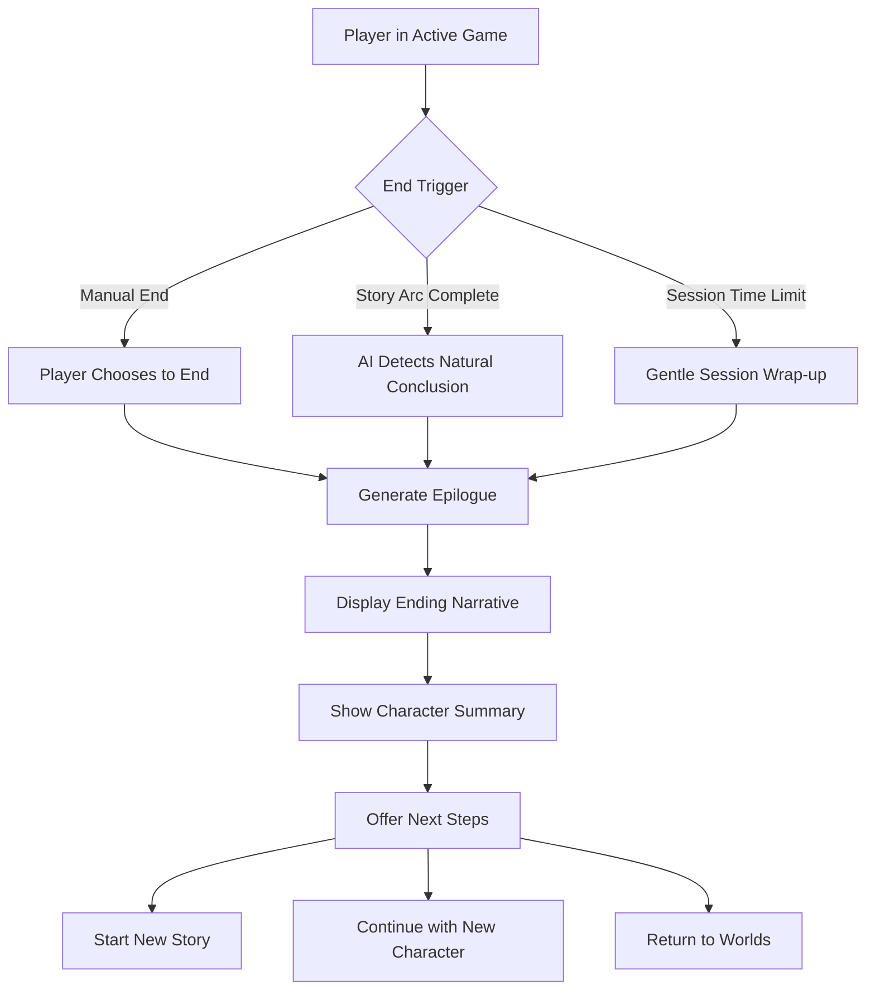

## Plain Language Summary
Create a satisfying way for players to end their game sessions with AI-generated epilogues and character summaries, providing narrative closure without complex health/death mechanics.

## Current Feature
Currently, game sessions have no formal ending mechanism. Players must simply abandon their story without any narrative conclusion or summary of their journey.

## Domain
- [x] Narrative Engine
- [x] State Management
- [ ] World Configuration
- [ ] Character System
- [ ] Decision Tracking System
- [ ] Decision Relevance System
- [ ] Journal System
- [ ] Other: _________

## Enhancement Description
Implement a narrative ending system that allows players to conclude their stories gracefully. The system should:
- Provide multiple ending triggers (player choice, story arc completion, session time limits)
- Generate AI-powered epilogues based on story events
- Display character journey summaries and achievements
- Offer clear next steps (new story, new character, return to worlds)
- Update character status to "retired" or "story complete"

## Reason for Enhancement
- Provides narrative closure without complex health/death systems
- Creates satisfying conclusions to player stories
- Encourages starting new stories/characters
- Makes each playthrough feel complete
- Addresses the missing "end state" in the current game flow

## Possible Implementation

### 1. Add Ending Types to Narrative System
```typescript
type EndingType = 'player-choice' | 'story-complete' | 'session-limit' | 'character-retirement';
type EndingTone = 'triumphant' | 'bittersweet' | 'mysterious' | 'tragic' | 'hopeful';

interface StoryEnding {
  id: string;
  type: EndingType;
  tone: EndingTone;
  epilogue: string;
  characterLegacy: string;
  worldImpact: string;
  timestamp: Date;
}
```

### 2. Create Ending Generation System
- New prompt templates for endings in `/src/lib/ai/prompts/ending-templates.ts`
- AI-generated epilogue based on journal entries and story events
- Character arc summary generation
- World impact summary based on major decisions

### 3. UI Components
- `EndingScreen` component with narrative display
- `CharacterLegacy` component showing achievements and journey highlights
- `NextStepsPrompt` component for continuation options
- Smooth transition animations for emotional impact

### 4. State Management Updates
- Add ending data to `narrativeStore`
- Track story completion status in `sessionStore`
- Update character with "retired" or "complete" status in `characterStore`
- Persist ending data for future reference

### 5. Integration Points
- Add "End Story" button to game session UI
- Implement AI detection of natural story conclusions
- Add gentle session time suggestions (e.g., after 30 minutes of play)
- Create keyboard shortcut for quick ending access

### Implementation Flow:


## Alternatives Considered
1. **Simple session abandonment** - Rejected as it provides no narrative satisfaction
2. **Complex health/death system** - Too heavy for MVP, adds unnecessary complexity
3. **Predetermined endings** - Lacks the personalization that AI can provide
4. **Auto-save only** - Doesn't give the sense of completion players need

## Additional Context
This feature addresses a critical gap in the current user experience. Without proper endings, players may feel their stories are incomplete or abandoned. The AI-generated epilogues will make each playthrough feel unique and meaningful.

### Technical Considerations:
- Leverage existing journal entries for context
- Use narrative store's story segments for epilogue generation
- Ensure endings are saved to IndexedDB for future reference
- Consider token limits when generating epilogues
- Add loading states during epilogue generation

### Test Plan:
1. Unit tests for ending type logic
2. Storybook stories for EndingScreen components
3. Integration tests for full ending flow
4. Test harness at `/dev/ending-system` for various ending scenarios

### Success Criteria:
- [ ] Players can manually trigger story endings
- [ ] AI generates contextually appropriate epilogues
- [ ] Character summaries accurately reflect the journey
- [ ] Next steps are clear and actionable
- [ ] Endings are persisted and can be viewed later
- [ ] The experience feels emotionally satisfying
