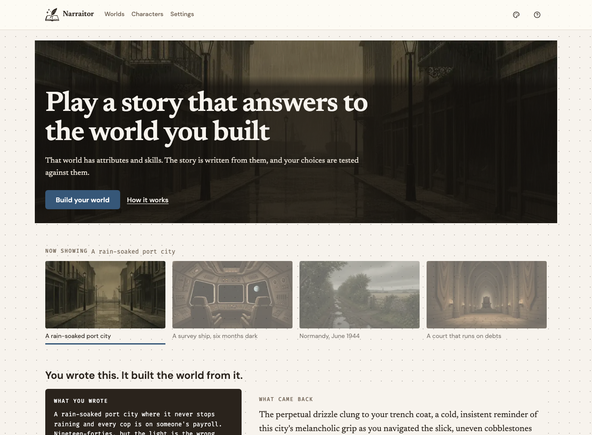
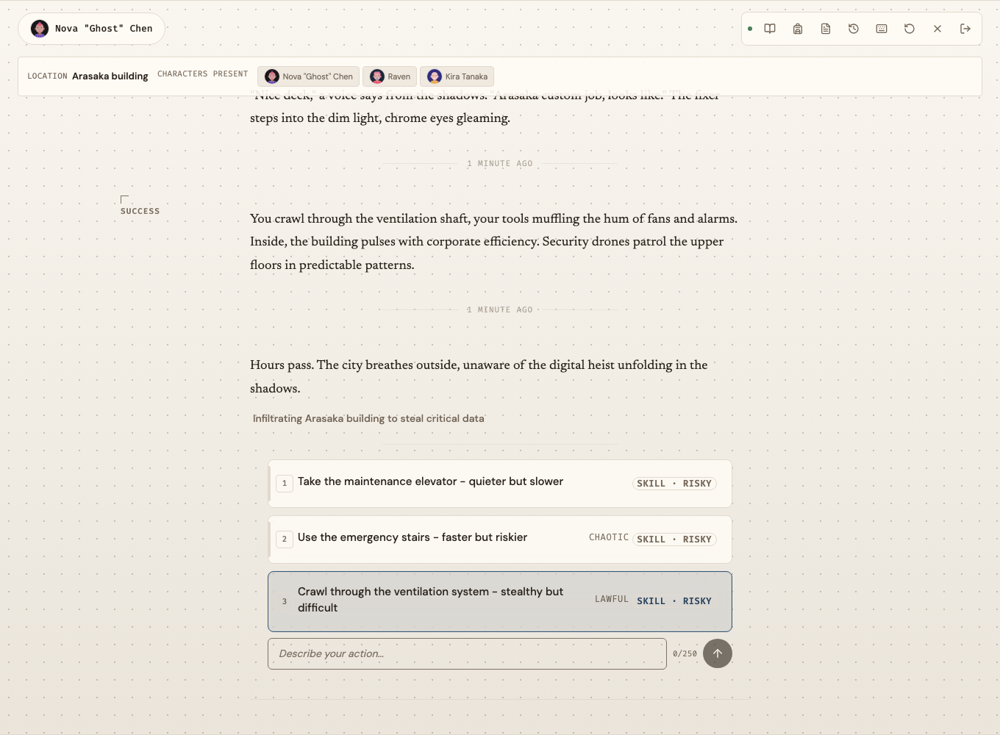
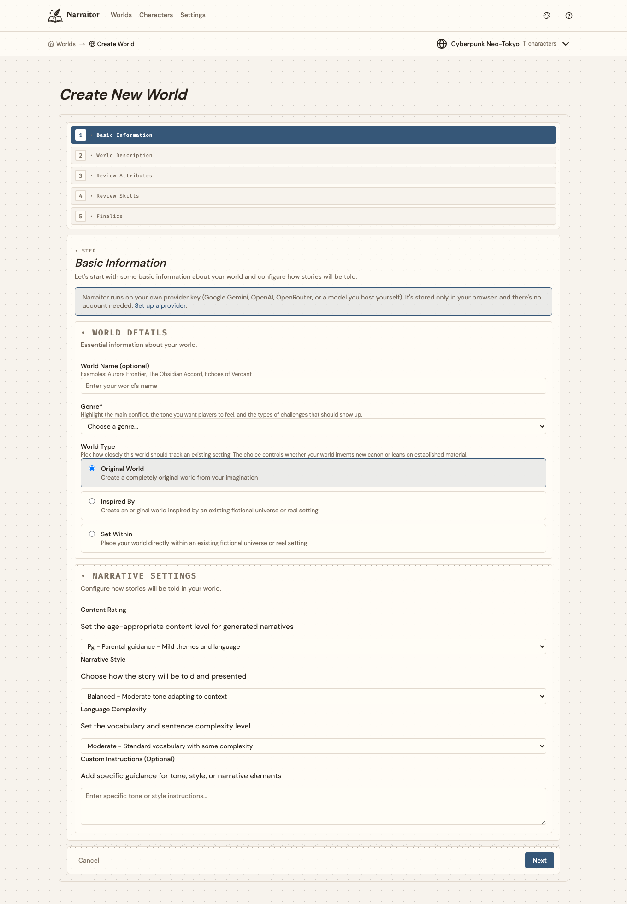

# Narraitor

A solo role-playing game where the story answers to the world you built. You define a setting with its own rules, attributes, and skills, create a character who fits it, and play through a story that is written from those rules, with your choices tested against your character's abilities.

It runs entirely in your browser. No account, nothing stored on a server, and it generates on a model key you bring yourself.

**[Play it at narraitor-six.vercel.app](https://narraitor-six.vercel.app/)**



## What makes it different

Most generated-story tools drop you into someone else's setting, or a chat box with a genre label. Narraitor treats the world as the thing you author. Its tone, attributes, skills, and rules are data the story generator reads on every turn, so a hardboiled-noir world and a high-fantasy world produce genuinely different writing from the same engine.

Two things it commits to:

- **Choices carry weight across turns.** Decisions are tracked, an alignment reading from lawful to chaotic builds up over a session, and the story keeps a record of where your character stands with the people in it.
- **Your data stays yours.** There is no account system and no database. Worlds, characters, and saved games live in your browser. Your model key is encrypted there and used only to make each request.



## What you can do

- **Build a world.** Describe a setting and the wizard suggests attributes and skills that fit it, all of which you can edit or replace. "Force Sensitivity" for a Star Wars world, "Sanity" for cosmic horror.
- **Create a character.** Spend attribute points, pick skills that make sense for the setting, write a background. A portrait is generated to match.
- **Play.** Pick from the offered choices or type your own action. A skill check decides how it goes. An inventory, a journal, and a running "story so far" summary keep a long session coherent.
- **Reach an ending.** When a story is near its natural close, you get a suggested ending and a generated conclusion.
- **Take it with you.** Settings exports everything as a single file you can re-import later or move to another browser.



## Before you play

You supply your own model key. The simplest is a free [Google Gemini](https://aistudio.google.com/apikey) key, added once under Settings, then Providers. OpenAI, OpenRouter, and a server you run yourself also work.

Everything is stored locally, so clearing your browser's site data really does delete your worlds and characters. Use the export in Settings if you want a backup.

---

The rest of this is for running Narraitor or working on it.

## Running it locally

You need Node 20 (see [.nvmrc](.nvmrc)) and npm. You do not need a key to install or start it; add one through Settings once it is running, the same way a player does.

```bash
git clone https://github.com/jerseycheese/narraitor.git
cd narraitor
npm install
npm run dev
```

The app comes up on `localhost:3000`. If you would rather not re-enter a key each time, copy `.env.example` to `.env.local` and set `GEMINI_API_KEY`. That is a local convenience only, and a player's own key always takes precedence.

Running from a git worktree? `npm run dev` picks a stable per-worktree port so several checkouts can run at once. The URL is printed on start.

## Development

Components are built in isolation in Storybook first, then wired into the app.

```bash
npm run storybook      # component catalog on :6006
npm run test           # Jest
npm run type-check     # tsc --noEmit
npm run lint           # ESLint
npm run lint:css       # Stylelint
```

Run the last four before committing. CI runs them separately, and the production build enforces types and lint anyway.

`npm run build` builds the app and Storybook together. `npm run build:app` is the faster app-only build.

There are ten `/dev` routes for exercising one screen against real data without walking the whole flow (`/dev/game-session`, `/dev/world-generation`, and the rest). For the full themed catalog, use Storybook.

Contributor PRs target `develop`, never `main` (see [Branches and releases](#branches-and-releases)).

## How the code is organized

Next.js 15 with the App Router. Files are grouped by feature area rather than by type, so a world component lives under `components/world/`, not `components/editors/`.

```
src/
├── app/           # pages and API routes
├── components/    # UI, grouped by feature area
├── state/         # one store per feature area (worlds, characters, narrative, ...)
├── lib/           # generation, theme, utilities
├── services/      # cross-feature logic
├── hooks/         # shared React hooks
├── stories/       # Storybook stories
├── styles/        # global CSS
└── types/         # TypeScript definitions
```

## How it works

**Generation.** Story text comes from Google Gemini through the app's own API routes (`/api/narrative/generate`, `/api/narrative/choices`, and others). Each prompt carries the world's rules, the character sheet, and recent story history so the writing stays consistent with the setting. The browser never calls the provider directly.

**State and saves.** Each feature area has its own small [Zustand](https://github.com/pmndrs/zustand) store, saved to the browser's IndexedDB. Sessions survive a reload. If IndexedDB is unavailable the app keeps running in memory and tells you it will not persist.

**Your key.** A player's key is encrypted in the browser. On each request it travels in a header, gets used once server-side for that call, and is never logged or stored. The `GEMINI_API_KEY` environment variable is a separate local-only fallback and stays on the server.

**Request limits.** All seventeen generation routes go through one wrapper (`withAIRoute`) that caps requests per IP (50 an hour in production, looser locally), rejects bodies over 64KB, holds output to a fixed ceiling, and strips provider error text before it reaches the client.

**Design.** One design system, "The Mechanical Manuscript" ([ADR-013](public_docs/architecture/ADR-013-collapse-to-single-design-system-ds3.md)): aged paper, drafting ink, a dot grid. Plain CSS driven by named tokens rather than hard-coded colors, and no Tailwind. Storybook is the reference for how every component should look ([ADR-012](public_docs/architecture/ADR-012-storybook-single-canon-surface.md)); when the app and Storybook disagree, the app is wrong. [DESIGN.md](DESIGN.md) lists the tokens and components.

## Branches and releases

`main` is the latest tagged release and the default clone target, so start there if you want something stable. `develop` is where in-progress work lands, which means it can carry half-finished features. Contributor PRs go to `develop`. Each release is written up in [RELEASES.md](RELEASES.md).

## Roadmap

Version 1.0 shipped in August 2026: a single-player release you run in your browser with your own key, no account needed. The releases since have been refinements rather than big new features, and each one is written up in [RELEASES.md](RELEASES.md). The current version is 1.6.

Recent work: a visual redesign, generated images for worlds and journal entries and endings, better keyboard support, longer stories that stay consistent turn to turn, and the option to generate with OpenAI or OpenRouter instead of Gemini (or your own server, if you run one).

The next version, [1.7](https://github.com/jerseycheese/Narraitor/milestone/8), makes what the story takes away from you land as a consequence of your choices rather than something that would have happened regardless.

There are no plans for accounts or cloud saves: Narraitor stays on your device unless a clear reason to change that turns up, and [the reasoning is written down](public_docs/architecture/ADR-014-browser-local-until-named-trigger.md). Further out, the ideas worth exploring are shared worlds, voice narration, and mobile apps.

## License

MIT. See the [LICENSE](LICENSE) file for details.
