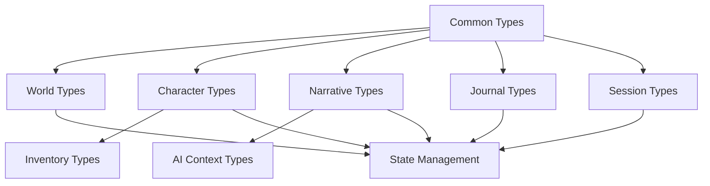

# Narraitor Type System API

The Narraitor type system provides TypeScript interfaces and types for all core domains in the application. This document serves as a comprehensive reference for all available types.

## Type Hierarchy



## Common Types

### Base Types

```typescript
// Unique identifier for entities
type EntityID = string;

// ISO 8601 timestamp
type Timestamp = string;
```

### Base Interfaces

```typescript
interface TimestampedEntity {
  createdAt: Timestamp;
  updatedAt: Timestamp;
}

interface NamedEntity {
  id: EntityID;
  name: string;
  description?: string;
}
```

## World Configuration Types

### World

The main world configuration interface.

```typescript
interface World extends NamedEntity, TimestampedEntity {
  theme: string;
  attributes: WorldAttribute[];
  skills: WorldSkill[];
  settings: WorldSettings;
}
```

**Properties:**
- `theme`: The world's genre or setting (e.g., "western", "fantasy")
- `attributes`: Available character attributes in this world
- `skills`: Available skills characters can learn
- `settings`: Configuration for character creation constraints

### WorldAttribute

```typescript
interface WorldAttribute extends NamedEntity {
  worldId: EntityID;
  baseValue: number;
  minValue: number;
  maxValue: number;
  category?: string;
}
```

**Properties:**
- `worldId`: Reference to the parent world
- `baseValue`: Default starting value
- `minValue`: Minimum allowed value
- `maxValue`: Maximum allowed value
- `category`: Optional grouping (e.g., "physical", "mental")

### WorldSkill

```typescript
interface WorldSkill extends NamedEntity {
  worldId: EntityID;
  linkedAttributeId?: EntityID;
  difficulty: 'easy' | 'medium' | 'hard';
  category?: string;
}
```

**Properties:**
- `linkedAttributeId`: Optional attribute that affects this skill
- `difficulty`: Learning difficulty affecting XP requirements

### WorldSettings

```typescript
interface WorldSettings {
  maxAttributes: number;
  maxSkills: number;
  attributePointPool: number;
  skillPointPool: number;
}
```

## Character Types

### Character

```typescript
interface Character extends NamedEntity, TimestampedEntity {
  worldId: EntityID;
  attributes: CharacterAttribute[];
  skills: CharacterSkill[];
  background: CharacterBackground;
  inventory: Inventory;
  status: CharacterStatus;
}
```

### CharacterAttribute

```typescript
interface CharacterAttribute {
  attributeId: EntityID;
  value: number;
}
```

### CharacterSkill

```typescript
interface CharacterSkill {
  skillId: EntityID;
  level: number;
  experience: number;
  isActive: boolean;
}
```

### CharacterBackground

```typescript
interface CharacterBackground {
  history: string;
  personality: string;
  goals: string[];
  fears: string[];
  relationships: CharacterRelationship[];
}

interface CharacterRelationship {
  characterId: EntityID;
  type: 'ally' | 'enemy' | 'neutral' | 'romantic' | 'family';
  strength: number; // -100 to 100
  description?: string;
}
```

### CharacterStatus

```typescript
interface CharacterStatus {
  health: number;
  maxHealth: number;
  conditions: string[];
  location?: string;
}
```

## Inventory Types

### Inventory

```typescript
interface Inventory {
  characterId: EntityID;
  items: InventoryItem[];
  capacity: number;
  categories: InventoryCategory[];
}
```

### InventoryItem

```typescript
interface InventoryItem extends NamedEntity {
  categoryId: EntityID;
  quantity: number;
}
```

### InventoryCategory

```typescript
interface InventoryCategory extends NamedEntity {
  icon?: string;
  sortOrder: number;
  parentCategoryId?: EntityID;
}
```

## Narrative Types

### NarrativeSegment

```typescript
interface NarrativeSegment extends TimestampedEntity {
  id: EntityID;
  worldId: EntityID;
  sessionId: EntityID;
  content: string;
  type: 'scene' | 'dialogue' | 'action' | 'transition';
  characterIds: EntityID[];
  decisions?: Decision[];
  metadata: NarrativeMetadata;
}
```

### Decision System

```typescript
interface Decision {
  id: EntityID;
  prompt: string;
  options: DecisionOption[];
  selectedOptionId?: EntityID;
  consequences?: Consequence[];
}

interface DecisionOption {
  id: EntityID;
  text: string;
  requirements?: DecisionRequirement[];
  hint?: string;
}

interface DecisionRequirement {
  type: 'attribute' | 'skill' | 'item' | 'relationship';
  targetId: EntityID;
  operator: 'gt' | 'gte' | 'lt' | 'lte' | 'eq' | 'neq';
  value: number | string;
}

interface Consequence {
  type: 'attribute' | 'skill' | 'item' | 'relationship' | 'narrative';
  action: 'add' | 'remove' | 'modify';
  targetId: EntityID;
  value: string | number | boolean | Record<string, unknown>;
  description?: string;
}
```

### NarrativeMetadata

```typescript
interface NarrativeMetadata {
  mood?: 'tense' | 'relaxed' | 'mysterious' | 'action' | 'emotional';
  tags: string[];
}
```

## Journal Types

### JournalEntry

```typescript
interface JournalEntry extends TimestampedEntity {
  id: EntityID;
  sessionId: EntityID;
  worldId: EntityID;
  characterId: EntityID;
  type: JournalEntryType;
  title: string;
  content: string;
  significance: 'major' | 'minor';
  isRead: boolean;
  relatedEntities: RelatedEntity[];
  metadata: JournalMetadata;
}

type JournalEntryType = 
  | 'character_event'
  | 'world_event'
  | 'relationship_change'
  | 'achievement'
  | 'discovery'
  | 'combat'
  | 'dialogue';
```

### RelatedEntity

```typescript
interface RelatedEntity {
  type: 'character' | 'item' | 'location' | 'event';
  id: EntityID;
  name: string;
}
```

### JournalMetadata

```typescript
interface JournalMetadata {
  tags: string[];
  automaticEntry: boolean;
  narrativeSegmentId?: EntityID;
}
```

## Session Types

### GameSession

```typescript
interface GameSession extends TimestampedEntity {
  id: EntityID;
  worldId: EntityID;
  characterId: EntityID;
  state: SessionState;
  narrativeHistory: EntityID[]; // NarrativeSegment IDs
  currentContext: NarrativeContext;
}
```

### SessionState

```typescript
interface SessionState {
  status: 'active' | 'paused' | 'completed';
  lastActivity: Timestamp;
  savePoint?: SavePoint;
}

interface SavePoint {
  narrativeSegmentId: EntityID;
  timestamp: Timestamp;
  description: string;
}
```

### NarrativeContext

```typescript
interface NarrativeContext {
  recentSegments: EntityID[]; // Last 5-10 segments
  activeCharacters: EntityID[];
  currentLocation?: string;
  activeQuests?: string[];
  mood?: string;
}
```

## AI Context Types

### AIContext

```typescript
interface AIContext {
  world: World;
  character: Character;
  recentNarrative: NarrativeSegment[];
  relevantNPCs?: Character[];
  currentObjectives?: string[];
}
```

### AIPromptContext

```typescript
interface AIPromptContext {
  templateId: string;
  variables: Record<string, unknown>;
  context: AIContext;
  constraints?: AIConstraint[];
}

interface AIConstraint {
  type: 'tone' | 'content' | 'length' | 'character';
  value: string | number;
  priority: 'required' | 'preferred';
}
```

## Type Guards

Runtime type validation functions are available for major interfaces:

```typescript
function isWorld(obj: unknown): obj is World
function isCharacter(obj: unknown): obj is Character
function isInventoryItem(obj: unknown): obj is InventoryItem
function isNarrativeSegment(obj: unknown): obj is NarrativeSegment
function isJournalEntry(obj: unknown): obj is JournalEntry
```

### Usage Example

```typescript
import { isWorld } from '@/types';

// Validate unknown data
const data = JSON.parse(savedData);
if (isWorld(data)) {
  // TypeScript knows data is a World
  console.log(`Loaded world: ${data.name}`);
}
```

## Integration Examples

### With Zustand State Management

```typescript
import { create } from 'zustand';
import { World, Character, GameSession } from '@/types';

interface GameState {
  // Entities stored by ID
  worlds: Record<EntityID, World>;
  characters: Record<EntityID, Character>;
  
  // Current session
  activeSession: GameSession | null;
  
  // Actions
  addWorld: (world: World) => void;
  updateCharacter: (id: EntityID, updates: Partial<Character>) => void;
}

const useGameStore = create<GameState>((set) => ({
  worlds: {},
  characters: {},
  activeSession: null,
  
  addWorld: (world) => set((state) => ({
    worlds: { ...state.worlds, [world.id]: world }
  })),
  
  updateCharacter: (id, updates) => set((state) => ({
    characters: {
      ...state.characters,
      [id]: { ...state.characters[id], ...updates }
    }
  }))
}));
```

### With IndexedDB Persistence

```typescript
import { Character } from '@/types';

// Serialize for storage
const saveCharacter = async (character: Character) => {
  const db = await openDB();
  await db.put('characters', character);
};

// Deserialize and validate
const loadCharacter = async (id: EntityID): Promise<Character | null> => {
  const db = await openDB();
  const data = await db.get('characters', id);
  
  if (isCharacter(data)) {
    return data;
  }
  
  console.error('Invalid character data');
  return null;
};
```

## Best Practices

1. **Type Safety First**: Always use proper types instead of `any`
2. **Validate External Data**: Use type guards for data from APIs or storage
3. **Immutable Updates**: Treat all types as immutable in state management
4. **Consistent IDs**: Use `generateUniqueId()` for all entity IDs
5. **Document Changes**: Update this documentation when adding new types

