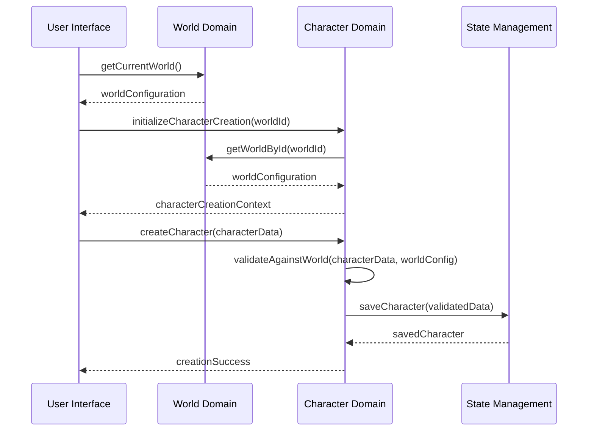

# Domain Integration Protocols

## Overview
This document defines how the different domains within NarrAItor communicate and interact with each other, establishing clear interfaces, data flow patterns, and error handling protocols at domain boundaries.

## Domain Communication Principles
1. **Loose Coupling**: Domains should interact through well-defined interfaces only
2. **Unidirectional Data Flow**: Domain data changes follow a unidirectional flow pattern
3. **Explicit State Management**: Domain state is managed through dedicated reducers
4. **Error Isolation**: Errors in one domain should not cascade to others
5. **Minimal Shared State**: Domains should only share what is absolutely necessary

## Core Domain Interfaces

### World Domain Interfaces

```typescript
// Public interface for World domain
interface WorldDomainInterface {
  // State access
  getCurrentWorld(): World | null;
  getAllWorlds(): World[];
  getWorldById(id: string): World | null;
  
  // Operations
  createWorld(world: WorldCreationParams): Promise<World>;
  updateWorld(id: string, updates: Partial<World>): Promise<World>;
  deleteWorld(id: string): Promise<boolean>;
  
  // Error handling
  getWorldErrors(): WorldErrorState;
  clearWorldErrors(): void;
}
```

### Character Domain Interfaces

```typescript
// Public interface for Character domain
interface CharacterDomainInterface {
  // State access
  getCurrentCharacter(): Character | null;
  getCharactersByWorldId(worldId: string): Character[];
  getCharacterById(id: string): Character | null;
  
  // Operations
  createCharacter(character: CharacterCreationParams): Promise<Character>;
  updateCharacter(id: string, updates: Partial<Character>): Promise<Character>;
  deleteCharacter(id: string): Promise<boolean>;
  
  // Error handling
  getCharacterErrors(): CharacterErrorState;
  clearCharacterErrors(): void;
}
```

### Narrative Domain Interfaces

```typescript
// Public interface for Narrative domain
interface NarrativeDomainInterface {
  // State access
  getCurrentNarrativeSession(): NarrativeSession | null;
  getNarrativeHistory(): NarrativeEntry[];
  getCurrentChoices(): PlayerChoice[];
  
  // Operations
  startNarrativeSession(params: SessionStartParams): Promise<NarrativeSession>;
  selectChoice(choiceId: string): Promise<NarrativeEntry>;
  generateNarrative(prompt: string): Promise<NarrativeEntry>;
  
  // Error handling
  getNarrativeErrors(): NarrativeErrorState;
  clearNarrativeErrors(): void;
}
```

### Journal Domain Interfaces

```typescript
// Public interface for Journal domain
interface JournalDomainInterface {
  // State access
  getAllEntries(): JournalEntry[];
  getEntriesBySession(sessionId: string): JournalEntry[];
  getFilteredEntries(filters: JournalFilters): JournalEntry[];
  
  // Operations
  createEntry(entry: JournalEntryParams): Promise<JournalEntry>;
  updateEntry(id: string, updates: Partial<JournalEntry>): Promise<JournalEntry>;
  deleteEntry(id: string): Promise<boolean>;
  
  // Error handling
  getJournalErrors(): JournalErrorState;
  clearJournalErrors(): void;
}
```

## Cross-Domain Data Flows

### World → Character Flow
- **Data Direction**: World configuration affects character creation options
- **Flow Trigger**: Loading a world for character creation
- **Data Passed**: Attribute definitions, skill definitions, world theme
- **Implementation**: Character creation wizard receives world configuration
- **Error Handling**: Invalid world data triggers error in character domain

### Character → Narrative Flow
- **Data Direction**: Character details inform narrative generation
- **Flow Trigger**: Starting a narrative session with a character
- **Data Passed**: Character attributes, skills, background
- **Implementation**: Narrative generation includes character context
- **Error Handling**: Invalid character data triggers error in narrative session start

### Narrative → Journal Flow
- **Data Direction**: Narrative events create journal entries
- **Flow Trigger**: Significant narrative events, player decisions
- **Data Passed**: Event details, timestamp, context
- **Implementation**: Event listeners in narrative domain call journal entry creation
- **Error Handling**: Journal entry creation failures don't block narrative progression

### Journal → Character Flow
- **Data Direction**: Journal entries may affect character development
- **Flow Trigger**: Character reviewing journal entries
- **Data Passed**: Relevant past decisions and events
- **Implementation**: Character development references journal history
- **Error Handling**: Missing journal entries don't prevent character operations

## Error Handling Protocols

### Domain-Level Error Handling
1. **Error Containment**: Errors should be handled at the domain level first
2. **Error Transformation**: Domain-specific errors into user-friendly messages
3. **Error State**: Each domain maintains its own error state
4. **Error Recovery**: Domains define recovery paths for different error types

### Cross-Domain Error Protocols
1. **Error Propagation**: When an error should be communicated across domains
2. **Failure Isolation**: Preventing cascading failures across domains
3. **Default Values**: Using sensible defaults when cross-domain data is missing
4. **Degraded Operation**: Continuing with limited functionality when dependencies fail

### Error Types and Responses

| Error Type | Domain Response | Cross-Domain Impact | UI Indication |
|------------|----------------|---------------------|--------------|
| Network Error | Retry with backoff | None until retries exhausted | Loading indicator |
| Validation Error | Return detailed field errors | Block dependent operations | Field error messages |
| Data Consistency Error | Attempt auto-repair | Alert dependent domains | Warning message |
| Fatal Error | Reset to known good state | Force reload of dependent domains | Error modal |

## Domain State Dependencies

### Primary Dependencies
- **Character** depends on **World** for attribute definitions
- **Narrative** depends on **Character** for player context
- **Journal** depends on **Narrative** for entry creation
- **UI State** depends on all domains for display

### Secondary Dependencies
- **World** may reference **Character** count
- **Character** may reference **Journal** for history
- **Narrative** may reference **Journal** for continuity

## Implementation Guidelines

### Data Access Patterns
- Use domain hooks to access data from other domains
- Use selectors to derive data from domain state
- Use domain context providers to make state available

### Event Communication
- Use event dispatchers for cross-domain communication
- Use middleware for side effects that affect multiple domains
- Use observer pattern for loosely coupled updates

### Testing Considerations
- Mock dependencies when testing cross-domain functionality
- Use test boundaries that align with domain boundaries
- Create integration tests specifically for domain interfaces

## Example Cross-Domain Scenario

### Creating a Character in a World



## Related Documents
- [Architecture Decisions](/users/jackhaas/projects/narraitor/docs/architecture/architecture-decisions.md)
- [State Management](/users/jackhaas/projects/narraitor/docs/architecture/state-management.md)
- [Technical Approach](/users/jackhaas/projects/narraitor/docs/architecture/technical-approach.md)