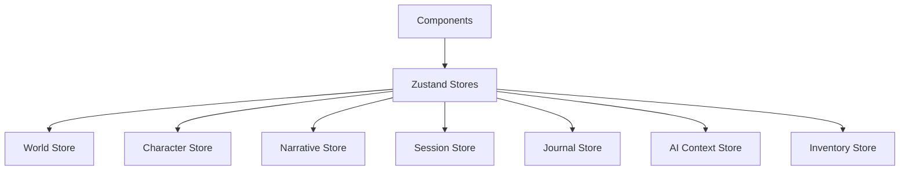

# State Management Guide

This the state management here uses Zustand with domain-driven stores. The key insight was that each major area of the app (World, Character, Narrative, etc.) needed its own state management, but they should follow consistent patterns.

## How It's Organized



Each store handles its own domain, but they can interact when needed. For example, the Character Store needs to know about available worlds from the World Store.

## Store Pattern

Every store follows the same basic structure, which makes them predictable and easier to test:

```typescript
interface DomainStore {
  // State
  entities: Record<EntityID, Entity>;
  currentEntityId: EntityID | null;
  loading: boolean;
  error: string | null;
  
  // CRUD Actions
  create: (data: CreateEntityData) => EntityID;
  update: (id: EntityID, updates: Partial<Entity>) => void;
  delete: (id: EntityID) => void;
  
  // Selection
  setCurrent: (id: EntityID) => void;
  
  // State Management
  setLoading: (loading: boolean) => void;
  setError: (error: string | null) => void;
  reset: () => void;
}
```

## Core Stores

### World Store
```typescript
import { useWorldStore } from '@/state/worldStore';

const {
  worlds,
  currentWorldId,
  createWorld,
  updateWorld,
  deleteWorld,
  setCurrentWorld
} = useWorldStore();

// Create new world
const worldId = createWorld({
  name: 'Wild West',
  description: 'A frontier town...',
  attributes: ['Strength', 'Dexterity', 'Intelligence'],
  skills: ['Gunslinging', 'Horseback Riding']
});

// Update world
updateWorld(worldId, { 
  description: 'Updated description' 
});
```

### Character Store
```typescript
import { useCharacterStore } from '@/state/characterStore';

const {
  characters,
  currentCharacterId,
  createCharacter,
  updateCharacter,
  deleteCharacter
} = useCharacterStore();

// Create character
const charId = createCharacter({
  name: 'Jake Morrison',
  worldId: 'world-1',
  attributes: { strength: 8, dexterity: 6 },
  skills: ['Gunslinging', 'Survival']
});
```

### Narrative Store
```typescript
import { useNarrativeStore } from '@/state/narrativeStore';

const {
  narrativeEntries,
  currentChoices,
  isGenerating,
  generateNarrative,
  selectChoice,
  submitCustomInput
} = useNarrativeStore();

// Generate narrative
await generateNarrative({
  worldId: 'world-1',
  sessionId: 'session-1',
  context: 'Player enters saloon...'
});

// Handle choice selection
selectChoice('choice-1');
```

### Session Store
```typescript
import { useSessionStore } from '@/state/sessionStore';

const {
  sessions,
  currentSessionId,
  createSession,
  endSession,
  updateSessionState
} = useSessionStore();

// Start new session
const sessionId = createSession({
  worldId: 'world-1',
  characterIds: ['char-1', 'char-2']
});
```

## Usage Patterns

### Component Integration
```typescript
const WorldEditor = () => {
  const { 
    worlds, 
    currentWorldId, 
    updateWorld, 
    loading, 
    error 
  } = useWorldStore();
  
  const currentWorld = currentWorldId ? worlds[currentWorldId] : null;
  
  if (loading) return <LoadingSpinner />;
  if (error) return <ErrorDisplay error={error} />;
  if (!currentWorld) return <div>No world selected</div>;
  
  const handleUpdate = (updates: Partial<World>) => {
    updateWorld(currentWorld.id, updates);
  };
  
  return <WorldForm world={currentWorld} onUpdate={handleUpdate} />;
};
```

### Cross-Store Operations
```typescript
const GameSession = () => {
  const worldStore = useWorldStore();
  const characterStore = useCharacterStore();
  const sessionStore = useSessionStore();
  
  const startNewGame = () => {
    // Get current world
    const world = worldStore.worlds[worldStore.currentWorldId];
    if (!world) return;
    
    // Get selected characters
    const characters = Object.values(characterStore.characters)
      .filter(char => char.worldId === world.id);
    
    // Create session
    const sessionId = sessionStore.createSession({
      worldId: world.id,
      characterIds: characters.map(c => c.id)
    });
    
    sessionStore.setCurrentSession(sessionId);
  };
  
  return <button onClick={startNewGame}>Start Game</button>;
};
```

### Error Handling
```typescript
const CharacterCreator = () => {
  const { createCharacter, error, setError } = useCharacterStore();
  
  const handleSubmit = async (data: CharacterData) => {
    try {
      setError(null);
      const characterId = createCharacter(data);
      console.log('Character created:', characterId);
    } catch (err) {
      setError(err.message);
    }
  };
  
  return (
    <div>
      {error && <ErrorMessage error={error} />}
      <CharacterForm onSubmit={handleSubmit} />
    </div>
  );
};
```

## Advanced Patterns

### Computed Values
```typescript
// In store definition
const useWorldStore = create<WorldStore>((set, get) => ({
  // ... other state and actions
  
  // Computed getter
  getCurrentWorld: () => {
    const { worlds, currentWorldId } = get();
    return currentWorldId ? worlds[currentWorldId] : null;
  },
  
  getWorldCharacters: (worldId: string) => {
    // This would typically be in a selector
    const characterStore = useCharacterStore.getState();
    return Object.values(characterStore.characters)
      .filter(char => char.worldId === worldId);
  }
}));
```

### Subscriptions
```typescript
// Listen to store changes
useEffect(() => {
  const unsubscribe = useWorldStore.subscribe(
    (state) => state.currentWorldId,
    (currentWorldId) => {
      console.log('Current world changed:', currentWorldId);
    }
  );
  
  return unsubscribe;
}, []);
```

### Middleware Integration
```typescript
import { subscribeWithSelector } from 'zustand/middleware';
import { devtools } from 'zustand/middleware';

const useWorldStore = create<WorldStore>()(
  devtools(
    subscribeWithSelector(
      (set, get) => ({
        // Store implementation
      })
    ),
    { name: 'world-store' }
  )
);
```

## Testing

### Mock Stores
```typescript
// For testing
const mockWorldStore = {
  worlds: { 'world-1': mockWorld },
  currentWorldId: 'world-1',
  createWorld: jest.fn(),
  updateWorld: jest.fn(),
  deleteWorld: jest.fn(),
  setCurrentWorld: jest.fn(),
  loading: false,
  error: null
};

// Use in tests
jest.mock('@/state/worldStore', () => ({
  useWorldStore: () => mockWorldStore
}));
```

### Store Testing
```typescript
test('creates world successfully', () => {
  const { result } = renderHook(() => useWorldStore());
  
  const worldData = {
    name: 'Test World',
    description: 'Test description'
  };
  
  act(() => {
    const worldId = result.current.createWorld(worldData);
    expect(worldId).toBeDefined();
    expect(result.current.worlds[worldId]).toMatchObject(worldData);
  });
});
```

## Best Practices

### State Structure
- Keep state flat and normalized
- Use IDs for relationships between entities
- Store UI state separately from domain state
- Avoid deeply nested objects

### Actions
- Make actions atomic and predictable
- Handle loading and error states consistently
- Use optimistic updates when appropriate
- Validate input data in actions

### Performance
- Use selectors to prevent unnecessary re-renders
- Keep actions pure and predictable
- Avoid storing derived data in state
- Use subscriptions sparingly

### Type Safety
- Define strict interfaces for all stores
- Use branded types for IDs when needed
- Type all action parameters and return values
- Leverage TypeScript for compile-time checks

## Persistence

Future persistence with IndexedDB:

```typescript
// Planned persistence integration
const persistedWorldStore = create<WorldStore>()(
  persist(
    (set, get) => ({
      // Store implementation
    }),
    {
      name: 'world-storage',
      storage: createJSONStorage(() => indexedDB)
    }
  )
);
```

## Related
- `/src/state/` - Store implementations
- `/src/types/` - TypeScript interfaces
- Zustand documentation
- Component integration examples