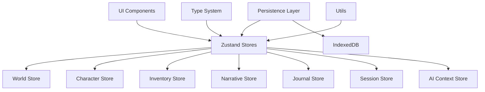

# State Management Architecture

## Overview

The Narraitor application uses Zustand for state management, following a domain-driven design with separate stores for each core domain. This architecture provides type-safe, reactive state management with built-in persistence capabilities (planned for IndexedDB integration).

## State Management Principles

1. **Domain Separation**: Each domain has its own Zustand store
2. **Immutable Updates**: State updates follow immutable patterns
3. **Type Safety**: All state operations are fully typed with TypeScript
4. **Persistence Ready**: Architecture supports automatic persistence (IndexedDB planned)
5. **Reactive Updates**: Components automatically re-render on state changes

## Architecture Diagram



## Zustand Store Implementation

Each domain is implemented as a separate Zustand store with consistent patterns:

### Store Structure Pattern

```typescript
interface StoreInterface {
  // State
  entities: Record<EntityID, Entity>;
  currentEntityId: EntityID | null;
  error: string | null;
  loading: boolean;

  // Actions
  createEntity: (data: Omit<Entity, 'id' | 'createdAt' | 'updatedAt'>) => EntityID;
  updateEntity: (id: EntityID, updates: Partial<Entity>) => void;
  deleteEntity: (id: EntityID) => void;
  setCurrentEntity: (id: EntityID) => void;
  
  // State management
  reset: () => void;
  setError: (error: string | null) => void;
  clearError: () => void;
  setLoading: (loading: boolean) => void;
}
```

## Implemented Stores

### 1. World Store (`worldStore.ts`)
Manages game worlds with their attributes, skills, and settings.

```typescript
interface WorldStore {
  // State
  worlds: Record<EntityID, World>;
  currentWorldId: EntityID | null;
  error: string | null;
  loading: boolean;

  // Actions
  createWorld: (world: Omit<World, 'id' | 'createdAt' | 'updatedAt'>) => EntityID;
  updateWorld: (id: EntityID, updates: Partial<World>) => void;
  deleteWorld: (id: EntityID) => void;
  setCurrentWorld: (id: EntityID) => void;
  
  // Attribute management
  addAttribute: (worldId: EntityID, attribute: Omit<WorldAttribute, 'id' | 'worldId'>) => void;
  updateAttribute: (worldId: EntityID, attributeId: EntityID, updates: Partial<WorldAttribute>) => void;
  removeAttribute: (worldId: EntityID, attributeId: EntityID) => void;
  
  // Skill management
  addSkill: (worldId: EntityID, skill: Omit<WorldSkill, 'id' | 'worldId'>) => void;
  updateSkill: (worldId: EntityID, skillId: EntityID, updates: Partial<WorldSkill>) => void;
  removeSkill: (worldId: EntityID, skillId: EntityID) => void;
  
  // Settings management
  updateSettings: (worldId: EntityID, settings: Partial<WorldSettings>) => void;
}
```

### 2. Character Store (`characterStore.ts`)
Handles player and NPC characters with their attributes, skills, and backgrounds.

```typescript
interface CharacterStore {
  // State
  characters: Record<EntityID, Character>;
  currentCharacterId: EntityID | null;
  error: string | null;
  loading: boolean;

  // Actions
  createCharacter: (character: Omit<Character, 'id' | 'createdAt' | 'updatedAt'>) => EntityID;
  updateCharacter: (id: EntityID, updates: Partial<Character>) => void;
  deleteCharacter: (id: EntityID) => void;
  setCurrentCharacter: (id: EntityID) => void;
  
  // Attribute management
  addAttribute: (characterId: EntityID, attribute: Omit<CharacterAttribute, 'id' | 'characterId'>) => void;
  updateAttribute: (characterId: EntityID, attributeId: EntityID, updates: Partial<CharacterAttribute>) => void;
  removeAttribute: (characterId: EntityID, attributeId: EntityID) => void;
  
  // Skill management
  addSkill: (characterId: EntityID, skill: Omit<CharacterSkill, 'id' | 'characterId'>) => void;
}
```

### 3. Inventory Store (`inventoryStore.ts`)
Manages character inventories and item operations.

```typescript
interface InventoryStore {
  // State
  items: Record<EntityID, InventoryItem>;
  characterInventories: Record<EntityID, EntityID[]>;
  error: string | null;
  loading: boolean;

  // Actions
  addItem: (characterId: EntityID, item: Omit<InventoryItem, 'id' | 'characterId'>) => EntityID;
  updateItem: (itemId: EntityID, updates: Partial<InventoryItem>) => void;
  removeItem: (itemId: EntityID) => void;
  transferItem: (itemId: EntityID, toCharacterId: EntityID) => void;
  
  // Query actions
  getCharacterItems: (characterId: EntityID) => InventoryItem[];
  getEquippedItems: (characterId: EntityID) => InventoryItem[];
  calculateTotalWeight: (characterId: EntityID) => number;
}
```

### 4. Narrative Store (`narrativeStore.ts`)
Handles narrative segments and story progression.

```typescript
interface NarrativeStore {
  // State
  segments: Record<EntityID, NarrativeSegment>;
  sessionSegments: Record<EntityID, EntityID[]>;
  error: string | null;
  loading: boolean;

  // Actions
  addSegment: (sessionId: EntityID, segment: Omit<NarrativeSegment, 'id' | 'sessionId' | 'createdAt'>) => EntityID;
  updateSegment: (segmentId: EntityID, updates: Partial<NarrativeSegment>) => void;
  deleteSegment: (segmentId: EntityID) => void;
  
  // Query actions
  getSessionSegments: (sessionId: EntityID) => NarrativeSegment[];
}
```

### 5. Journal Store (`journalStore.ts`)
Manages journal entries and quest tracking.

```typescript
interface JournalStore {
  // State
  entries: Record<EntityID, JournalEntry>;
  sessionEntries: Record<EntityID, EntityID[]>;
  error: string | null;
  loading: boolean;

  // Actions
  addEntry: (sessionId: EntityID, entry: Omit<JournalEntry, 'id' | 'sessionId' | 'createdAt'>) => EntityID;
  updateEntry: (entryId: EntityID, updates: Partial<JournalEntry>) => void;
  deleteEntry: (entryId: EntityID) => void;
  markAsRead: (entryId: EntityID) => void;
  
  // Query actions
  getSessionEntries: (sessionId: EntityID) => JournalEntry[];
  getEntriesByType: (type: JournalEntryType) => JournalEntry[];
}
```

### 6. Session Store (`sessionStore.ts`)
Manages game sessions and their state.

```typescript
interface SessionStore {
  // State
  sessions: Record<EntityID, GameSession>;
  activeSessionId: EntityID | null;
  error: string | null;
  loading: boolean;

  // Actions
  createSession: (worldId: EntityID, characterId: EntityID) => EntityID;
  updateSession: (sessionId: EntityID, updates: Partial<GameSession>) => void;
  endSession: (sessionId: EntityID) => void;
  setActiveSession: (sessionId: EntityID) => void;
}
```

### 7. AI Context Store (`aiContextStore.ts`)
Manages AI prompt contexts and constraints.

```typescript
interface AIContextStore {
  // State
  contexts: Record<EntityID, AIContext>;
  activeContextId: EntityID | null;
  error: string | null;
  loading: boolean;

  // Actions
  createContext: (sessionId: EntityID) => EntityID;
  updateContext: (contextId: EntityID, updates: Partial<AIContext>) => void;
  addPromptContext: (contextId: EntityID, promptContext: AIPromptContext) => void;
  clearContext: (contextId: EntityID) => void;
}
```

## Usage Examples

### Basic Store Usage

```typescript
import { worldStore } from '@/state/worldStore';

// Create a world
const worldId = worldStore.getState().createWorld({
  name: 'Middle Earth',
  theme: 'fantasy',
  attributes: [],
  skills: [],
  settings: {
    maxAttributes: 6,
    maxSkills: 8,
    attributePointPool: 27,
    skillPointPool: 20
  }
});

// Update world
worldStore.getState().updateWorld(worldId, { 
  name: 'Middle Earth - Extended' 
});

// Access state in components
function WorldSelector() {
  const worlds = worldStore((state) => Object.values(state.worlds));
  const currentWorldId = worldStore((state) => state.currentWorldId);
  const setCurrentWorld = worldStore((state) => state.setCurrentWorld);
  
  return (
    <select 
      value={currentWorldId || ''} 
      onChange={(e) => setCurrentWorld(e.target.value)}
    >
      {worlds.map(world => (
        <option key={world.id} value={world.id}>
          {world.name}
        </option>
      ))}
    </select>
  );
}
```

### Cross-Store Integration

```typescript
import { worldStore } from '@/state/worldStore';
import { characterStore } from '@/state/characterStore';
import { sessionStore } from '@/state/sessionStore';

// Create a new game session
function createGameSession(worldId: EntityID, characterId: EntityID) {
  // Verify world exists
  const world = worldStore.getState().worlds[worldId];
  if (!world) {
    throw new Error('World not found');
  }
  
  // Verify character exists and belongs to world
  const character = characterStore.getState().characters[characterId];
  if (!character || character.worldId !== worldId) {
    throw new Error('Character not found or does not belong to world');
  }
  
  // Create session
  const sessionId = sessionStore.getState().createSession(worldId, characterId);
  
  return sessionId;
}
```

## Type System Integration

All stores use the comprehensive type system defined in `/src/types`:

```typescript
import { 
  World, 
  Character, 
  NarrativeSegment, 
  JournalEntry,
  GameSession,
  EntityID 
} from '../types';
```

### Type Safety

1. **Strict Typing**: All store interfaces and actions are fully typed
2. **Type Guards**: Validation functions ensure data integrity
3. **Generics**: Reusable patterns for common operations
4. **Discriminated Unions**: Clear action type definitions

## Error Handling

Each store implements consistent error handling:

```typescript
// Example from worldStore
addAttribute: (worldId, attributeData) => set((state) => {
  const world = state.worlds[worldId];
  if (!world) {
    return { error: 'World not found' };
  }

  if (world.attributes.length >= world.settings.maxAttributes) {
    return { error: 'Maximum attributes limit reached' };
  }

  // ... continue with operation
});
```

## Testing

All stores have comprehensive test coverage:

- Unit tests for each action
- Integration tests for cross-store operations
- Error case testing
- State validation testing

Example test:

```typescript
describe('worldStore', () => {
  it('should create a new world', () => {
    const { createWorld, worlds } = worldStore.getState();
    
    const worldId = createWorld({
      name: 'Test World',
      theme: 'fantasy',
      attributes: [],
      skills: [],
      settings: defaultWorldSettings
    });
    
    expect(worlds[worldId]).toBeDefined();
    expect(worlds[worldId].name).toBe('Test World');
  });
});
```

## Performance Considerations

1. **Selective Subscriptions**: Components only subscribe to needed state slices
2. **Memoization**: Complex selectors use memoization where appropriate
3. **Batch Updates**: Multiple state changes can be batched
4. **Shallow Comparison**: Zustand uses shallow comparison for efficiency

## Future Enhancements

### IndexedDB Persistence
The next phase (issue #340) will add persistence:

```typescript
import { persist } from 'zustand/middleware';

export const worldStore = create<WorldStore>()(
  persist(
    (set, get) => ({
      // ... existing implementation
    }),
    {
      name: 'narraitor-world-state',
      storage: createIndexedDBStorage(), // Custom adapter
      partialize: (state) => ({
        worlds: state.worlds,
        currentWorldId: state.currentWorldId
      })
    }
  )
);
```

### State Migration
Future updates will include state migration utilities:

```typescript
const migrations = {
  1: (state) => {
    // Migrate from v0 to v1
    return { ...state, version: 1 };
  }
};
```

## Best Practices

1. **Keep Stores Focused**: Each store handles one domain
2. **Use Actions**: Don't modify state directly
3. **Handle Errors**: All actions include error handling
4. **Validate Input**: Check data before state updates
5. **Test Thoroughly**: Write tests for all actions
6. **Document Types**: Keep interfaces well-documented

## Common Patterns

### Entity Management Pattern
```typescript
// Used across all stores for CRUD operations
const createEntity = (data) => {
  const id = generateUniqueId(prefix);
  const now = new Date().toISOString();
  
  const entity = {
    ...data,
    id,
    createdAt: now,
    updatedAt: now
  };
  
  set((state) => ({
    entities: { ...state.entities, [id]: entity }
  }));
  
  return id;
};
```

### Nested Entity Updates
```typescript
// Pattern for updating nested entities (attributes, skills, etc.)
const updateNestedEntity = (parentId, entityId, updates) => set((state) => {
  const parent = state.entities[parentId];
  if (!parent) {
    return { error: 'Parent not found' };
  }
  
  const updatedNested = parent.nestedEntities.map((entity) =>
    entity.id === entityId ? { ...entity, ...updates } : entity
  );
  
  return {
    entities: {
      ...state.entities,
      [parentId]: {
        ...parent,
        nestedEntities: updatedNested,
        updatedAt: new Date().toISOString()
      }
    }
  };
});
```

## Developer Tools

Zustand provides excellent developer experience:

- React DevTools integration
- Time-travel debugging
- State snapshots
- Action logging

## Migration Status

✅ **Completed**: All stores implemented with Zustand
⏳ **Next**: IndexedDB persistence (issue #340)
🔮 **Future**: State synchronization, optimistic updates
