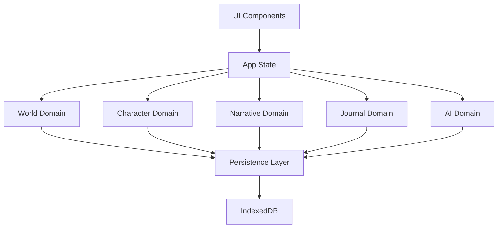

# State Management Architecture

## Overview

This document outlines the state management approach for the Narraitor application. The architecture follows a domain-driven design with separate state management for each core domain, combined with a persistence layer using IndexedDB.

## State Management Principles

1. **Domain Separation**: Each domain has its own state, reducer, and actions
2. **Immutable Updates**: State updates follow immutable patterns
3. **Type Safety**: All state operations are fully typed
4. **Persistence**: State changes are automatically persisted
5. **Context Providers**: State is made available via React Context

## Architecture Diagram



## Type System Integration

The state management system is built on top of the comprehensive type system defined in `/src/types`. This ensures type safety across all state operations.

### Core Type Definitions

```typescript
import { 
  World, 
  Character, 
  NarrativeSegment, 
  JournalEntry,
  GameSession,
  EntityID 
} from '@/types';
```

### Type-Safe State Structures

Each domain state interface uses the core types from the type system:

#### World Domain State
```typescript
interface WorldState {
  worlds: Record<EntityID, World>;  // Using EntityID from types
  currentWorldId: EntityID | null;
  loading: boolean;
  error: string | null;
}
```

#### Character Domain State
```typescript
interface CharacterState {
  characters: Record<EntityID, Character>;
  currentCharacterId: EntityID | null;
  selectedCharacterIds: EntityID[];
  loading: boolean;
  error: string | null;
}
```

#### Narrative Domain State
```typescript
interface NarrativeState {
  sessions: Record<EntityID, GameSession>;
  segments: Record<EntityID, NarrativeSegment>;
  currentSessionId: EntityID | null;
  loading: boolean;
  error: string | null;
}
```

#### Journal Domain State
```typescript
interface JournalState {
  entries: Record<EntityID, JournalEntry>;
  filters: JournalFilters;
  sortOrder: 'chronological' | 'significance';
  loading: boolean;
  error: string | null;
}

interface JournalFilters {
  types: JournalEntryType[];
  significance?: 'major' | 'minor';
  isRead?: boolean;
  sessionId?: EntityID;
}
```

#### AI Domain State
```typescript
interface AiState {
  provider: 'google' | 'openai' | 'mock';
  settings: AiSettings;
  contexts: Record<EntityID, AIContext>;  // Using AIContext from types
  loading: boolean;
  error: string | null;
}
```

## Zustand Integration (Future)

When implementing state management with Zustand, the type system will provide the foundation:

```typescript
import { create } from 'zustand';
import { persist } from 'zustand/middleware';
import { World, Character, GameSession, EntityID } from '@/types';

interface GameStore {
  // State using core types
  worlds: Record<EntityID, World>;
  characters: Record<EntityID, Character>;
  activeSession: GameSession | null;
  
  // Type-safe actions
  addWorld: (world: World) => void;
  updateCharacter: (id: EntityID, updates: Partial<Character>) => void;
  createSession: (worldId: EntityID, characterId: EntityID) => void;
  
  // Selectors
  getWorldById: (id: EntityID) => World | undefined;
  getCharactersByWorld: (worldId: EntityID) => Character[];
}

const useGameStore = create<GameStore>()(
  persist(
    (set, get) => ({
      // State
      worlds: {},
      characters: {},
      activeSession: null,
      
      // Actions
      addWorld: (world) => set((state) => ({
        worlds: { ...state.worlds, [world.id]: world }
      })),
      
      updateCharacter: (id, updates) => set((state) => ({
        characters: {
          ...state.characters,
          [id]: { ...state.characters[id], ...updates }
        }
      })),
      
      createSession: (worldId, characterId) => {
        const session: GameSession = {
          id: generateUniqueId('session'),
          worldId,
          characterId,
          state: {
            status: 'active',
            lastActivity: new Date().toISOString()
          },
          narrativeHistory: [],
          currentContext: {
            recentSegments: [],
            activeCharacters: [characterId]
          },
          createdAt: new Date().toISOString(),
          updatedAt: new Date().toISOString()
        };
        
        set({ activeSession: session });
      },
      
      // Selectors
      getWorldById: (id) => get().worlds[id],
      
      getCharactersByWorld: (worldId) => 
        Object.values(get().characters).filter(c => c.worldId === worldId)
    }),
    {
      name: 'narraitor-game-state',
      partialize: (state) => ({
        worlds: state.worlds,
        characters: state.characters,
        activeSession: state.activeSession
      })
    }
  )
);
```

## Type-Safe Actions

Domain-specific actions are defined using discriminated unions with proper typing:

```typescript
// Example for World Domain
type WorldAction = 
  | { type: 'ADD_WORLD'; payload: World }
  | { type: 'UPDATE_WORLD'; payload: { id: EntityID; updates: Partial<World> } }
  | { type: 'DELETE_WORLD'; payload: EntityID }
  | { type: 'SET_CURRENT_WORLD'; payload: EntityID }
  | { type: 'SET_LOADING'; payload: boolean }
  | { type: 'SET_ERROR'; payload: string | null };
```

## Type Guards for State Validation

When loading state from persistence, type guards ensure data integrity:

```typescript
import { isWorld, isCharacter, isJournalEntry } from '@/types';

// Example: Loading world from IndexedDB
async function loadWorld(id: EntityID): Promise<World | null> {
  const data = await db.get('worlds', id);
  
  if (isWorld(data)) {
    return data;
  }
  
  console.error('Invalid world data loaded from storage');
  return null;
}

// Example: Validating state on hydration
function hydrateState(savedState: unknown): GameState | null {
  if (!savedState || typeof savedState !== 'object') {
    return null;
  }
  
  const state = savedState as any;
  
  // Validate worlds
  if (state.worlds) {
    const validWorlds: Record<EntityID, World> = {};
    
    for (const [id, world] of Object.entries(state.worlds)) {
      if (isWorld(world)) {
        validWorlds[id] = world;
      }
    }
    
    state.worlds = validWorlds;
  }
  
  // Validate characters
  if (state.characters) {
    const validCharacters: Record<EntityID, Character> = {};
    
    for (const [id, character] of Object.entries(state.characters)) {
      if (isCharacter(character)) {
        validCharacters[id] = character;
      }
    }
    
    state.characters = validCharacters;
  }
  
  return state as GameState;
}
```

## Persistence Layer with Types

The persistence layer uses the type system for data validation:

### IndexedDB Schema

```typescript
import { World, Character, GameSession, JournalEntry } from '@/types';

interface DbSchema {
  worlds: {
    key: EntityID;
    value: World;
    indexes: {
      'by-theme': string;
      'by-created': string;
    };
  };
  characters: {
    key: EntityID;
    value: Character;
    indexes: {
      'by-world': EntityID;
      'by-player': EntityID;
    };
  };
  sessions: {
    key: EntityID;
    value: GameSession;
    indexes: {
      'by-world': EntityID;
      'by-character': EntityID;
      'by-status': string;
    };
  };
  journal: {
    key: EntityID;
    value: JournalEntry;
    indexes: {
      'by-session': EntityID;
      'by-type': JournalEntryType;
      'by-significance': string;
    };
  };
}
```

## State Access Patterns with Types

### Type-Safe Hooks

Each domain provides custom hooks with proper typing:

```typescript
// Example for World Domain
export function useWorlds(): World[] {
  const { state } = useContext(WorldContext);
  return Object.values(state.worlds);
}

export function useWorld(id: EntityID): World | undefined {
  const { state } = useContext(WorldContext);
  return state.worlds[id];
}

export function useWorldActions() {
  const { dispatch } = useContext(WorldContext);
  
  return {
    addWorld: (world: Omit<World, 'id' | 'createdAt' | 'updatedAt'>) => {
      const newWorld: World = {
        ...world,
        id: generateUniqueId('world'),
        createdAt: new Date().toISOString(),
        updatedAt: new Date().toISOString()
      };
      
      dispatch({ type: 'ADD_WORLD', payload: newWorld });
    },
    
    updateWorld: (id: EntityID, updates: Partial<World>) => {
      dispatch({
        type: 'UPDATE_WORLD',
        payload: { id, updates }
      });
    },
    
    deleteWorld: (id: EntityID) => {
      dispatch({ type: 'DELETE_WORLD', payload: id });
    }
  };
}
```

### Type-Safe Selectors

For complex state derivation with proper typing:

```typescript
// Example for Character Domain
export function useCharactersByWorld(worldId: EntityID): Character[] {
  const { state } = useContext(CharacterContext);
  
  return useMemo(
    () => Object.values(state.characters).filter(
      character => character.worldId === worldId
    ),
    [state.characters, worldId]
  );
}

// Example for Journal Domain
export function useJournalEntriesByType(
  type: JournalEntryType,
  sessionId?: EntityID
): JournalEntry[] {
  const { state } = useContext(JournalContext);
  
  return useMemo(() => {
    let entries = Object.values(state.entries).filter(
      entry => entry.type === type
    );
    
    if (sessionId) {
      entries = entries.filter(entry => entry.sessionId === sessionId);
    }
    
    return entries;
  }, [state.entries, type, sessionId]);
}
```

## Testing with Types

### Testing Type-Safe Reducers

```typescript
import { worldReducer, WorldAction, WorldState } from '@/state/world';
import { World } from '@/types';

describe('World Reducer', () => {
  it('should handle ADD_WORLD action', () => {
    const initialState: WorldState = {
      worlds: {},
      currentWorldId: null,
      loading: false,
      error: null
    };
    
    const newWorld: World = {
      id: 'world-1',
      name: 'Test World',
      theme: 'fantasy',
      attributes: [],
      skills: [],
      settings: {
        maxAttributes: 6,
        maxSkills: 8,
        attributePointPool: 27,
        skillPointPool: 20
      },
      createdAt: '2025-01-01T00:00:00Z',
      updatedAt: '2025-01-01T00:00:00Z'
    };
    
    const action: WorldAction = {
      type: 'ADD_WORLD',
      payload: newWorld
    };
    
    const newState = worldReducer(initialState, action);
    
    expect(newState.worlds[newWorld.id]).toEqual(newWorld);
    expect(Object.keys(newState.worlds)).toHaveLength(1);
  });
});
```

### Testing Type Validation

```typescript
import { isWorld, isCharacter } from '@/types';
import { loadStateFromStorage } from '@/state/persistence';

describe('State Persistence', () => {
  it('should validate loaded data with type guards', async () => {
    const mockData = {
      worlds: {
        'world-1': { /* invalid world data */ },
        'world-2': createMockWorld() // valid world data
      },
      characters: {
        'char-1': { /* invalid character data */ },
        'char-2': createMockCharacter() // valid character data
      }
    };
    
    const validatedState = await loadStateFromStorage(mockData);
    
    // Only valid data should be loaded
    expect(Object.keys(validatedState.worlds)).toHaveLength(1);
    expect(Object.keys(validatedState.characters)).toHaveLength(1);
    expect(validatedState.worlds['world-2']).toBeDefined();
    expect(validatedState.characters['char-2']).toBeDefined();
  });
});
```

## Best Practices for Type-Safe State Management

1. **Always use type guards** when loading data from external sources
2. **Define strict action types** using discriminated unions
3. **Create type-safe selectors** with proper memoization
4. **Validate state on persistence** to prevent corrupted data
5. **Use generics** for reusable state patterns
6. **Document complex type relationships** in code comments

## Migration Guide

When migrating from the current state management to Zustand:

1. Map existing reducers to Zustand actions
2. Convert Context providers to Zustand stores
3. Update hooks to use Zustand selectors
4. Implement persistence middleware
5. Add type validation on hydration
6. Update tests for new state patterns

The type system provides a solid foundation for this migration, ensuring type safety throughout the process.
