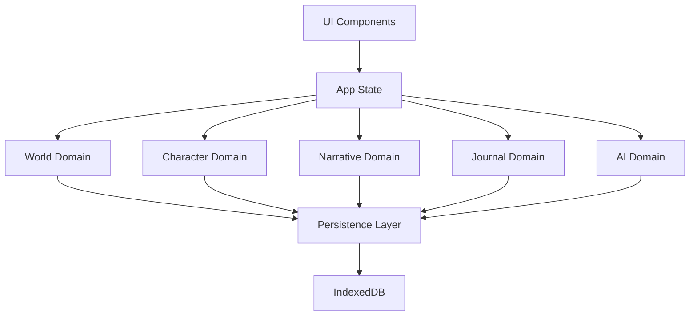

# State Management Architecture

## Overview

This document outlines the state management approach for the Narraitor application. The architecture follows a domain-driven design with separate state management for each core domain, combined with a persistence layer using IndexedDB.

## State Management Principles

1. **Domain Separation**: Each domain has its own state, reducer, and actions
2. **Immutable Updates**: State updates follow immutable patterns
3. **Type Safety**: All state operations are fully typed
4. **Persistence**: State changes are automatically persisted
5. **Context Providers**: State is made available via React Context

## Architecture Diagram



## Domain-Specific State

Each domain maintains its own state, following a consistent pattern:

### World Domain State
```typescript
interface WorldState {
  worlds: World[];
  currentWorldId: string | null;
  loading: boolean;
  error: string | null;
}
```

### Character Domain State
```typescript
interface CharacterState {
  characters: Character[];
  currentCharacterId: string | null;
  loading: boolean;
  error: string | null;
}
```

### Narrative Domain State
```typescript
interface NarrativeState {
  sessions: NarrativeSession[];
  currentSessionId: string | null;
  loading: boolean;
  error: string | null;
}
```

### Journal Domain State
```typescript
interface JournalState {
  entries: JournalEntry[];
  filters: JournalFilters;
  loading: boolean;
  error: string | null;
}
```

### AI Domain State
```typescript
interface AiState {
  provider: 'google' | 'openai' | 'mock';
  settings: AiSettings;
  loading: boolean;
  error: string | null;
}
```

## State Operations

Each domain implements its own set of operations following a consistent pattern:

### Actions
Domain-specific actions are defined using a type-safe approach:

```typescript
// Example for World Domain
type WorldAction = 
  | { type: 'ADD_WORLD'; payload: World }
  | { type: 'UPDATE_WORLD'; payload: { id: string; updates: Partial<World> } }
  | { type: 'DELETE_WORLD'; payload: string }
  | { type: 'SET_CURRENT_WORLD'; payload: string }
  | { type: 'SET_LOADING'; payload: boolean }
  | { type: 'SET_ERROR'; payload: string | null };
```

### Reducers
Each domain has a reducer that handles state updates immutably:

```typescript
// Example for World Domain
function worldReducer(state: WorldState, action: WorldAction): WorldState {
  switch (action.type) {
    case 'ADD_WORLD':
      return {
        ...state,
        worlds: [...state.worlds, action.payload],
        error: null
      };
    case 'UPDATE_WORLD':
      return {
        ...state,
        worlds: state.worlds.map(world => 
          world.id === action.payload.id 
            ? { ...world, ...action.payload.updates }
            : world
        ),
        error: null
      };
    // Other cases...
    default:
      return state;
  }
}
```

### Context Providers
State is made available to components via context providers:

```typescript
// Example for World Domain
export const WorldContext = createContext<{
  state: WorldState;
  dispatch: Dispatch<WorldAction>;
}>({
  state: initialWorldState,
  dispatch: () => null
});

export function WorldProvider({ children }: { children: ReactNode }) {
  const [state, dispatch] = useReducer(worldReducer, initialWorldState);
  
  // Add persistence side effects here
  
  return (
    <WorldContext.Provider value={{ state, dispatch }}>
      {children}
    </WorldContext.Provider>
  );
}
```

## Persistence Layer

The persistence layer handles automatic saving of state changes to IndexedDB:

### Implementation Strategy

1. **Middleware Approach**: Listen for state changes and persist relevant parts
2. **Batched Updates**: Throttle saves to prevent performance issues
3. **Selective Persistence**: Only persist what needs to be saved
4. **Error Handling**: Graceful fallbacks if persistence fails

### IndexedDB Structure

```typescript
interface DbSchema {
  worlds: {
    key: string; // World ID
    value: World;
  };
  characters: {
    key: string; // Character ID
    value: Character;
    indexes: {
      'by-world': string; // World ID
    };
  };
  narrativeSessions: {
    key: string; // Session ID
    value: NarrativeSession;
    indexes: {
      'by-world': string; // World ID
      'by-character': string; // Character ID
    };
  };
  journalEntries: {
    key: string; // Entry ID
    value: JournalEntry;
    indexes: {
      'by-session': string; // Session ID
    };
  };
}
```

## State Access Patterns

### Hooks for Component Access

Each domain provides custom hooks for accessing state:

```typescript
// Example for World Domain
export function useWorlds() {
  const { state } = useContext(WorldContext);
  return state.worlds;
}

export function useCurrentWorld() {
  const { state } = useContext(WorldContext);
  return state.worlds.find(world => world.id === state.currentWorldId);
}

export function useWorldActions() {
  const { dispatch } = useContext(WorldContext);
  
  return {
    addWorld: (world: Omit<World, 'id' | 'createdAt' | 'updatedAt'>) => {
      const now = new Date().toISOString();
      dispatch({ 
        type: 'ADD_WORLD', 
        payload: {
          ...world,
          id: crypto.randomUUID(),
          createdAt: now,
          updatedAt: now
        }
      });
    },
    // Other actions...
  };
}
```

### State Selectors

For more complex state derivation, we implement memoized selectors:

```typescript
// Example for Character Domain
export function useCharactersByWorld(worldId: string) {
  const { state } = useContext(CharacterContext);
  
  return useMemo(() => 
    state.characters.filter(character => character.worldId === worldId),
    [state.characters, worldId]
  );
}
```

## Testing Strategy

### Unit Testing Reducers

```typescript
// Example test for World Domain reducer
test('should add a world correctly', () => {
  const initialState = { worlds: [], currentWorldId: null, loading: false, error: null };
  const world = { id: '123', name: 'Test World', /* other properties */ };
  
  const newState = worldReducer(initialState, { type: 'ADD_WORLD', payload: world });
  
  expect(newState.worlds).toHaveLength(1);
  expect(newState.worlds[0]).toBe(world);
});
```

### Testing Context Providers

```typescript
// Example test for World Context Provider
test('should provide world state and dispatch', () => {
  const { result } = renderHook(() => useContext(WorldContext), {
    wrapper: ({ children }) => <WorldProvider>{children}</WorldProvider>
  });
  
  expect(result.current.state).toEqual(initialWorldState);
  expect(typeof result.current.dispatch).toBe('function');
});
```

## Implementation Plan

1. Define core state types and interfaces
2. Implement domain-specific reducers
3. Create context providers for each domain
4. Set up persistence layer with IndexedDB
5. Develop custom hooks for component access
6. Add test coverage for all state operations
