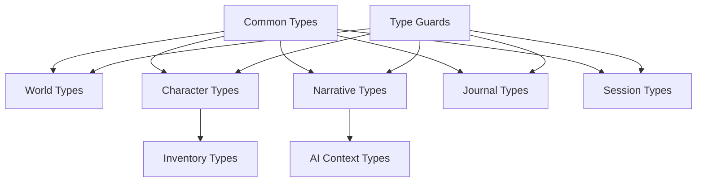

# Type System Documentation

The Narraitor type system provides comprehensive TypeScript interfaces and types for all core domains in the application. This document describes the type architecture, design decisions, and usage patterns.

## Overview

The type system is organized by domain, with each domain having its own type definition file. All types are centrally exported through an index file for easy importing.

## Architecture



## Core Design Principles

### 1. Domain Separation
Each domain has its own type file to maintain clear boundaries and prevent circular dependencies.

### 2. Type Inheritance
Common patterns are defined in base interfaces that domain-specific types extend:
- `TimestampedEntity`: Adds `createdAt` and `updatedAt`
- `NamedEntity`: Adds `id`, `name`, and optional `description`

### 3. Strict Typing
All properties are explicitly typed with no use of `any` except in type guards where necessary.

### 4. Immutability
Types are designed to work with immutable state patterns, using `readonly` where appropriate.

### 5. Extensibility
Types use optional properties and union types to allow for future expansion without breaking changes.

## Domain Types

### Common Types (`common.types.ts`)
- **EntityID**: String identifier used across all entities
- **Timestamp**: ISO 8601 date string for consistency
- **TimestampedEntity**: Base interface for entities with timestamps
- **NamedEntity**: Base interface for entities with names

### World Configuration (`world.types.ts`)
Defines the game world structure:
- **World**: Main world configuration with theme, attributes, and skills
- **WorldAttribute**: Character attributes available in the world
- **WorldSkill**: Skills that characters can learn
- **WorldSettings**: Constraints for character creation

### Character System (`character.types.ts`)
Character-related types:
- **Character**: Complete character data including attributes, skills, and inventory
- **CharacterAttribute**: Character's attribute values with modifiers
- **CharacterSkill**: Skill levels and experience
- **CharacterBackground**: Backstory, personality, and relationships
- **CharacterStatus**: Current health and conditions

### Inventory System (`inventory.types.ts`)
Item management types:
- **Inventory**: Container for character items
- **InventoryItem**: Individual items with category and quantity
- **InventoryCategory**: Organization system for items

### Narrative Engine (`narrative.types.ts`)
Story and decision types:
- **NarrativeSegment**: Story segments with metadata
- **Decision**: Choice points in the narrative
- **DecisionOption**: Individual choices with requirements
- **Consequence**: Results of decisions
- **NarrativeMetadata**: Mood, pacing, and tags

### Journal System (`journal.types.ts`)
Event tracking types:
- **JournalEntry**: Recorded game events
- **JournalEntryType**: Categories of events
- **RelatedEntity**: References to other game entities
- **JournalMetadata**: Additional entry information

### Session Management (`session.types.ts`)
Game state types:
- **GameSession**: Active game session data
- **SessionState**: Current session status
- **SavePoint**: Checkpoint information
- **NarrativeContext**: Current story context

### AI Integration (`ai-context.types.ts`)
AI service types:
- **AIContext**: Complete context for AI processing
- **AIPromptContext**: Structured prompt data
- **AIConstraint**: Generation constraints

## Type Guards

Runtime type validation functions are provided for major interfaces:

```typescript
// Check if unknown data is a valid World
if (isWorld(data)) {
  // TypeScript knows data is a World
  console.log(data.theme);
}
```

Available type guards:
- `isWorld()`
- `isCharacter()`
- `isInventoryItem()`
- `isNarrativeSegment()`
- `isJournalEntry()`

## Usage Patterns

### Creating New Entities

```typescript
import { World, EntityID } from '@/types';
import { generateUniqueId } from '@/lib/utils';

const newWorld: World = {
  id: generateUniqueId('world'),
  name: "Fantasy Realm",
  theme: "fantasy",
  attributes: [],
  skills: [],
  settings: {
    maxAttributes: 6,
    maxSkills: 8,
    attributePointPool: 27,
    skillPointPool: 20
  },
  createdAt: new Date().toISOString(),
  updatedAt: new Date().toISOString()
};
```

### Updating Entities

```typescript
// Type-safe partial updates
const updates: Partial<Character> = {
  name: "Updated Name",
  updatedAt: new Date().toISOString()
};

// Merge with existing character
const updatedCharacter: Character = {
  ...existingCharacter,
  ...updates
};
```

### Working with Collections

```typescript
// Type-safe collections using Record
type CharacterCollection = Record<EntityID, Character>;

const characters: CharacterCollection = {
  [character1.id]: character1,
  [character2.id]: character2
};

// Filter characters by world
const worldCharacters = Object.values(characters)
  .filter(char => char.worldId === worldId);
```

### Discriminated Unions

```typescript
// Decision requirements use discriminated unions
const requirement: DecisionRequirement = {
  type: 'skill',  // Discriminator
  targetId: 'skill-lockpicking',
  operator: 'gte',
  value: 5
};

// Type narrowing based on discriminator
if (requirement.type === 'skill') {
  // TypeScript knows this is a skill requirement
  console.log(`Requires skill: ${requirement.targetId}`);
}
```

## Integration with State Management

The type system is designed to work seamlessly with state management solutions:

### With Zustand

```typescript
import { create } from 'zustand';
import { World, Character, EntityID } from '@/types';

interface GameStore {
  worlds: Record<EntityID, World>;
  characters: Record<EntityID, Character>;
  
  addWorld: (world: World) => void;
  updateCharacter: (id: EntityID, updates: Partial<Character>) => void;
}
```

### With Context API

```typescript
import { createContext } from 'react';
import { World, Character } from '@/types';

interface GameContextType {
  worlds: World[];
  characters: Character[];
  currentWorldId: EntityID | null;
}

const GameContext = createContext<GameContextType>({
  worlds: [],
  characters: [],
  currentWorldId: null
});
```

## Extending the Type System

When adding new features:

1. **Create domain-specific types** in the appropriate file
2. **Extend base interfaces** where applicable
3. **Add type guards** for runtime validation
4. **Update exports** in index.ts
5. **Write tests** for new types
6. **Document** complex type relationships

Example of extending for a new feature:

```typescript
// Adding a combat system
interface CombatSession extends TimestampedEntity {
  id: EntityID;
  participants: EntityID[];
  rounds: CombatRound[];
  status: 'active' | 'completed';
}

interface CombatRound {
  actions: CombatAction[];
  effects: CombatEffect[];
}

// Add to index.ts exports
export type { CombatSession, CombatRound };
```

## Best Practices

1. **Use interfaces over types** for object shapes
2. **Prefer union types** over enums for string literals
3. **Document complex types** with JSDoc comments
4. **Validate external data** with type guards
5. **Keep types pure** - no business logic
6. **Use discriminated unions** for polymorphic types
7. **Design for immutability** in state management

## Common Patterns

### Optional Properties
```typescript
interface Character {
  playerId?: EntityID;  // Optional player association
  location?: string;    // Optional current location
}
```

### Union Types
```typescript
type JournalEntryType = 
  | 'character_event'
  | 'world_event'
  | 'relationship_change';
```

### Generic Collections
```typescript
type EntityCollection<T> = Record<EntityID, T>;
type WorldCollection = EntityCollection<World>;
```

### Nested Types
```typescript
interface Character {
  background: CharacterBackground;
  inventory: Inventory;
  status: CharacterStatus;
}
```

## Testing Types

Type definitions are tested to ensure:
1. Required fields are present
2. Optional fields work correctly
3. Type guards function properly
4. Nested structures validate
5. Union types are exhaustive

See `/src/types/__tests__/` for comprehensive type tests.

## Related Documentation

- [API Reference](/docs/api/types.md)
- [State Management](/docs/architecture/state-management.md)
- [Development Roadmap](/docs/development-roadmap.md)
