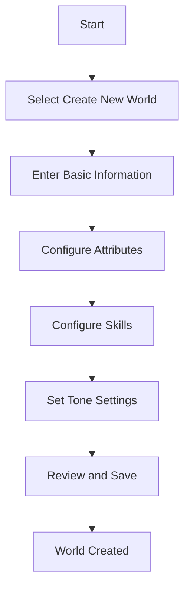
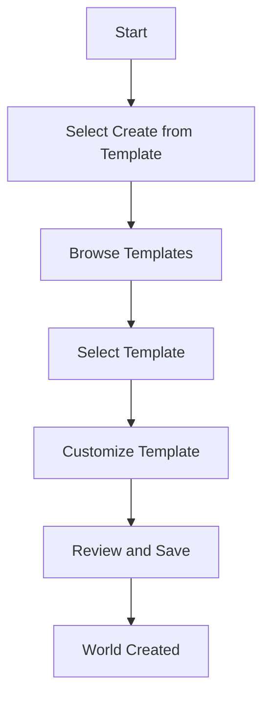
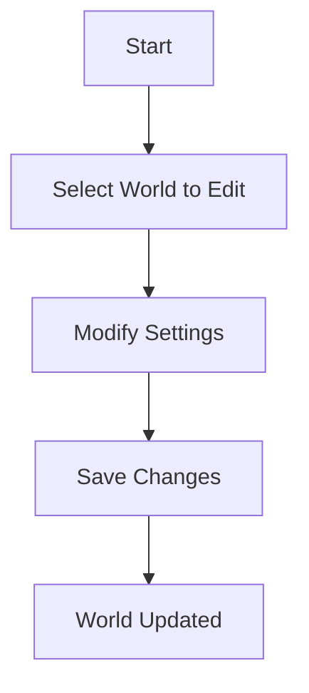

# World Configuration System

## Overview

The World Configuration System is the foundation of Narraitor, allowing users to define the parameters, tone, and mechanics of different fictional worlds. This system is designed to be flexible enough to support a wide range of genres while maintaining a consistent structure.

## Core Concepts

### World

A World represents a complete fictional setting with its own rules, tone, and characteristics. Each world includes:

- **Basic Information**: Name, description, genre, and visual theme
- **Attributes**: The core characteristics that define entities within the world
- **Skills**: Specific abilities that entities can develop
- **Tone Settings**: Parameters that control the narrative style and content
- **Narrative Elements**: Common tropes, themes, and narrative structures

### Attributes

Attributes are the fundamental characteristics that define characters and NPCs within a world. They are configurable per world, allowing different settings to focus on relevant traits. Each attribute includes:

- **Name**: The attribute's identifier (e.g., "Strength", "Intelligence")
- **Description**: What the attribute represents in the world
- **Range**: Minimum and maximum possible values
- **Default Value**: Starting value for new characters

### Skills

Skills represent specific abilities that characters can develop within a world. They are often associated with one or more attributes. Each skill includes:

- **Name**: The skill's identifier (e.g., "Marksmanship", "Persuasion")
- **Description**: What the skill represents in the world
- **Related Attributes**: Attributes that influence this skill
- **Range**: Minimum and maximum possible values
- **Default Value**: Starting value for new characters

### Tone Settings

Tone Settings control the narrative style and content generated by the AI. They help ensure that the narrative matches the world's genre and theme. Settings include:

- **Narrative Style**: How the AI presents the story (descriptive, concise, dramatic)
- **Content Rating**: Appropriate content level (family-friendly, teen, mature)
- **Pacing**: The rhythm and speed of narrative development
- **Thematic Elements**: Key themes to emphasize or avoid
- **Language Style**: Vocabulary and structure appropriate to the setting

## System Architecture

### Data Model

```typescript
interface World {
  id: string;
  name: string;
  description: string;
  theme: WorldTheme;
  attributes: AttributeDefinition[];
  skills: SkillDefinition[];
  toneSettings: ToneSettings;
  createdAt: string;
  updatedAt: string;
}

interface WorldTheme {
  primaryColor: string;
  secondaryColor: string;
  backgroundColor: string;
  fontFamily: string;
  imageryStyle: string;
}

interface AttributeDefinition {
  id: string;
  name: string;
  description: string;
  minValue: number;
  maxValue: number;
  defaultValue: number;
}

interface SkillDefinition {
  id: string;
  name: string;
  description: string;
  relatedAttributes: string[]; // IDs of attributes
  minValue: number;
  maxValue: number;
  defaultValue: number;
}

interface ToneSettings {
  narrativeStyle: 'descriptive' | 'concise' | 'dramatic' | 'humorous';
  pacePreference: 'slow' | 'moderate' | 'fast';
  contentRating: 'family' | 'teen' | 'mature';
  thematicElements: string[];
  languageStyle: 'formal' | 'casual' | 'period-appropriate';
}
```

### State Management

The World domain uses a dedicated reducer and context:

```typescript
type WorldAction = 
  | { type: 'ADD_WORLD'; payload: World }
  | { type: 'UPDATE_WORLD'; payload: { id: string; updates: Partial<World> } }
  | { type: 'DELETE_WORLD'; payload: string }
  | { type: 'SET_CURRENT_WORLD'; payload: string }
  | { type: 'IMPORT_WORLD'; payload: World }
  | { type: 'SET_LOADING'; payload: boolean }
  | { type: 'SET_ERROR'; payload: string | null };

interface WorldState {
  worlds: World[];
  currentWorldId: string | null;
  loading: boolean;
  error: string | null;
}
```

### Component Architecture

The World Configuration system includes the following key components:

- **WorldList**: Displays all available worlds with filtering options
- **WorldCreationWizard**: Step-by-step interface for creating a new world
- **WorldEditor**: Interface for modifying an existing world
- **AttributeEditor**: Management interface for world attributes
- **SkillEditor**: Management interface for world skills
- **ToneSettingsEditor**: Interface for configuring narrative tone
- **WorldTemplateSelector**: Selection of pre-defined world templates

## User Flows

### World Creation Flow



### World Template Usage Flow



### World Editing Flow



## Template Worlds

The system includes several pre-defined world templates to help users get started quickly:

### Western Template

A world set in the American Wild West, with attributes focused on physical capabilities, survival skills, and social interactions appropriate to the setting.

### Sitcom Template

A modern, comedic world set in everyday locations, with attributes focused on social interactions, humor, and relationships rather than physical conflict.

### Adventure Template

A high-fantasy adventure world with attributes focused on combat abilities, magical powers, and heroic traits.

## Integration Points

### Character System

- Provides attribute and skill definitions for character creation
- Defines the mechanical aspects of character capabilities

### Narrative Engine

- Provides tone settings to guide AI narrative generation
- Defines thematic elements and narrative style

### Journal System

- Provides world context for journal entries
- Determines the format and style of recorded events

## Implementation Plan

1. Define core data types and interfaces
2. Implement world state reducer and context
3. Create basic CRUD operations for worlds
4. Develop world editor components
5. Implement world template system
6. Add import/export functionality
7. Create test worlds

## Future Enhancements

- Custom narrative prompt templates per world
- Location management within worlds
- Faction and organization definitions
- Advanced mechanics beyond attributes and skills
- Visual customization of UI based on world theme
- AI-assisted world creation

## Success Criteria

The World Configuration System will be considered successful when:

1. Users can create, edit, and delete worlds
2. Worlds can be exported and imported
3. Template worlds demonstrate different genres
4. Worlds properly influence the narrative engine
5. The system supports character creation within the world context
