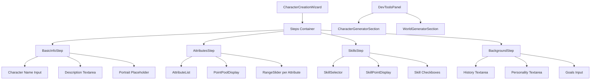

# Character Creation Wizard Implementation Plan

**Issue**: #115 - Create new character for enhanced player experience  
**Created**: 2025-05-22  
**Priority**: High (Foundational blocker)  

## Executive Summary

This document outlines the comprehensive implementation plan for the Character Creation Wizard, a critical foundational component that allows players to create characters within their configured worlds. The implementation includes a 4-step wizard with validation, auto-save functionality, and DevTools integration for rapid testing.

## Related Issues

### Follow-up Enhancements (Created)
- #392: Implement skill prerequisites based on minimum attribute values (Low Priority)
- #393: Add character creation templates for quick setup (Medium Priority)  
- #394: Implement character portrait and avatar system (Post-MVP)

## Architecture Overview

### System Flow

```mermaid
graph TB
    subgraph "Character Creation Flow"
        A[Character List Page] --> B[Create Character Button]
        B --> C{Current World?}
        C -->|No| D[Redirect to Worlds]
        C -->|Yes| E[Character Creation Wizard]
        
        E --> F[Step 1: Basic Info]
        F --> G[Step 2: Attributes]
        G --> H[Step 3: Skills]
        H --> I[Step 4: Background]
        I --> J[Create Character]
        J --> K[Navigate to Character Detail]
    end
    
    subgraph "DevTools Integration"
        L[DevToolsPanel] --> M[Character Generator]
        L --> N[World Generator]
        M --> O[Fill Wizard Fields]
        N --> P[Fill World Wizard]
    end
    
    subgraph "Auto-save System"
        Q[Field Blur Event] --> R[Save to SessionStorage]
        R --> S[Restore on Mount]
    end
```


### Component Structure


## Technical Design

### Data Flow
- User navigates from Character List → Create Character button
- Character Creation Wizard loads current world configuration from worldStore
- User progresses through 4 steps with validation blocking progression
- Auto-save triggers on field blur, storing to sessionStorage
- On completion, character is saved to characterStore
- User is automatically redirected to the new character's detail page

### Core Interfaces

```typescript
// Character Creation State
interface CharacterCreationState {
  currentStep: number;
  worldId: EntityID;
  characterData: {
    name: string;
    description: string;
    portraitPlaceholder: string; // Placeholder for future portrait system
    attributes: Array<{
      attributeId: EntityID;
      name: string;
      value: number;
      minValue: number;
      maxValue: number;
    }>;
    skills: Array<{
      skillId: EntityID;
      name: string;
      level: number;
      linkedAttributeId?: EntityID;
      isSelected: boolean;
    }>;
    background: {
      history: string;
      personality: string;
      goals: string[];
      motivation: string;
    };
  };
  validation: {
    [stepNumber: number]: {
      valid: boolean;
      errors: string[];
      touched: boolean; // Track if user has interacted with step
    };
  };
  pointPools: {
    attributes: {
      total: number;
      spent: number;
      remaining: number;
    };
    skills: {
      total: number;
      spent: number;
      remaining: number;
    };
  };
}

// Props for individual steps
interface StepProps {
  data: CharacterCreationState;
  onUpdate: (updates: Partial<CharacterCreationState['characterData']>) => void;
  onValidation: (valid: boolean, errors: string[]) => void;
  worldConfig: World;
}
```

## Implementation Details

### 1. Validation Strategy

Validation will prevent progression to the next step if current step has errors:

```typescript
const validateStep = (step: number): ValidationResult => {
  const errors: string[] = [];
  
  switch(step) {
    case 0: // Basic Info
      if (!data.name?.trim()) errors.push('Name is required');
      if (data.name.length < 3) errors.push('Name must be at least 3 characters');
      if (data.name.length > 50) errors.push('Name must be less than 50 characters');
      // Check uniqueness within world
      const existingCharacters = Object.values(characterStore.characters)
        .filter(c => c.worldId === worldId);
      if (existingCharacters.some(c => c.name === data.name)) {
        errors.push('A character with this name already exists in this world');
      }
      break;
      
    case 1: // Attributes
      const pointsSpent = data.attributes.reduce((sum, attr) => sum + attr.value, 0);
      if (pointsSpent !== world.settings.attributePointPool) {
        errors.push(`Must spend exactly ${world.settings.attributePointPool} points (${pointsSpent} spent)`);
      }
      break;
      
    case 2: // Skills
      const selectedSkills = data.skills.filter(s => s.isSelected);
      if (selectedSkills.length === 0) {
        errors.push('Select at least one skill');
      }
      if (selectedSkills.length > 8) {
        errors.push('Maximum 8 skills allowed');
      }
      break;
      
    case 3: // Background
      if (!data.background.history || data.background.history.length < 50) {
        errors.push('Character history must be at least 50 characters');
      }
      if (!data.background.personality || data.background.personality.length < 20) {
        errors.push('Personality description must be at least 20 characters');
      }
      break;
  }
  
  return { valid: errors.length === 0, errors };
};

// Navigation handler
const handleNext = () => {
  const validation = validateStep(currentStep);
  setValidation(prev => ({
    ...prev,
    [currentStep]: { ...validation, touched: true }
  }));
  
  if (!validation.valid) {
    return; // Block progression
  }
  
  setCurrentStep(currentStep + 1);
  autoSave();
};
```

### 2. Auto-save Implementation

Auto-save triggers on field blur and stores to sessionStorage:

```typescript
const useCharacterCreationAutoSave = (worldId: EntityID) => {
  const [data, setData] = useState<CharacterCreationState>();
  const saveKey = `character-creation-${worldId}`;
  
  // Save on field blur
  const handleFieldBlur = useCallback(() => {
    if (data) {
      sessionStorage.setItem(saveKey, JSON.stringify(data));
    }
  }, [data, saveKey]);
  
  // Restore on mount
  useEffect(() => {
    const saved = sessionStorage.getItem(saveKey);
    if (saved) {
      try {
        const parsed = JSON.parse(saved);
        setData(parsed);
      } catch (e) {
        console.error('Failed to restore character creation data', e);
      }
    }
  }, [saveKey]);
  
  // Clear on completion
  const clearAutoSave = useCallback(() => {
    sessionStorage.removeItem(saveKey);
  }, [saveKey]);
  
  return { handleFieldBlur, clearAutoSave };
};
```

### 3. Portrait Placeholder Implementation

Simple initials-based placeholder with gradient background:

```typescript
const CharacterPortraitPlaceholder: React.FC<{ name: string; className?: string }> = ({ 
  name, 
  className = '' 
}) => {
  const initials = name
    .split(' ')
    .map(n => n[0])
    .join('')
    .toUpperCase()
    .slice(0, 2);
    
  // Generate consistent color based on name
  const colorIndex = name.charCodeAt(0) % 5;
  const gradients = [
    'from-blue-500 to-purple-600',
    'from-green-500 to-teal-600',
    'from-orange-500 to-red-600',
    'from-pink-500 to-rose-600',
    'from-indigo-500 to-blue-600'
  ];
  
  return (
    <div 
      className={`
        bg-gradient-to-br ${gradients[colorIndex]}
        rounded-full flex items-center justify-center 
        text-white font-bold text-2xl w-24 h-24
        ${className}
      `}
      data-testid="character-portrait-placeholder"
    >
      {initials || '?'}
    </div>
  );
};
```

### 4. DevTools Test Data Generators

#### Character Generator
```typescript
const generateTestCharacter = (world: World): Partial<CharacterCreationState['characterData']> => {
  const firstNames = ['Aragorn', 'Gandalf', 'Frodo', 'Elara', 'Marcus', 'Luna', 'Kai', 'Zara'];
  const lastNames = ['Stormwind', 'Ironforge', 'Brightblade', 'Shadowmere', 'Goldleaf'];
  const descriptions = [
    'A brave warrior seeking redemption',
    'A wise sage with ancient knowledge',
    'An unlikely hero with a mysterious past',
    'A skilled ranger from the northern lands',
    'A charismatic leader with a silver tongue'
  ];
  
  const name = `${firstNames[Math.floor(Math.random() * firstNames.length)]} ${lastNames[Math.floor(Math.random() * lastNames.length)]}`;
  
  return {
    name,
    description: descriptions[Math.floor(Math.random() * descriptions.length)],
    attributes: distributePointsRandomly(world.attributes, world.settings.attributePointPool),
    skills: selectRandomSkills(world.skills, Math.floor(Math.random() * 5) + 3), // 3-8 skills
    background: {
      history: generateRandomHistory(world.theme),
      personality: generateRandomPersonality(),
      goals: generateRandomGoals(3),
      motivation: generateRandomMotivation()
    }
  };
};

// Helper functions
const distributePointsRandomly = (attributes: WorldAttribute[], totalPoints: number) => {
  const result = attributes.map(attr => ({
    attributeId: attr.id,
    name: attr.name,
    value: attr.minValue,
    minValue: attr.minValue,
    maxValue: attr.maxValue
  }));
  
  let remainingPoints = totalPoints - attributes.length * attributes[0].minValue;
  
  while (remainingPoints > 0) {
    const randomIndex = Math.floor(Math.random() * result.length);
    if (result[randomIndex].value < result[randomIndex].maxValue) {
      result[randomIndex].value++;
      remainingPoints--;
    }
  }
  
  return result;
};
```

#### World Generator
```typescript
const generateTestWorld = (): Partial<World> => {
  const themes = [
    { genre: 'fantasy', name: 'The Realm of Eldoria', description: 'A high fantasy world of magic and dragons' },
    { genre: 'sci-fi', name: 'Neo Terra 2185', description: 'A cyberpunk dystopia in the far future' },
    { genre: 'western', name: 'Dustwood County', description: 'A lawless frontier town in the old west' },
    { genre: 'modern', name: 'Metropolis Heights', description: 'A contemporary urban setting full of intrigue' }
  ];
  
  const selected = themes[Math.floor(Math.random() * themes.length)];
  
  return {
    name: `${selected.name} (Test ${Date.now()})`,
    description: selected.description,
    theme: selected.genre,
    attributes: generateGenreAttributes(selected.genre),
    skills: generateGenreSkills(selected.genre),
    settings: {
      maxAttributes: 6,
      maxSkills: 12,
      attributePointPool: 27,
      skillPointPool: 20
    }
  };
};
```

#### DevTools Panel Integration
```typescript
// New section for DevToolsPanel
export const TestDataGeneratorSection: React.FC = () => {
  const { worlds, createWorld } = worldStore();
  const { createCharacter } = characterStore();
  const router = useRouter();
  
  const handleGenerateWorld = () => {
    const testWorld = generateTestWorld();
    const worldId = createWorld(testWorld);
    toast.success(`Test world "${testWorld.name}" created!`);
  };
  
  const handleGenerateCharacter = () => {
    const currentWorld = worlds[worldStore.currentWorldId];
    if (!currentWorld) {
      toast.error('Please select a world first');
      return;
    }
    
    // Navigate to character creation with test data
    const testData = generateTestCharacter(currentWorld);
    sessionStorage.setItem(
      `character-creation-${currentWorld.id}-test`, 
      JSON.stringify(testData)
    );
    router.push('/characters/create?testMode=true');
  };
  
  return (
    <div className="space-y-4">
      <h3 className="font-bold text-sm">Test Data Generators</h3>
      
      <div className="space-y-2">
        <button
          onClick={handleGenerateWorld}
          className="w-full px-3 py-2 bg-blue-600 text-white rounded hover:bg-blue-700 text-sm"
        >
          Generate Test World
        </button>
        
        <button
          onClick={handleGenerateCharacter}
          className="w-full px-3 py-2 bg-green-600 text-white rounded hover:bg-green-700 text-sm"
        >
          Generate Test Character
        </button>
      </div>
      
      <p className="text-xs text-gray-400">
        Test data generators create randomized content for development testing.
      </p>
    </div>
  );
};
```

## File Structure

```
src/
├── components/
│   ├── CharacterCreationWizard/
│   │   ├── CharacterCreationWizard.tsx
│   │   ├── CharacterCreationWizard.stories.tsx
│   │   ├── CharacterCreationWizard.test.tsx
│   │   ├── index.ts
│   │   ├── steps/
│   │   │   ├── BasicInfoStep.tsx
│   │   │   ├── BasicInfoStep.test.tsx
│   │   │   ├── AttributesStep.tsx
│   │   │   ├── AttributesStep.test.tsx
│   │   │   ├── SkillsStep.tsx
│   │   │   ├── SkillsStep.test.tsx
│   │   │   ├── BackgroundStep.tsx
│   │   │   └── BackgroundStep.test.tsx
│   │   ├── components/
│   │   │   ├── AttributeAllocator.tsx
│   │   │   ├── SkillSelector.tsx
│   │   │   ├── PointPoolDisplay.tsx
│   │   │   └── CharacterPortraitPlaceholder.tsx
│   │   └── utils/
│   │       ├── validation.ts
│   │       ├── validation.test.ts
│   │       └── characterDefaults.ts
│   ├── devtools/
│   │   └── TestDataGeneratorSection/
│   │       ├── TestDataGeneratorSection.tsx
│   │       ├── TestDataGeneratorSection.test.tsx
│   │       └── generators/
│   │           ├── characterGenerator.ts
│   │           └── worldGenerator.ts
├── hooks/
│   ├── useCharacterCreationAutoSave.ts
│   └── useCharacterCreationAutoSave.test.ts
├── app/
│   ├── characters/
│   │   ├── page.tsx (update to add create button)
│   │   └── create/
│   │       └── page.tsx (new - wizard page)
│   └── dev/
│       └── character-creation/
│           └── page.tsx (test harness)
└── lib/
    └── utils/
        ├── characterValidation.ts
        └── characterValidation.test.ts
```

## Implementation Steps

1. **Define test cases (TDD approach)**
   - Character name validation tests
   - Attribute point allocation tests  
   - Skill selection limit tests
   - Background validation tests
   - Auto-save functionality tests
   - Integration with stores tests

2. **Create Storybook stories**
   - Individual step components in isolation
   - Complete wizard flow
   - Different world configurations
   - Error states and validation feedback
   - Loading and saving states

3. **Implement minimum code to pass tests**
   - Basic wizard container with step navigation
   - Individual step components
   - Validation utilities
   - Auto-save hook
   - Integration with worldStore and characterStore

4. **Create test harness pages**
   - Wizard with mock world data
   - Different world configurations (Fantasy, Western, Sitcom)
   - Test auto-save persistence
   - Error scenario testing

5. **DevTools integration**
   - Add TestDataGeneratorSection to DevToolsPanel
   - Implement character and world generators
   - Test with various scenarios

6. **Integration testing**
   - Full flow from character list to creation
   - Verify character appears in list after creation
   - Test with real world data
   - Verify persistence across page refreshes

7. **Polish and refinements**
   - Accessibility improvements
   - Responsive design verification
   - Performance optimization
   - Error handling improvements

## Test Plan

### Unit Tests
- Character name validation (required, length, uniqueness)
- Attribute point allocation (min/max values, total pool)
- Skill selection (max 8 skills, point allocation)
- Background validation (minimum length requirements)
- Auto-save hook functionality
- DevTools generator functions

### Storybook Stories
- 'Narraitor/Character/CharacterCreationWizard' - Full wizard
- 'Narraitor/Character/BasicInfoStep' - Step 1 isolation
- 'Narraitor/Character/AttributesStep' - Step 2 with different pools
- 'Narraitor/Character/SkillsStep' - Step 3 with skill limits
- 'Narraitor/Character/BackgroundStep' - Step 4 isolation
- 'Narraitor/Character/AttributeAllocator' - Point allocation component
- 'Narraitor/Character/SkillSelector' - Skill selection component
- 'Narraitor/Character/CharacterPortraitPlaceholder' - Portrait component

### Test Harness (/dev/character-creation)
- Test with Fantasy world (6 attributes, 12 skills)
- Test with Western world (different attributes/skills)
- Test auto-save persistence across browser refresh
- Test validation error scenarios
- Test point pool edge cases
- Test DevTools generator integration

### Integration Tests
- Complete character creation flow
- Verify character saved to store
- Verify navigation to character detail
- Test with missing world configuration
- Test DevTools generators creating valid data

## Success Criteria

- [x] Users can create a character through a 4-step wizard
- [x] Character names are validated for uniqueness within world
- [x] Validation blocks progression to next step if errors exist
- [x] Attribute points allocation respects world-defined pools
- [x] Maximum 8 skills can be selected per character
- [x] Background information meets minimum requirements
- [x] Auto-save preserves progress between steps on field blur
- [x] Created characters appear in character list
- [x] Navigation goes directly to character detail after creation
- [x] Portrait placeholder shows character initials
- [x] DevTools provides "Generate Character" functionality
- [x] DevTools provides "Generate World" functionality
- [x] All tests pass with >90% coverage
- [x] Stories follow 'Narraitor/[Category]/[Component]' naming

## Technical Notes

- **Character/World type alignment**: Using the simplified types from characterStore rather than the more complex character.types.ts
- **Placeholder portrait**: Simple initials with gradient background, preparing UI for future portrait system
- **Session storage key**: Using world-specific keys to avoid conflicts between different character creation sessions
- **Point pool calculations**: Real-time updates with RangeSlider component, visual feedback for remaining points
- **Skill categories**: Display skills grouped by category if defined in world configuration
- **Error display**: Following WorldCreationWizard pattern - inline errors under fields
- **Navigation**: Three-button layout (Back, Cancel, Next) consistent with existing wizard

## Out of Scope

- Character portrait/avatar selection (placeholder only)
- Skill prerequisites based on attribute values (issue #392)
- Character templates for quick creation (issue #393)
- Import/export character functionality
- Character duplication
- Advanced relationship management
- Character progression/leveling system

## Dependencies

### Existing Components to Reuse
- `RangeSlider` from `/src/components/ui/RangeSlider`
- Button styles from WorldCreationWizard
- Error display patterns from WorldCreationWizard steps
- Step indicator pattern from WorldCreationWizard
- Form input styles from existing components

### Stores
- `worldStore` - For accessing current world configuration
- `characterStore` - For saving created characters

### Utilities
- `generateUniqueId()` - For generating character IDs
- `logger` - For debugging and error logging
- `textFormatter` - For formatting background text

## Future Enhancements

Based on the created follow-up issues:
- #392: Add skill prerequisites system
- #393: Implement character templates
- #394: Add portrait/avatar system
- Character import/export functionality
- Character comparison view
- Character sheet printing functionality
- Batch character creation for NPCs
