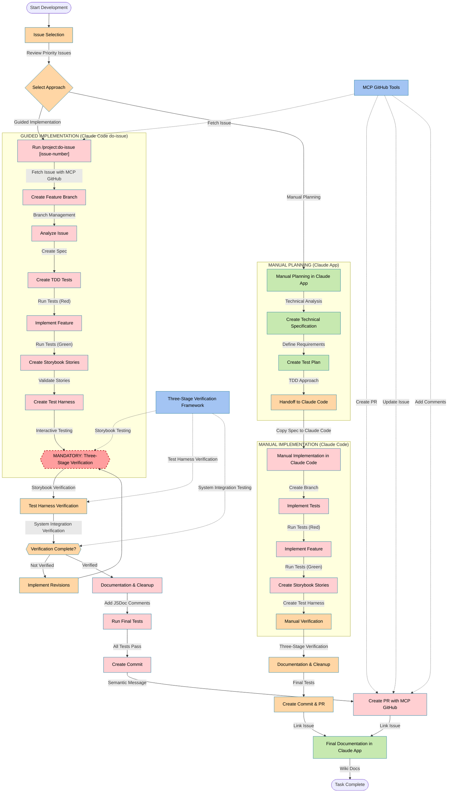

# Complete Narraitor Development Workflow

## End-to-End Development Process with Claude App & Claude Code Integration



## Key

- <span style="color:#227c9d;background-color:#c7e9b0;padding:3px 5px;border-radius:3px;">Claude App Tasks</span>: High-level planning, specifications, test planning
- <span style="color:#227c9d;background-color:#ffcfd2;padding:3px 5px;border-radius:3px;">Claude Code Tasks</span>: Implementation, automated testing, git operations
- <span style="color:#227c9d;background-color:#ffd6a5;padding:3px 5px;border-radius:3px;">Manual Tasks</span>: Human review, verification, edge case testing
- <span style="color:#b71c1c;background-color:#ff9e9e;padding:3px 5px;border-radius:3px;">Verification Gates</span>: Mandatory verification points
- <span style="color:#227c9d;background-color:#a3c4f3;padding:3px 5px;border-radius:3px;">Integration Tools</span>: MCP tools and frameworks

## Development Approaches

This flowchart shows two main development approaches:

### 1. Guided Implementation with do-issue

The `/project:do-issue` command provides a guided, structured workflow for implementing GitHub issues:

1. **Issue Analysis**: Automatically fetches issue details using MCP GitHub tools
2. **Branch Management**: Creates a feature branch with proper naming convention
3. **Test-Driven Development**: Creates tests before implementation
4. **Three-Stage Verification**: Includes a mandatory verification checkpoint
5. **PR Creation**: Creates a PR using MCP GitHub tools and links to the issue

Benefits:
- Consistent implementation process
- Reduced manual steps
- Automatic GitHub integration
- Built-in verification framework
- Reduced context switching

### 2. Manual Planning Approach

For more complex issues or when you need more detailed planning:

1. **Manual Planning in Claude App**: Create detailed specifications and test plans
2. **Manual Handoff to Claude Code**: Transfer the specifications to Claude Code
3. **Manual Implementation**: Implement the feature with Claude Code's guidance
4. **Manual Verification**: Perform the Three-Stage Verification process
5. **Manual PR Creation**: Create a commit and PR

Benefits:
- More flexibility for complex issues
- Deeper planning phase
- Custom implementation approaches

## MCP GitHub Tools Integration

The workflow integrates MCP GitHub tools for seamless GitHub operations:

1. **Fetch Issue Details**: Get issue information without permission prompts
2. **Create Pull Requests**: Create PRs with proper templates and linking
3. **Update Issues**: Update issue status and add comments
4. **Add Comments**: Document implementation details in issue comments

## Three-Stage Verification Framework

A critical part of both workflows is the Three-Stage Verification Framework:

1. **Stage 1: Storybook Testing**
   - Component isolation testing
   - Visual appearance verification
   - Variant and state testing

2. **Stage 2: Test Harness Verification**
   - Interactive testing with controlled data
   - State transitions and edge cases
   - Integration with parent components

3. **Stage 3: System Integration Verification**
   - Full application context testing
   - Real data and state management
   - Cross-component interactions

This verification framework is **mandatory** - the workflow will not proceed until verification is complete.

## Workflow Steps Detail

### Using the Guided Implementation Approach

1. **Start with the do-issue command**:
   ```bash
   cd /Users/jackhaas/Projects/narraitor
   claude
   /project:do-issue 123
   ```

2. **Follow the guided workflow**:
   - The script creates a feature branch
   - It analyzes the issue and creates a technical specification
   - It implements tests following TDD principles
   - It implements the feature to make tests pass
   - It creates Storybook stories and a test harness

3. **Complete the mandatory verification**:
   - Follow the Three-Stage Verification framework
   - Verify in Storybook, test harness, and system integration
   - Type "C" to continue only after successful verification

4. **Finalize the implementation**:
   - The script will add documentation and clean up the code
   - It will run final tests to ensure everything passes
   - It will create a commit with a semantic message
   - It will create a PR using MCP GitHub tools

### Using the Manual Planning Approach

1. **Start with planning in Claude App**:
   - Analyze the issue and requirements
   - Create a detailed technical specification
   - Define a test plan with acceptance criteria

2. **Transition to Claude Code**:
   - Copy the specification to Claude Code
   - Create a feature branch manually
   - Implement tests and features with Claude Code's guidance

3. **Perform verification**:
   - Follow the Three-Stage Verification framework
   - Make any necessary revisions

4. **Finalize and document**:
   - Create a commit and PR
   - Document the implementation in Claude App

## Best Practices

1. **Choose the right approach**:
   - Use the guided `/project:do-issue` approach for well-defined, standard issues
   - Use the manual planning approach for complex issues needing deeper analysis

2. **Never skip verification**:
   - The Three-Stage Verification framework is mandatory
   - All three stages must be completed successfully

3. **Leverage MCP GitHub tools**:
   - Use MCP GitHub tools instead of `gh` CLI commands
   - Fall back to helper scripts only when necessary

4. **Document thoroughly**:
   - Add JSDoc comments to code
   - Create wiki documentation for significant components
   - Include usage examples and edge cases

## Automation and Manual Points

The workflow balances automation and human judgment:

- **Automated**: Issue fetching, test creation, implementation, PR creation
- **Manual**: Selection of approach, verification, final approval

This balance ensures efficiency while maintaining quality and control.
