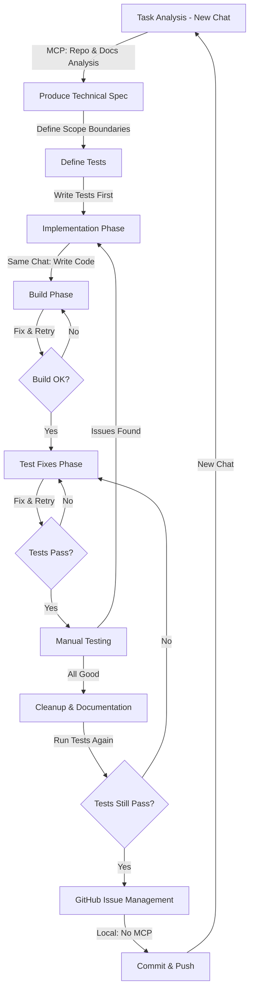

# Updated Claude App Development Workflow

> [!note] 
> Optimized development workflow using Claude's app interface with MCP tools, designed for test-driven development with a KISS (Keep It Simple, Stupid) mindset and strict scope control. This workflow puts the build phase before test fixes phase, supports IDE integration via Cline/Roo, and includes updated prompt templates.

## Development Flow

## Key Updates to Workflow
1. **Build Phase Before Test Fixes**: This ensures code compiles correctly before trying to fix test issues
2. **IDE Integration**: Option to use Claude via Cline/Roo in IDE for build and test phases
3. **Copyable Prompt Templates**: Templates are now easily copied with a single click from Obsidian
4. **Naming Conventions**: Standardized approach for AI-generated code naming

## IDE vs Claude.ai App Selection
- **Claude.ai App**: Preferred for analysis, planning, and complex implementation tasks
- **IDE via Cline/Roo**: Alternative for build and test fixes phases to conserve Claude.ai usage
  - Auto-approve changes option speeds up workflow
  - Useful for rapid iterations on build errors and test failures

## Workflow Phases

### 1. Task Analysis (New Chat)
**Purpose:** Select and plan next most valuable task
**Output:** Technical specification as artifact with clear scope boundaries

Start each task with a fresh chat using the Analysis & Planning prompt template.

**Key MCP Tools:**
- `list_directory` to explore repo structure
- `read_file` for roadmaps and issues
- `search_files` to find related code

**Expected Output:**
- Technical specification as an artifact
- Implementation steps prioritizing simplicity
- Files that need to be modified
- **Explicit scope boundaries and constraints**

### 2. Define Tests First (Same Chat)
**Purpose:** Apply TDD principles by defining expected behavior
**Output:** Test specifications as artifacts

Before writing implementation code, use the Define Tests prompt template.

**Key MCP Tools:**
- `read_file` to examine existing test files
- `search_files` to find similar test patterns

**Test Format:**
- Provide test code as artifacts
- Focus on the minimum tests needed to verify functionality
- Include data-testid attributes needed for testing
- Ensure tests only cover functionality within scope

### 3. Implementation Phase (Same Chat)
**Purpose:** Write minimal code to make tests pass
**Output:** Code artifacts that implement ONLY specified functionality

After defining tests, proceed to implementation using the Implementation Phase prompt template.

**Key MCP Tools:**
- `read_file` to examine existing similar components
- `read_multiple_files` to understand patterns

**Code Format:**
- Provide implementation code as artifacts
- Focus on making tests pass with minimal complexity
- Include only what's needed, avoid premature optimization
- Stay strictly within defined scope boundaries

### 4. Build Phase (Same Chat or IDE)
**Purpose:** Resolve any build errors
**Output:** Fixed code that builds successfully

After implementation, use the Build Phase prompt template or switch to IDE with Cline/Roo.

**When to use IDE:**
- Rapid iterative fixes are needed
- Auto-approve option is beneficial
- Claude.ai usage conservation is important

**Iterative Process:**
- Fix build errors first before proceeding to tests
- Return to implementation if substantial changes needed
- Only move forward when build succeeds
- Ensure fixes respect scope boundaries

### 5. Test Fixes Phase (Same Chat or IDE)
**Purpose:** Ensure tests pass
**Output:** Working code verified by tests

After build issues are fixed, use the Test Fixes Phase prompt template or continue in IDE.

**When to use IDE:**
- Multiple test iterations are likely
- Auto-approve option speeds up workflow
- Claude.ai usage conservation is important

**Iterative Process:**
- Fix failing tests one by one
- Return to implementation if substantial changes needed
- Only move forward when all tests pass
- Maintain scope boundaries when fixing tests

### 6. Manual Testing (Same Chat)
**Purpose:** Verify user experience
**Output:** Final adjustments for real-world usage

After tests pass, use the Manual Testing prompt template.

**Feedback Loop:**
- Document issues found during manual testing
- Return to implementation if issues require code changes
- Run both build and tests again after changes
- Keep all fixes within scope boundaries

### 7. Cleanup & Documentation (Same Chat)
**Purpose:** Clean up code and update documentation
**Output:** Clean codebase, updated documentation

After all testing is successful, use the Cleanup & Documentation prompt template.

**Key MCP Tools:**
- `read_file` on existing docs to maintain consistency
- `search_files` to find places needing docs updates

**Important:** Always run tests again after cleanup to ensure nothing broke. Maintain strict scope boundaries in documentation.

### 8. GitHub Issue Management
**Purpose:** Track work and maintain project backlog
**Output:** Updated GitHub issues

Use the GitHub Issue Management prompt template to finalize the feature.

## Related Documents
- [[tdd-with-kiss|Test-Driven Development with KISS]]
- [[kiss-principles-react|KISS Principles for React]]
- [[claude-app-mcp-optimization|MCP Optimization Guide]]
- [[claude-app-prompt-templates-old|Prompt Templates]]
- [[coding-naming-conventions|Coding Naming Conventions]]
