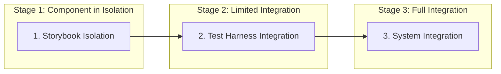

# Component Isolation Strategy

## Overview
This document outlines the approach for developing components in isolation before integration into larger systems. This strategy ensures components are fully tested and functional on their own, reducing integration issues and making the codebase more maintainable.

## Three-Stage Testing Approach



### 1. Storybook Isolation
- Component is developed with Storybook first
- All variants and states are tested in isolation
- Mock data and props simulate real usage
- No external dependencies or context providers

### 2. Test Harness Integration
- Component is tested in a dedicated test harness page
- Limited integration with specific dependencies
- Real-time manipulation of props and state
- Controlled environment separate from main application

### 3. System Integration
- Component is integrated into the full application
- Real data and context providers are used
- Integration testing verifies proper behavior
- End-to-end testing confirms user flows

## Implementation Guidelines

### Setting Up Storybook for Isolation

1. **Mock Data Generation**
```typescript
// /src/mocks/narrative-mocks.ts
export const mockNarrativeText = `
  The dusty trail stretched before you as the sun beat down on your shoulders.
  The town of Redemption lay just beyond the horizon, promising respite from
  your long journey.
`;

export const mockPlayerChoices = [
  { id: 'choice1', text: 'Head straight into town' },
  { id: 'choice2', text: 'Rest by the creek first' },
  { id: 'choice3', text: 'Approach cautiously and observe' }
];
```

2. **Storybook Component Setup**
```typescript
// /src/components/narrative/NarrativeDisplay.stories.tsx
import { NarrativeDisplay } from './NarrativeDisplay';
import { mockNarrativeText, mockPlayerChoices } from '../../mocks/narrative-mocks';

export default {
  title: 'Game/NarrativeDisplay',
  component: NarrativeDisplay,
  parameters: {
    // Storybook parameters
  },
  argTypes: {
    // Storybook controls
  }
};

export const Default = {
  args: {
    narrativeText: mockNarrativeText,
    playerChoices: mockPlayerChoices,
    onChoiceSelected: (choiceId) => console.log(`Choice selected: ${choiceId}`),
    isLoading: false
  }
};

export const Loading = {
  args: {
    ...Default.args,
    isLoading: true
  }
};

export const Error = {
  args: {
    ...Default.args,
    error: 'Failed to generate narrative content'
  }
};
```

### Creating Test Harnesses

1. **Dedicated Test Page**
```typescript
// /src/app/dev/narrative-test/page.tsx
'use client';

import { useState } from 'react';
import { NarrativeDisplay } from '@/components/narrative/NarrativeDisplay';
import { mockNarrativeText, mockPlayerChoices } from '@/mocks/narrative-mocks';
import { DevControls } from '@/components/dev/DevControls';

export default function NarrativeTestPage() {
  const [narrativeText, setNarrativeText] = useState(mockNarrativeText);
  const [playerChoices, setPlayerChoices] = useState(mockPlayerChoices);
  const [isLoading, setIsLoading] = useState(false);
  const [error, setError] = useState<string | null>(null);
  
  // Test harness controls
  const handleChoiceSelected = (choiceId: string) => {
    console.log(`Choice selected: ${choiceId}`);
    setIsLoading(true);
    
    // Simulate AI response delay
    setTimeout(() => {
      setNarrativeText(`You selected ${choiceId}. New narrative content would appear here.`);
      setIsLoading(false);
    }, 1500);
  };
  
  return (
    <div className="p-4">
      <h1 className="text-2xl font-bold mb-4">Narrative Component Test Harness</h1>
      
      <div className="flex gap-4">
        <div className="w-2/3 border rounded p-4">
          <NarrativeDisplay
            narrativeText={narrativeText}
            playerChoices={playerChoices}
            onChoiceSelected={handleChoiceSelected}
            isLoading={isLoading}
            error={error}
          />
        </div>
        
        <DevControls
          controls={[
            {
              label: 'Toggle Loading',
              action: () => setIsLoading(!isLoading)
            },
            {
              label: 'Simulate Error',
              action: () => setError(error ? null : 'Simulated error occurred')
            },
            {
              label: 'Reset Content',
              action: () => {
                setNarrativeText(mockNarrativeText);
                setPlayerChoices(mockPlayerChoices);
                setError(null);
              }
            }
          ]}
          state={{
            narrativeText,
            playerChoices,
            isLoading,
            error
          }}
        />
      </div>
    </div>
  );
}
```

2. **Dev Tools Component**
```typescript
// /src/components/dev/DevControls.tsx
'use client';

import React from 'react';

interface ControlAction {
  label: string;
  action: () => void;
}

interface DevControlsProps {
  controls: ControlAction[];
  state: Record<string, any>;
}

export function DevControls({ controls, state }: DevControlsProps) {
  return (
    <div className="w-1/3 border rounded p-4 bg-gray-50">
      <h2 className="text-lg font-semibold mb-4">Dev Controls</h2>
      
      <div className="space-y-2 mb-6">
        {controls.map((control, index) => (
          <button
            key={index}
            onClick={control.action}
            className="px-3 py-1 bg-blue-500 text-white rounded hover:bg-blue-600 mr-2"
          >
            {control.label}
          </button>
        ))}
      </div>
      
      <div>
        <h3 className="text-md font-semibold mb-2">Current State</h3>
        <pre className="bg-gray-100 p-2 rounded text-xs overflow-auto max-h-96">
          {JSON.stringify(state, null, 2)}
        </pre>
      </div>
    </div>
  );
}
```

### Mock Service Providers

```typescript
// /src/mocks/ai-service-mock.ts
import { delay } from '@/lib/utils';

export class MockAIService {
  private responseMap: Record<string, string> = {
    'default': 'The AI responds with a general narrative.',
    'choice1': 'You decided to head straight into town. As you approach, you notice the streets are unusually empty.',
    'choice2': 'You rest by the creek, enjoying the cool water. After a while, you hear horses approaching.',
    'choice3': 'From your vantage point, you observe several armed individuals patrolling the town entrance.'
  };
  
  private errorProbability = 0;
  
  constructor(options?: { errorProbability?: number, customResponses?: Record<string, string> }) {
    if (options?.errorProbability) {
      this.errorProbability = options.errorProbability;
    }
    
    if (options?.customResponses) {
      this.responseMap = { ...this.responseMap, ...options.customResponses };
    }
  }
  
  async generateNarrative(prompt: string, context: any): Promise<string> {
    // Simulate network delay
    await delay(1000 + Math.random() * 1000);
    
    // Simulate random errors
    if (Math.random() < this.errorProbability) {
      throw new Error('AI service connection failed');
    }
    
    // Return mapped response or default
    const choiceId = context.lastChoiceId || 'default';
    return this.responseMap[choiceId] || this.responseMap.default;
  }
  
  async generateChoices(context: any): Promise<Array<{ id: string, text: string }>> {
    // Simulate network delay
    await delay(800 + Math.random() * 800);
    
    // Simulate random errors
    if (Math.random() < this.errorProbability) {
      throw new Error('AI service connection failed');
    }
    
    // Return default choices
    return [
      { id: 'choice1', text: 'Investigate further' },
      { id: 'choice2', text: 'Proceed with caution' },
      { id: 'choice3', text: 'Change your approach' }
    ];
  }
}
```

## Integration Strategy

### Phase 1: Component Development in Storybook
1. Define component props interface
2. Create mock data for all component states
3. Implement component with internal state management
4. Write Storybook stories for all variations
5. Test component thoroughly in Storybook
6. Implement unit tests based on Stories

### Phase 2: Test Harness Validation
1. Create dedicated test harness page
2. Implement state manipulation controls
3. Add mock service providers if needed
4. Test component interactivity
5. Validate error handling
6. Confirm all variants work as expected

### Phase 3: System Integration
1. Integrate component into parent system
2. Connect to actual data sources and services
3. Implement context providers
4. Test component in real application flow
5. Verify integration with other components
6. Run end-to-end tests for user flows

## Best Practices

### Component Design for Isolation
1. **Prop-Based Configuration**: Components should accept all required data via props
2. **Minimal Dependencies**: Limit dependencies on external contexts and services
3. **Controlled Components**: Implement controlled components pattern where state is managed by parent
4. **Error Boundaries**: Include error handling for all external dependencies
5. **Loading States**: Support loading states for asynchronous operations

### Mock Data Management
1. **Realistic Mocks**: Create mock data that closely resembles production data
2. **Edge Cases**: Include mocks for edge cases and error conditions
3. **Typed Mocks**: Ensure all mock data follows proper TypeScript interfaces
4. **Shared Mocks**: Centralize mock data for reuse across stories and tests
5. **Variant Coverage**: Create mocks for all component variations

### Integration Testing
1. **Incremental Integration**: Integrate components incrementally, not all at once
2. **Mock Boundaries**: Mock dependencies at system boundaries
3. **Integration Tests**: Write specific tests for component interactions
4. **User Flow Testing**: Test complete user flows with integrated components
5. **Performance Testing**: Evaluate performance impact of integration

## Common Isolated Components

| Component Type | Isolation Strategy | Mock Requirements |
|----------------|-------------------|-------------------|
| UI Components | Pure presentational components with props | Mock display data |
| Form Components | Controlled components with callbacks | Mock submission handlers |
| Data Display | Components with mock data providers | Mock data records |
| Interactive Elements | State managed internally or via props | Mock interaction handlers |
| AI-Dependent Components | Mock AI service implementation | Predefined AI responses |

## Related Documents
- [[storybook-workflow|Storybook Workflow]]
- [[tdd-with-kiss|Test-Driven Development with KISS]]
- [[feature-development-workflow|Feature Development Workflow]]