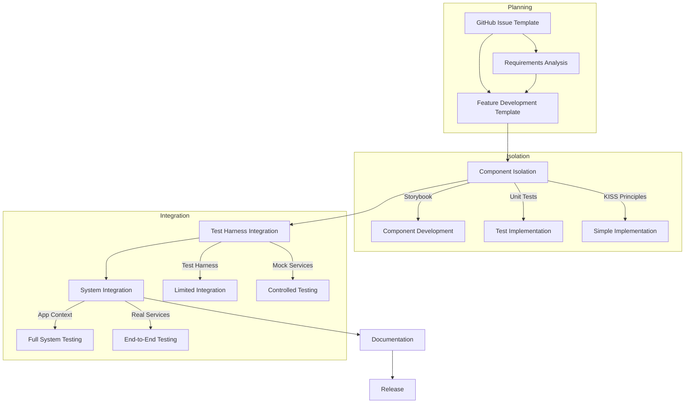
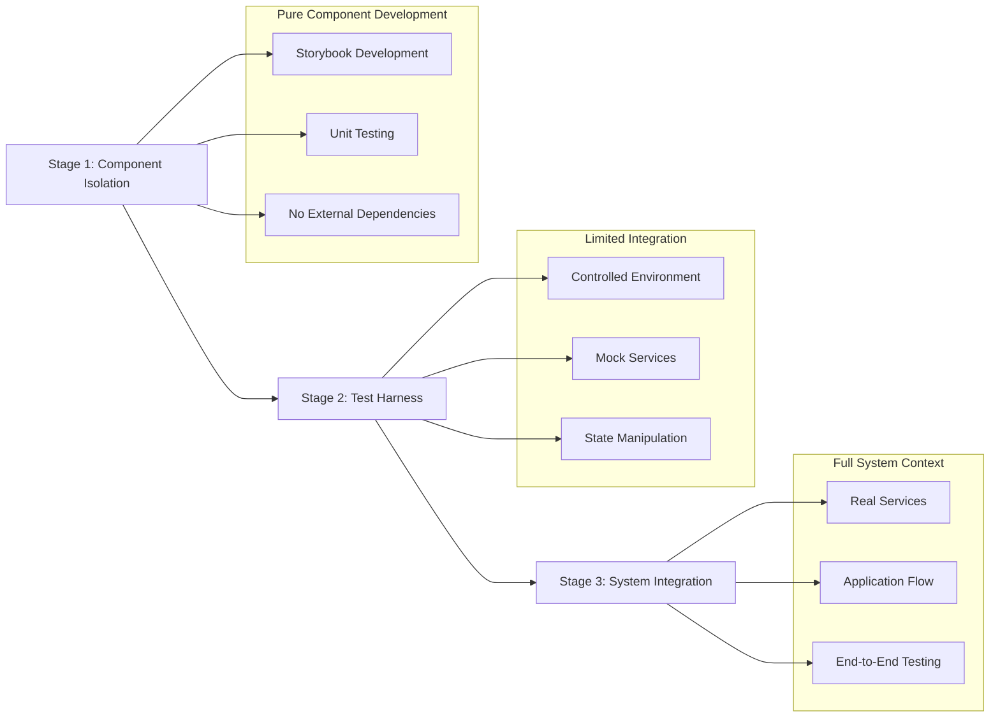

# Feature Development Workflow with Next.js

> [!info]
> Comprehensive workflow for developing features using Next.js App Router and KISS principles.

## Workflow Overview



## Component-First Development Approach

The NarrAItor project follows a strict component-first development approach where:

1. Components are developed in complete isolation first
2. Testing happens in stages from isolation to integration
3. Integration occurs only after components are fully functional

### Three-Stage Development Process



## 1. Issue Creation
- Create a new GitHub issue using an existing issue template
- Define requirements, acceptance criteria, and priority
- Get approval to proceed with development

## 2. Technical Planning
- Create a Feature Development document using the template
- Define component architecture and data flow
- Identify server vs. client components
- Plan implementation approach
- Determine appropriate testing stages

## 3. Stage 1: Component Isolation

### Storybook-First Development
- Create Storybook stories before implementation
- Define component props interface
- Test all variants and states
- Develop and test in complete isolation

```typescript
// Example component in isolation
// components/narrative/NarrativeDisplay.tsx
import React from 'react';

interface NarrativeDisplayProps {
  narrativeText: string;
  isLoading?: boolean;
  error?: string | null;
}

export function NarrativeDisplay({ 
  narrativeText, 
  isLoading = false,
  error = null
}: NarrativeDisplayProps) {
  if (isLoading) {
    return <div data-testid="loading-indicator">Loading narrative...</div>;
  }
  
  if (error) {
    return <div data-testid="error-message" className="text-red-500">{error}</div>;
  }
  
  return (
    <div className="narrative-display" data-testid="narrative-text">
      {narrativeText.split('\n').map((paragraph, index) => (
        <p key={index} className="mb-4">{paragraph}</p>
      ))}
    </div>
  );
}
```

```typescript
// Storybook story
// components/narrative/NarrativeDisplay.stories.tsx
import { NarrativeDisplay } from './NarrativeDisplay';

export default {
  title: 'Game/NarrativeDisplay',
  component: NarrativeDisplay,
  parameters: {
    // Storybook parameters
  }
};

export const Default = {
  args: {
    narrativeText: 'This is an example narrative passage.\n\nIt contains multiple paragraphs to demonstrate text formatting.'
  }
};

export const Loading = {
  args: {
    narrativeText: '',
    isLoading: true
  }
};

export const Error = {
  args: {
    narrativeText: '',
    error: 'Failed to generate narrative content.'
  }
};
```

### TDD Approach
- Write unit tests before implementation
- Test component behavior in isolation
- Mock all external dependencies
- Focus on pure component functionality

```typescript
// Unit tests
// components/narrative/NarrativeDisplay.test.tsx
import { render } from '@testing-library/react';
import { NarrativeDisplay } from './NarrativeDisplay';

describe('NarrativeDisplay', () => {
  it('renders narrative text correctly', () => {
    const text = 'This is a test narrative.';
    const { getByTestId } = render(<NarrativeDisplay narrativeText={text} />);
    
    expect(getByTestId('narrative-text')).toHaveTextContent(text);
  });
  
  it('shows loading indicator when loading', () => {
    const { getByTestId } = render(<NarrativeDisplay narrativeText="" isLoading={true} />);
    
    expect(getByTestId('loading-indicator')).toBeInTheDocument();
  });
  
  it('shows error message when error is provided', () => {
    const error = 'Test error message';
    const { getByTestId } = render(<NarrativeDisplay narrativeText="" error={error} />);
    
    expect(getByTestId('error-message')).toHaveTextContent(error);
  });
});
```

## 4. Stage 2: Test Harness Integration

### Dedicated Test Environment
- Create a dedicated test harness page
- Implement controls for state manipulation
- Test with limited dependencies
- Verify component in a controlled environment

```typescript
// Test harness
// app/dev/narrative-test/page.tsx
'use client';

import { useState } from 'react';
import { NarrativeDisplay } from '@/components/narrative/NarrativeDisplay';
import { DevControls } from '@/components/dev/DevControls';

export default function NarrativeTestPage() {
  const [narrativeText, setNarrativeText] = useState(
    'This is a test narrative passage.\n\nIt contains multiple paragraphs for testing.'
  );
  const [isLoading, setIsLoading] = useState(false);
  const [error, setError] = useState<string | null>(null);
  
  // Test controls
  const simulateLoading = () => {
    setIsLoading(true);
    setError(null);
    
    setTimeout(() => {
      setIsLoading(false);
      setNarrativeText('New narrative content after loading...');
    }, 2000);
  };
  
  const simulateError = () => {
    setIsLoading(true);
    setError(null);
    
    setTimeout(() => {
      setIsLoading(false);
      setError('Failed to generate narrative content');
    }, 1500);
  };
  
  return (
    <div className="p-6">
      <h1 className="text-2xl font-bold mb-4">Narrative Display Test Harness</h1>
      
      <div className="flex gap-6">
        <div className="w-2/3 border p-4 rounded">
          <NarrativeDisplay 
            narrativeText={narrativeText}
            isLoading={isLoading}
            error={error}
          />
        </div>
        
        <DevControls
          controls={[
            {
              label: 'Simulate Loading',
              action: simulateLoading
            },
            {
              label: 'Simulate Error',
              action: simulateError
            },
            {
              label: 'Reset Content',
              action: () => {
                setNarrativeText('Reset narrative content...');
                setIsLoading(false);
                setError(null);
              }
            }
          ]}
          state={{ narrativeText, isLoading, error }}
        />
      </div>
    </div>
  );
}
```

### Mock Service Integration
- Create mock services for external dependencies
- Test component with controlled responses
- Validate behavior with different scenarios
- Focus on integration points

```typescript
// Mock AI service for test harness
// mocks/ai-service-mock.ts
export class MockAIService {
  async generateNarrative(prompt: string): Promise<string> {
    // Simulate network delay
    await new Promise(resolve => setTimeout(resolve, 1500));
    
    // Return mock response
    return `Generated narrative based on: ${prompt}\n\nThis is a mock narrative response from the AI service.`;
  }
}
```

## 5. Stage 3: System Integration

### Container Components
- Create container components for integration
- Connect to real services and state
- Implement full application flow
- Test end-to-end behavior

```typescript
// Container component for system integration
// components/game/NarrativeContainer.tsx
'use client';

import { useState, useEffect } from 'react';
import { NarrativeDisplay } from '@/components/narrative/NarrativeDisplay';
import { useAIService } from '@/hooks/useAIService';
import { useGameSession } from '@/hooks/useGameSession';

interface NarrativeContainerProps {
  sessionId: string;
}

export function NarrativeContainer({ sessionId }: NarrativeContainerProps) {
  const [narrativeText, setNarrativeText] = useState('');
  const [isLoading, setIsLoading] = useState(true);
  const [error, setError] = useState<string | null>(null);
  
  const aiService = useAIService();
  const { session, character, world } = useGameSession(sessionId);
  
  useEffect(() => {
    async function loadNarrative() {
      try {
        setIsLoading(true);
        setError(null);
        
        // Generate narrative with real AI service
        const context = {
          sessionId,
          character,
          world,
          history: session?.history || []
        };
        
        const narrative = await aiService.generateNarrative(
          'Continue the story',
          context
        );
        
        setNarrativeText(narrative);
      } catch (err) {
        setError('Failed to generate narrative: ' + (err as Error).message);
      } finally {
        setIsLoading(false);
      }
    }
    
    loadNarrative();
  }, [sessionId, aiService, session, character, world]);
  
  return (
    <NarrativeDisplay
      narrativeText={narrativeText}
      isLoading={isLoading}
      error={error}
    />
  );
}
```

### End-to-End Testing
- Test complete user flows
- Verify behavior in production-like environment
- Test with real data and services
- Validate full system behavior

```typescript
// End-to-end test
// tests/e2e/narrative-flow.spec.ts
import { test, expect } from '@playwright/test';

test('narrative generation flow', async ({ page }) => {
  // Navigate to game session
  await page.goto('/session/test-session-id');
  
  // Expect loading state first
  await expect(page.getByTestId('loading-indicator')).toBeVisible();
  
  // Wait for narrative to appear
  await expect(page.getByTestId('narrative-text')).toBeVisible({ timeout: 10000 });
  
  // Expect player choices to be presented
  await expect(page.getByTestId('player-choices')).toBeVisible();
  
  // Select a choice
  await page.getByTestId('choice-option-1').click();
  
  // Expect loading state again
  await expect(page.getByTestId('loading-indicator')).toBeVisible();
  
  // Wait for updated narrative to appear
  await expect(page.getByTestId('narrative-text')).toBeVisible({ timeout: 10000 });
  
  // Verify narrative was updated (contains new content)
  const narrativeText = await page.getByTestId('narrative-text').textContent();
  expect(narrativeText?.length).toBeGreaterThan(100); // Verify substantial content
});
```

## 6. Next.js App Router Organization

### Directory Structure
```
/app
  /api                     # API routes
    /ai/route.js           # AI service endpoints
    /game/route.js         # Game state endpoints
    
  /(auth)                  # Auth route group
    /login/page.tsx        # Login page
    /signup/page.tsx       # Signup page
    /layout.tsx            # Layout for auth pages
    
  /(game)                  # Game route group
    /world/page.tsx        # World management
    /character/page.tsx    # Character management
    /play/page.tsx         # Game interface
    /journal/page.tsx      # Journal interface
    /layout.tsx            # Game layout with navigation
    
  /dev                     # Development test harnesses
    /narrative-test/page.tsx  # Narrative component tests
    /character-test/page.tsx  # Character component tests
    
  /components              # Shared components
    /ui                    # UI primitives (buttons, cards, etc.)
    /world                 # World-related components
    /character             # Character-related components 
    /narrative             # Narrative-related components
    /journal               # Journal-related components
    
  /lib                     # Utility functions
    /utils                 # General utilities
    /validation            # Form validation
    /aiService             # AI service client
    
  /hooks                   # Custom hooks
    /useWorld.ts
    /useCharacter.ts
    /useNarrative.ts
    
  /contexts                # Context providers
    /GameStateContext.tsx
    /CharacterContext.tsx
```

### Organization Guidelines

1. **Route Groups**: Use parentheses to create route groups that don't affect the URL structure
   ```
   /app/(game)/character/page.tsx → /character
   ```

2. **Component Co-location**:
   - Place components used only in one route in that route's directory
   - Move reusable components to `/app/components`

3. **Isolated Components**:
   - Develop components in isolation first
   - Use test harnesses for controlled testing
   - Integrate only after thorough testing

## 7. Testing Strategy

### Comprehensive Testing Approach
- Unit tests for business logic
- Component tests with React Testing Library
- Visual testing with Storybook
- Test harnesses for controlled integration
- End-to-end tests with Playwright

### Test Coverage Targets
- Core business logic: 90%+
- UI components: 80%+
- Integration points: 75%+
- Critical user flows: 100%

## 8. Integration with Utilities and Helpers

Always leverage existing utilities and helpers before creating new ones:

```typescript
// Example of using existing utilities
import { formatDate, truncateText } from '@/lib/utils/formatting';
import { validateCharacter } from '@/lib/validation/characterValidation';
import { useDebounce } from '@/hooks/useDebounce';

// Component using existing utilities
function CharacterCard({ character }) {
  // Use existing formatting utility
  const formattedDate = formatDate(character.createdAt);
  
  // Use existing text utility
  const truncatedDescription = truncateText(character.description, 100);
  
  // Use existing validation utility
  const validationErrors = validateCharacter(character);
  
  // Use existing hook
  const debouncedSave = useDebounce((updates) => saveCharacter(updates), 500);
  
  // Component implementation
}
```

## 9. Documentation
- Update technical documentation
- Add JSDoc comments to components
- Create usage examples
- Document integration points

## 10. Review and Release
- Complete Feature Implementation Checklist
- Code review
- Merge to main branch
- Enable feature flag for production when ready

## Component Integration Checklist

Before integrating a component into the larger system, verify:

- [ ] Component has been fully tested in isolation (Storybook)
- [ ] Component has comprehensive unit tests
- [ ] Component has been tested in a test harness
- [ ] Component follows KISS principles
- [ ] Component leverages existing utilities where appropriate
- [ ] Component properly handles error states
- [ ] Component has appropriate loading states
- [ ] Component documentation is complete
- [ ] Component accessibility has been verified

## Related Documents
- [[component-isolation-strategy|Component Isolation Strategy]]
- [[kiss-principles-react|KISS Principles for React Development]]
- [[testing-workflow|Testing Workflow]]
- [[storybook-workflow|Storybook Workflow]]
- [[tdd-with-kiss|TDD with KISS]]
