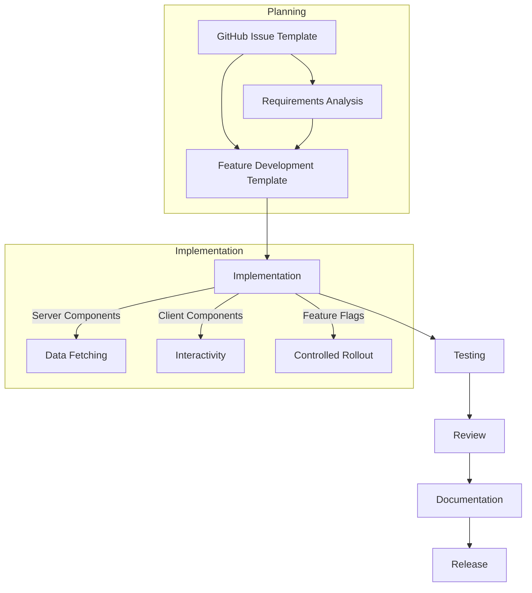

# Feature Development Workflow with Next.js

> [!info]
> Comprehensive workflow for developing features using Next.js App Router and KISS principles.

## Workflow Overview



## 1. Issue Creation
- Create a new GitHub issue using an existing issue template
- Define requirements, acceptance criteria, and priority
- Get approval to proceed with development

## 2. Technical Planning
- Create a Feature Development document using the template
- Define component architecture and data flow
- Identify server vs. client components
- Plan implementation approach

## 3. Next.js App Router Organization

### Directory Structure
```
/app
  /api                     # API routes
    /character/route.js    # Character API endpoints
    /game/route.js         # Game state endpoints
    
  /(auth)                  # Auth route group
    /login/page.tsx        # Login page
    /signup/page.tsx       # Signup page
    /layout.tsx            # Layout for auth pages
    
  /(game)                  # Game route group
    /characters/page.tsx   # Character management
    /combat/page.tsx       # Combat interface
    /journal/page.tsx      # Journal interface
    /layout.tsx            # Game layout with navigation
    
  /components              # Shared components
    /ui                    # UI primitives (buttons, cards, etc.)
    /character             # Character-related components
    /combat                # Combat-related components
    /journal               # Journal-related components
    
  /lib                     # Utility functions
    /api                   # API utilities
    /formatting            # Formatting utilities
    /gameLogic             # Game mechanics
    
  /hooks                   # Custom hooks
    /useCharacter.ts
    /useCombat.ts
    /useJournal.ts
    
  /contexts                # Context providers
    /GameStateContext.tsx
    /CharacterContext.tsx
    
  /types                   # TypeScript type definitions
    /character.ts
    /combat.ts
    
  /styles                  # Global styles
    /globals.css
    
  layout.tsx               # Root layout
  page.tsx                 # Home page
```

### Organization Guidelines

1. **Route Groups**: Use parentheses to create route groups that don't affect the URL structure
   ```
   /app/(game)/characters/page.tsx → /characters
   ```

2. **Component Co-location**:
   - Place components used only in one route in that route's directory
   - Move reusable components to `/app/components`

3. **Layout Structure**:
   - Keep layouts focused on structure and minimal logic
   - Use nested layouts for sections with shared UI

## 4. React/Next.js Component Patterns

### Server Components (Default)
- Data fetching
- Database access
- Access to backend resources
- No useState, useEffect, or other React hooks
- No browser APIs
- No event listeners

```tsx
// app/characters/page.tsx
// Server Component (default in Next.js App Router)
async function CharactersPage() {
  // Data fetching directly in component
  const characters = await fetchCharacters();
  
  return (
    <main>
      <h1>Characters</h1>
      <CharacterList characters={characters} />
    </main>
  );
}
```

### Client Components ('use client')
- Interactivity and event listeners
- React hooks (useState, useEffect, etc.)
- Browser APIs
- Client-side state
- Event handlers

```tsx
// app/components/character/CharacterForm.tsx
'use client';

import { useState } from 'react';

export function CharacterForm({ onSave }) {
  const [name, setName] = useState('');
  
  const handleSubmit = (e) => {
    e.preventDefault();
    onSave({ name });
  };
  
  return (
    <form onSubmit={handleSubmit}>
      <input 
        value={name}
        onChange={(e) => setName(e.target.value)}
      />
      <button type="submit">Save</button>
    </form>
  );
}
```

### Feature Flag Implementation

```tsx
// lib/featureFlags.ts
export interface FeatureFlags {
  enableCharacterCreation: boolean;
  enableCombat: boolean;
  enableJournal: boolean;
  enableInventory: boolean;
  enableNarrativeGeneration: boolean;
  // New features in development
  enableExtendedCombat: boolean;
  enableMultiCharacter: boolean;
}

const defaultFlags: FeatureFlags = {
  enableCharacterCreation: true,
  enableCombat: true,
  enableJournal: true,
  enableInventory: true,
  enableNarrativeGeneration: true,
  // New features in development
  enableExtendedCombat: false,
  enableMultiCharacter: false,
};

// Environment-specific overrides
const envFlags = process.env.NEXT_PUBLIC_FEATURE_FLAGS
  ? JSON.parse(process.env.NEXT_PUBLIC_FEATURE_FLAGS)
  : {};

// Merge default flags with environment overrides
export const featureFlags: FeatureFlags = {
  ...defaultFlags,
  ...envFlags,
};

// Hook for feature flag usage
export function useFeatureFlag(flag: keyof FeatureFlags): boolean {
  // Allow for dynamic override in development
  if (typeof window !== 'undefined' && process.env.NODE_ENV === 'development') {
    const urlParams = new URLSearchParams(window.location.search);
    const paramValue = urlParams.get(`feature_${String(flag)}`);
    
    if (paramValue === 'true') return true;
    if (paramValue === 'false') return false;
  }
  
  return featureFlags[flag];
}
```

```tsx
// components/ui/FeatureFlag.tsx
'use client';

import { useFeatureFlag } from '@/lib/featureFlags';

interface FeatureFlagProps {
  name: keyof FeatureFlags;
  children: React.ReactNode;
  fallback?: React.ReactNode;
}

export function FeatureFlag({ name, children, fallback = null }: FeatureFlagProps) {
  const isEnabled = useFeatureFlag(name);
  
  return isEnabled ? <>{children}</> : <>{fallback}</>;
}
```

## 5. Testing Strategy
- Component tests with React Testing Library
- Hook tests with renderHook
- Integration tests for complex features

```tsx
// Basic component test example
it('renders character name', () => {
  const { getByText } = render(
    <CharacterCard character={{ name: 'Gunslinger' }} />
  );
  expect(getByText('Gunslinger')).toBeInTheDocument();
});
```

## 6. Documentation
- Update technical documentation
- Add JSDoc comments to components
- Create usage examples

## 7. Review and Release
- Complete Feature Implementation Checklist
- Code review
- Merge to main branch
- Enable feature flag for production when ready

## Integration with Claude Workflow

This workflow enhances the existing Claude integration by adding Next.js-specific guidance:

### Planning (Desktop)
- Review requirements from GitHub issue
- Apply Feature Development template to plan implementation
- Use Claude Desktop to assist with component design

### Implementation (API)
- Generate server and client components
- Implement feature flag if needed
- Create tests following patterns

### Cleanup (API)
- Run through Feature Implementation Checklist
- Verify KISS principles are followed
- Complete documentation

## Related Documents
- [[feature-checklist|Feature Implementation Checklist]]
- [[kiss-principles-react|KISS Principles for React Development]]
- [[testing-workflow|Testing Workflow]]
