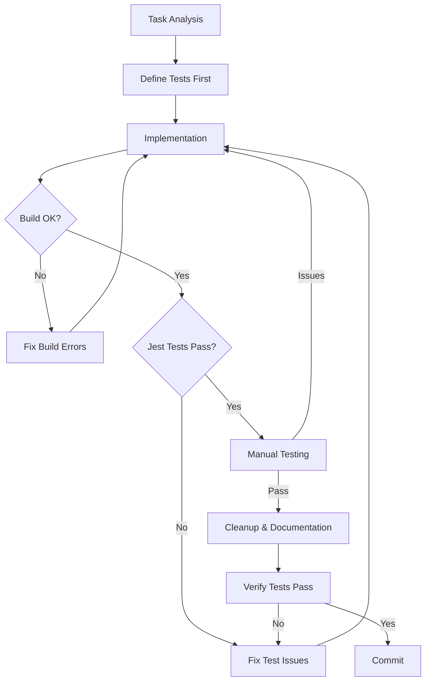

# Development Workflows

> [!note]
> Start here to understand development processes for Narraitor.

## Core Workflows
- 🧪 [[testing-workflow|Testing]]
- 📋 [[user-story-workflow|User Story Management]]
- 🔧 [[claude-app-prompt-templates#component-refactoring|Refactoring Guide]]

## TDD with KISS Principles
- 🧠 [[tdd-with-kiss|Test-Driven Development with KISS]] - Recommended workflow
- 💡 [[kiss-principles-react|KISS Principles for React]] - Simplicity guidelines

## AI-Assisted Development
- 🤖 [[claude-app-workflow|Claude App Workflow]] - Primary development workflow

### Claude App Tools
- 🔄 [[claude-app-workflow-handoffs|Handoff Templates]]
- 📝 [[claude-app-prompt-templates|Prompt Templates]]

## Development Workflow Diagram

## Quick Reference Checklist

1. ✅ Create user story using proper template and domain
2. ✅ Define and write tests first
3. ✅ Implement simplest solution that passes tests
4. ✅ Fix build errors before running tests
5. ✅ Fix failing tests before manual testing
6. ✅ Cleanup only after all tests pass
7. ✅ Verify tests still pass after cleanup
8. ✅ Commit and close GitHub issue

## Further Reading
- [[../../../docs/user-stories|User Stories Reference]]
