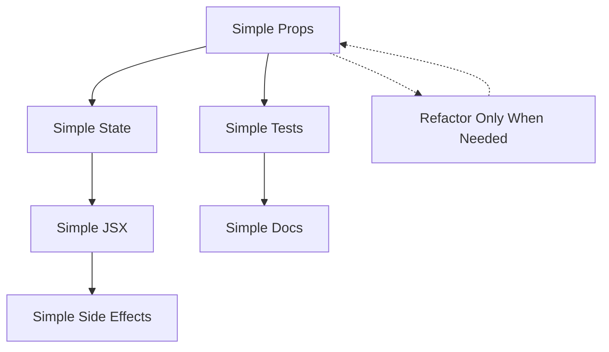

# KISS Principles for React Development

> [!tip]
> Keep It Simple, Stupid (KISS): The art of maximizing the work not done — by doing only what's absolutely necessary.

## Core KISS Principles



## From Traditional Architecture to React: Simplicity Mapping

| Traditional Pattern | React Anti-Pattern | KISS React Pattern |
|----------------|-------------------|-------------------|
| Complex component APIs with too many parameters | Components with too many props | Focused components with minimal, well-typed props |
| Nested processing functions | Deeply nested components with prop drilling | Flat component hierarchies with context where needed |
| Over-engineered utility modules | Premature abstraction into utility hooks/components | Start concrete, extract patterns only when they repeat |
| "Just in case" parameters | Components that accept unused props | Props that directly map to component needs |
| jQuery spaghetti | Imperative DOM manipulations | Declarative state-driven rendering |

## Principles in Practice

### 1. Simple Props
Props define your component's API:

```tsx
// ❌ Too complex - equivalent to a component with 10+ parameters
interface CharacterCardProps {
  character: Character;
  onSave: (character: Character) => void;
  onDelete: (id: string) => void;
  editable?: boolean;
  showStats?: boolean;
  showInventory?: boolean;
  showSpells?: boolean;
  showNotes?: boolean;
  className?: string;
  style?: React.CSSProperties;
  renderCustomHeader?: (character: Character) => React.ReactNode;
  // ...and more props
}

// ✅ KISS approach - focused component API
interface CharacterCardProps {
  character: Character;
  onSave: (character: Character) => void;
  variant: 'compact' | 'full';
}
```

### 2. Simple State

React state should be minimal:

```tsx
// ❌ Too complex - overly granular state management
const CharacterForm = () => {
  const [name, setName] = useState('');
  const [class, setClass] = useState('');
  const [level, setLevel] = useState(1);
  const [strength, setStrength] = useState(10);
  const [dexterity, setDexterity] = useState(10);
  // ...20 more useState calls
  
  // Complex state synchronization logic
}

// ✅ KISS approach - consolidated state object
const CharacterForm = () => {
  const [character, setCharacter] = useState({
    name: '',
    class: '',
    level: 1,
    // ...other fields with defaults
  });
  
  const updateField = (field, value) => {
    setCharacter({...character, [field]: value});
  };
}
```

### 3. Simple JSX

JSX should be readable:

```tsx
// ❌ Too complex - template with too many conditionals
return (
  <div className={classNames(styles.card, { 
    [styles.editing]: isEditing,
    [styles.highlighted]: isHighlighted,
    [styles.selected]: isSelected,
    [styles.disabled]: isDisabled
  })}>
    {showHeader && <Header title={title} subtitle={subtitle} />}
    {isEditing ? (
      <EditMode 
        fields={fields} 
        values={values} 
        onChange={handleChange} 
        onSave={handleSave} 
      />
    ) : (
      <ViewMode 
        fields={fields} 
        values={values} 
        onEdit={handleEdit} 
      />
    )}
    {showFooter && (
      <Footer>
        {canDelete && <DeleteButton onClick={handleDelete} />}
        {canSave && <SaveButton onClick={handleSave} disabled={!isValid} />}
        {canCancel && <CancelButton onClick={handleCancel} />}
      </Footer>
    )}
  </div>
);

// ✅ KISS approach - separate component files 
// Split into smaller components with clearer responsibility
return (
  <CharacterCard mode={isEditing ? 'edit' : 'view'}>
    <CardContent character={character} onChange={handleChange} />
    <CardActions onSave={handleSave} onCancel={handleCancel} />
  </CharacterCard>
);
```

### 4. Simple Side Effects

Side effects should be focused:

```tsx
// ❌ Too complex - module with too many side effects
useEffect(() => {
  // Load character data
  // Update URL
  // Sync with localStorage
  // Track analytics event
  // Update document title
  // Calculate derived stats
  // Check permissions
}, [characterId, userId]);

// ✅ KISS approach - single-purpose effects
// Split into multiple, focused effects
useEffect(() => {
  // Only load character data
}, [characterId]);

useEffect(() => {
  // Only update document title
}, [character.name]);

// Extract complex logic to custom hooks
const characterStats = useCharacterStats(character);
```

### 5. Simple Testing

Focus on behavior not implementation:

```tsx
// ❌ Too complex - brittle tests that test implementation
test('character card component', () => {
  const { getByTestId } = render(<CharacterCard character={mockCharacter} />);
  
  // Testing too many things
  expect(getByTestId('character-name')).toHaveTextContent('Aragorn');
  expect(getByTestId('character-level')).toHaveTextContent('5');
  expect(getByTestId('character-class')).toHaveTextContent('Ranger');
  expect(getByTestId('character-race')).toHaveTextContent('Human');
  expect(getByTestId('character-strength')).toHaveTextContent('16');
  expect(getByTestId('character-health')).toHaveTextContent('45/45');
  expect(getByTestId('character-stamina')).toHaveTextContent('30/30');
  
  // And 20 more expectations...
});

// ✅ KISS approach - testing key behaviors only
test('displays character name and level', () => {
  const { getByTestId } = render(<CharacterCard character={mockCharacter} />);
  expect(getByTestId('character-name')).toHaveTextContent('Aragorn');
  expect(getByTestId('character-level')).toHaveTextContent('5');
});

test('saving updates character data', async () => {
  const handleSave = jest.fn();
  const { getByText } = render(
    <CharacterCard character={mockCharacter} onSave={handleSave} />
  );
  
  await userEvent.click(getByText('Edit'));
  await userEvent.type(screen.getByLabelText('Name'), 'Strider');
  await userEvent.click(getByText('Save'));
  
  expect(handleSave).toHaveBeenCalledWith({
    ...mockCharacter,
    name: 'Strider'
  });
});
```

## When to Add Complexity

Complexity should only be added when there's clear evidence it's needed:

1. **Repetition**: The same pattern appears in 3+ places
2. **Performance**: Measured (not assumed) performance issues
3. **Maintainability**: When simpler code becomes harder to understand
4. **Requirements**: Only when explicitly required by specifications

## AI-Assisted KISS Development

When working with Claude:

### 1. Request Simple Solutions
```
Please provide the simplest React component that handles [requirement].
Focus on readability over cleverness.
```

### 2. Emphasize Core Functionality First
```
Let's implement the core functionality first, without any optimizations 
or edge cases. We can add those later if needed.
```

### 3. Ask for Simplifications
```
This implementation seems complex. How could we simplify it while 
maintaining the same functionality?
```

## Red Flags: When You're Violating KISS

1. Component file exceeds 150 lines
2. More than 5-7 props for a component
3. Nested ternary operators
4. Multiple levels of nested components
5. useEffect with multiple dependencies
6. Complex state calculations
7. "What does this code do?" moments when reviewing

## Mental Model Shifts for React

| Traditional Thinking | React KISS Thinking |
|-----------------|---------------------|
| "I need to account for every component variation" | "I'll build for the current use case and refactor when patterns emerge" |
| "Let's add this variable just in case" | "Props should reflect actual usage, not potential future needs" |
| "I need to build a complex system of templates" | "I'll build focused components and compose them together" |
| "Performance comes from clever preprocessing" | "Performance comes from minimizing re-renders and focused updates" |

## React Component Structure Simplified

React components can follow an organized hierarchy:

```
src/
├── components/
│   ├── atoms/           // Base components
│   │   ├── Button.tsx
│   │   ├── Input.tsx
│   │   └── Text.tsx
│   ├── molecules/       // Composite components
│   │   ├── CharacterStat.tsx
│   │   ├── SkillRow.tsx
│   │   └── InventoryItem.tsx
│   └── organisms/       // Template regions
│       ├── CharacterSheet.tsx
│       ├── CombatTracker.tsx
│       └── SpellBook.tsx
├── pages/               // Page templates
│   ├── CharacterPage.tsx
│   ├── CampaignPage.tsx
│   └── EncounterPage.tsx
└── hooks/               // Custom React hooks
    ├── useCharacter.ts
    ├── useCampaign.ts
    └── useEncounter.ts
```

## Practical Examples for Narraitor

### Simplified Character Sheet Component

```tsx
// components/organisms/CharacterSheet.tsx

// ✅ KISS approach
interface CharacterSheetProps {
  character: Character;
  onUpdate: (character: Character) => void;
  readOnly?: boolean;
}

export const CharacterSheet: React.FC<CharacterSheetProps> = ({ 
  character, 
  onUpdate,
  readOnly = false
}) => {
  // Single state object rather than multiple state variables
  const [editedCharacter, setEditedCharacter] = useState(character);
  
  // Simple event handler with field abstraction
  const handleChange = (field: keyof Character, value: any) => {
    setEditedCharacter({
      ...editedCharacter,
      [field]: value
    });
  };
  
  // Simple save handler
  const handleSave = () => {
    onUpdate(editedCharacter);
  };
  
  // Simplified render with component composition
  return (
    <div className="character-sheet">
      <CharacterHeader 
        name={character.name} 
        level={character.level}
        characterClass={character.characterClass}
        editable={!readOnly}
        onChange={handleChange}
      />
      
      <CharacterStats 
        stats={character.stats}
        editable={!readOnly}
        onChange={(stats) => handleChange('stats', stats)}
      />
      
      {!readOnly && (
        <Button onClick={handleSave}>Save Character</Button>
      )}
    </div>
  );
};
```

## Related Documents
- [[tdd-with-kiss|Test-Driven Development with KISS]]
