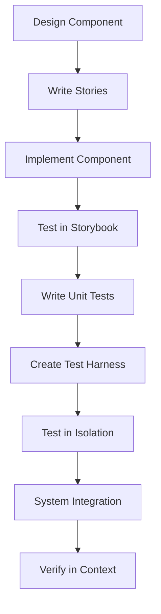

# Storybook Workflow

> [!important]
> Component-driven development approach using Storybook for UI components in Narraitor.

## Component Development Stages



## Three-Stage Component Testing 

### Stage 1: Storybook Isolation
- Develop components in complete isolation first
- Test all variants and states through Storybook
- Verify visual appearance and behavior
- Ensure proper handling of all props and conditions
- Test edge cases and error states

### Stage 2: Test Harness Integration
- Create a dedicated test harness page at `/dev/component-name`
- Test component with mock services but minimal real dependencies 
- Manually verify interactive behavior
- Test with more realistic data flows
- Confirm state transitions and side effects

### Stage 3: System Integration
- Integrate component into the full application
- Test with real services and data
- Verify behavior in context of parent components
- Confirm proper interaction with system state
- End-to-end test in user flows

## Storybook Principles

1. **Complete Isolation**: Develop and test components without external dependencies
2. **Variants Coverage**: Document all component states and variants
3. **Documentation First**: Self-document component usage and props
4. **KISS**: Keep implementations simple and maintainable
5. **No Integration Dependencies**: Stories should never depend on actual services

## Story Organization

### File Structure
```
ComponentName/
├── ComponentName.tsx       # Component implementation
├── ComponentName.test.tsx  # Test file
├── ComponentName.stories.tsx  # Storybook file
├── ComponentNameTestHarness.tsx  # Test harness (optional)
└── index.ts                # Export file
```

### Story File Structure
```tsx
import type { Meta, StoryObj } from '@storybook/react';
import ComponentName from './ComponentName';

const meta: Meta<typeof ComponentName> = {
  title: 'Narraitor/[Category]/ComponentName',
  component: ComponentName,
  parameters: {
    layout: 'centered',
    docs: {
      description: {
        component: 'Brief description of what the component does'
      }
    }
  },
  tags: ['autodocs'],
};

export default meta;
type Story = StoryObj<typeof ComponentName>;

// Default state
export const Default: Story = {
  args: {
    // Default props
  },
};

// Additional state variants
export const Variant: Story = {
  args: {
    // Variant-specific props
  },
};
```

## Story Naming Convention

All stories should follow the hierarchical naming pattern:
```
title: 'Narraitor/[Category]/[ComponentName]'
```

This ensures all components appear under the "Narraitor" folder in Storybook's sidebar, organized by category.

### Component Categories

Follow these categories for organizing components:

1. **World**: World-related components
   - Example: `'Narraitor/World/WorldList'`
   - Example: `'Narraitor/World/WorldCard'`
   - Example: `'Narraitor/World/WorldListScreen'`

2. **Character**: Character-related components
   - Example: `'Narraitor/Character/CharacterSheet'`
   - Example: `'Narraitor/Character/CharacterList'`

3. **Combat**: Combat system components
   - Example: `'Narraitor/Combat/CombatControls'`
   - Example: `'Narraitor/Combat/AttackButton'`

4. **Journal**: Journal and narrative components
   - Example: `'Narraitor/Journal/JournalViewer'`
   - Example: `'Narraitor/Journal/NoteEditor'`

5. **Common**: Reusable UI components
   - Example: `'Narraitor/Common/Button'`
   - Example: `'Narraitor/Common/DeleteConfirmationDialog'`
   - Example: `'Narraitor/Common/LoadingSpinner'`

6. **AI**: AI-related components
   - Example: `'Narraitor/AI/ResponseFormatter'`
   - Example: `'Narraitor/AI/PromptBuilder'`

7. **Game**: Game session components
   - Example: `'Narraitor/Game/GameControls'`
   - Example: `'Narraitor/Game/SessionManager'`

## Writing Effective Stories

### 1. Document All States
Create stories for all possible component states:
- Default/empty
- Loading
- Success/populated
- Error
- Interactive states

### 2. Use Args to Control Props
```tsx
export const Default: Story = {
  args: {
    character: mockCharacter,
    isEditable: true,
  },
};
```

### 3. Add Controls for Interactive Testing
```tsx
const meta: Meta<typeof Button> = {
  // ...
  argTypes: {
    variant: {
      control: 'select',
      options: ['primary', 'secondary', 'danger'],
    },
  },
};
```

### 4. Simulate App Router Context
For components using Next.js App Router features:
```tsx
const meta: Meta<typeof NavigationComponent> = {
  // ...
  parameters: {
    nextjs: {
      appDirectory: true,
      navigation: {
        pathname: '/game-session',
        query: { id: '12345' },
      },
    },
  },
};
```

### 5. Mock External Dependencies
Use decorators to provide context:
```tsx
const withGameContext = (initialState) => (Story) => (
  <GameProvider initialState={initialState}>
    <Story />
  </GameProvider>
);

export const WithContext: Story = {
  decorators: [withGameContext({ /* mock state */ })],
};
```

## Creating Isolation-Friendly Components

### 1. Props-Based Configuration
Components should accept all configuration via props:

```tsx
// ✅ Good: Component accepts all data via props
function CharacterCard({ character, onAction, theme }) {
  return (
    <div className={`card ${theme}`}>
      <h2>{character.name}</h2>
      <button onClick={onAction}>View Details</button>
    </div>
  );
}

// ❌ Bad: Component has external dependencies
function CharacterCard({ characterId }) {
  // Fetches data from context or service
  const character = useCharacter(characterId);
  const theme = useTheme();
  const { viewCharacter } = useCharacterActions();
  
  return (
    <div className={`card ${theme}`}>
      <h2>{character.name}</h2>
      <button onClick={() => viewCharacter(character.id)}>View Details</button>
    </div>
  );
}
```

### 2. Container/Presenter Pattern
Separate data fetching from presentation:

```tsx
// Presenter component (Storybook friendly)
export function CharacterCardView({ character, onAction, theme }) {
  return (
    <div className={`card ${theme}`}>
      <h2>{character.name}</h2>
      <button onClick={onAction}>View Details</button>
    </div>
  );
}

// Container component (uses external dependencies)
export function CharacterCard({ characterId }) {
  const character = useCharacter(characterId);
  const theme = useTheme();
  const { viewCharacter } = useCharacterActions();
  
  if (!character) return <Skeleton />;
  
  return (
    <CharacterCardView 
      character={character}
      theme={theme}
      onAction={() => viewCharacter(character.id)}
    />
  );
}
```

### 3. Mock Service Providers
Create mock versions of services for isolation:

```tsx
// Mock data provider for Stories
export const MockCharacterProvider = ({ characters, children }) => {
  return (
    <CharacterContext.Provider 
      value={{ 
        characters, 
        getCharacter: (id) => characters.find(c => c.id === id),
        actions: {
          viewCharacter: (id) => console.log(`View character ${id}`),
          editCharacter: (id) => console.log(`Edit character ${id}`)
        }
      }}
    >
      {children}
    </CharacterContext.Provider>
  );
};

// Usage in story
export const WithMockData: Story = {
  decorators: [
    (Story) => (
      <MockCharacterProvider characters={mockCharacters}>
        <Story />
      </MockCharacterProvider>
    )
  ]
};
```

## Test Harness Implementation

Create dedicated test pages for components that need interactive testing:

```tsx
// pages/dev/character-card-test.tsx
'use client';

import { useState } from 'react';
import { CharacterCardView } from '@/components/character/CharacterCard';
import { mockCharacter } from '@/mocks/character-mocks';
import { DevControls } from '@/components/dev/DevControls';

export default function CharacterCardTestPage() {
  const [character, setCharacter] = useState(mockCharacter);
  const [theme, setTheme] = useState('default');
  
  return (
    <div className="p-6">
      <h1 className="text-2xl font-bold mb-4">Character Card Test Harness</h1>
      
      <div className="flex gap-6">
        <div className="w-2/3">
          <CharacterCardView 
            character={character}
            theme={theme}
            onAction={() => alert(`Action for ${character.name}`)}
          />
        </div>
        
        <div className="w-1/3">
          <DevControls
            controls={[
              {
                label: 'Toggle Theme',
                action: () => setTheme(theme === 'default' ? 'dark' : 'default')
              },
              {
                label: 'Change Name',
                action: () => setCharacter({...character, name: character.name + '+'})
              }
            ]}
            state={{ character, theme }}
          />
        </div>
      </div>
    </div>
  );
}
```

## Running Storybook

### Development Mode
```bash
npm run storybook
```
This starts Storybook on http://localhost:6006

### Build Static Version
```bash
npm run build-storybook
```
This creates a static version of Storybook in the `storybook-static` directory.

## Integration with Testing Workflow

Storybook complements the three-stage testing workflow:

1. **Storybook → Test Harness → Integration**:
   - Start with Storybook for isolated component development
   - Validate in test harness with limited integration
   - Finally verify in full application context

2. **Visual Testing + Unit Testing + Integration Testing**:
   - Stories verify visual appearance and states
   - Unit tests verify component logic
   - Integration tests verify system behavior

3. **Component Isolation**:
   - Stories ensure components work in isolation
   - Test harnesses test with minimal dependencies
   - System integration tests full application behavior

## Best Practices

### 1. Keep Stories Simple
```tsx
// ✅ Simple and focused
export const Simple: Story = {
  args: {
    theme: 'dark',
    // Pass required props directly
  },
};
```

### 2. Use Mock Data Consistently
Create a dedicated mock data file:
```tsx
// mocks/characters.ts
export const mockCharacter = {
  name: 'John Smith',
  strength: 10,
  // ...
};
```

### 3. Document Props with Comments
```tsx
const meta: Meta<typeof CharacterSheet> = {
  // ...
  argTypes: {
    /** The character data object */
    character: { control: 'object' },
    /** Whether the character sheet is in edit mode */
    isEditable: { control: 'boolean' },
  },
};
```

### 4. Include Component Description
Always add a docs description for the component:
```tsx
parameters: {
  docs: {
    description: {
      component: 'A reusable button component with multiple variants'
    }
  }
}
```

## Common Issues and Solutions

### Next.js App Router Components

**Issue**: Error "invariant expected app router to be mounted" when using `useRouter` from `next/navigation`.

**Solution**: Add the App Directory parameter:
```tsx
parameters: {
  nextjs: {
    appDirectory: true,
  },
},
```

### Context-Dependent Components

**Issue**: Components that rely on context providers fail in Storybook.

**Solution**: Use decorators to provide context:
```tsx
export const WithContext: Story = {
  decorators: [
    (Story) => (
      <GameProvider initialState={mockGameState}>
        <Story />
      </GameProvider>
    ),
  ],
};
```

### Loading Global Styles

**Issue**: Tailwind styles not applying in Storybook.

**Solution**: Import globals.css in preview.js:
```js
// .storybook/preview.js
import '../app/globals.css';
```

### Store Integration in Storybook

**Issue**: Components using Zustand stores cause infinite loops or state issues in Storybook.

**Solution**: Create mock components without store dependencies for Storybook:
```tsx
// Mock version for Storybook
const MockWorldListScreen = ({ worlds, loading, error }) => {
  // Component logic without store
  return <div>...</div>;
};

// Story uses mock component
const meta = {
  title: 'Narraitor/World/WorldListScreen',
  component: MockWorldListScreen,
  // ...
};
```

## Related Documents
- [[testing-workflow|Test-Driven Development Workflow]]
- [[kiss-principles-react|KISS Principles for React]]
- [[component-isolation-strategy|Component Isolation Strategy]]
- [[feature-development-workflow|Feature Development Workflow]]