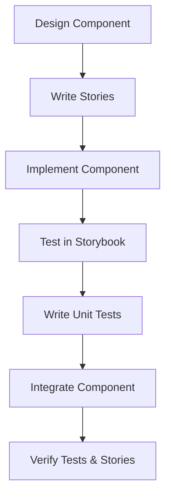

# Storybook Workflow

> [!important]
> Component-driven development approach using Storybook for UI components in Narraitor.

## Process Flow


## Storybook Principles

1. **Isolation**: Develop and test components in isolation
2. **Variants**: Document all component states and variants
3. **Documentation**: Self-document component usage and props
4. **KISS**: Keep implementations simple and maintainable

## Story Organization

### File Structure
```
ComponentName/
├── ComponentName.tsx       # Component implementation
├── ComponentName.test.tsx  # Test file
├── ComponentName.stories.tsx  # Storybook file
└── index.ts                # Export file
```

### Story File Structure
```tsx
import type { Meta, StoryObj } from '@storybook/react';
import ComponentName from './ComponentName';

const meta: Meta<typeof ComponentName> = {
  title: 'Category/ComponentName',
  component: ComponentName,
  parameters: {
    // For components using next/navigation
    nextjs: {
      appDirectory: true,
    },
  },
};

export default meta;
type Story = StoryObj<typeof ComponentName>;

// Default state
export const Default: Story = {
  args: {
    // Default props
  },
};

// Additional state variants
export const Variant: Story = {
  args: {
    // Variant-specific props
  },
};
```

## Component Categories

Follow these categories for organizing components:

1. **Combat**: Combat system components (CombatControls, etc.)
2. **Character**: Character-related components (CharacterSheet, etc.)
3. **Journal**: Journal and narrative components (JournalViewer, etc.)
4. **UI**: Reusable UI components (Button, Card, etc.)

## Writing Effective Stories

### 1. Document All States
Create stories for all possible component states:
- Default/empty
- Loading
- Success/populated
- Error
- Interactive states

### 2. Use Args to Control Props
```tsx
export const Default: Story = {
  args: {
    character: mockCharacter,
    isEditable: true,
  },
};
```

### 3. Add Controls for Interactive Testing
```tsx
const meta: Meta<typeof Button> = {
  // ...
  argTypes: {
    variant: {
      control: 'select',
      options: ['primary', 'secondary', 'danger'],
    },
  },
};
```

### 4. Simulate App Router Context
For components using Next.js App Router features:
```tsx
const meta: Meta<typeof NavigationComponent> = {
  // ...
  parameters: {
    nextjs: {
      appDirectory: true,
      navigation: {
        pathname: '/game-session',
        query: { id: '12345' },
      },
    },
  },
};
```

### 5. Mock External Dependencies
Use decorators to provide context:
```tsx
const withGameContext = (initialState) => (Story) => (
  <GameProvider initialState={initialState}>
    <Story />
  </GameProvider>
);

export const WithContext: Story = {
  decorators: [withGameContext({ /* mock state */ })],
};
```

## Running Storybook

### Development Mode
```bash
npm run storybook
```
This starts Storybook on http://localhost:6006

### Build Static Version
```bash
npm run build-storybook
```
This creates a static version of Storybook in the `storybook-static` directory.

## Integration with Testing Workflow

Storybook complements the existing TDD workflow:

1. **Stories First → Tests First**:
   - Write stories to define component visual states
   - Write tests to define component behavior
   - Implement to satisfy both

2. **Visual Testing + Unit Testing**:
   - Stories verify visual appearance and states
   - Tests verify behavior and interactions

3. **Component Isolation**:
   - Stories isolate components for visual testing
   - Tests isolate components for functional testing

## Best Practices

### 1. Keep Stories Simple
```tsx
// ✅ Simple and focused
export const Simple: Story = {
  args: {
    theme: 'dark',
    // Pass required props directly
  },
};
```

### 2. Use Mock Data Consistently
Create a dedicated mock data file:
```tsx
// mocks/characters.ts
export const mockCharacter = {
  name: 'John Smith',
  strength: 10,
  // ...
};
```

### 3. Document Props with Comments
```tsx
const meta: Meta<typeof CharacterSheet> = {
  // ...
  argTypes: {
    /** The character data object */
    character: { control: 'object' },
    /** Whether the character sheet is in edit mode */
    isEditable: { control: 'boolean' },
  },
};
```

## Common Issues and Solutions

### Next.js App Router Components

**Issue**: Error "invariant expected app router to be mounted" when using `useRouter` from `next/navigation`.

**Solution**: Add the App Directory parameter:
```tsx
parameters: {
  nextjs: {
    appDirectory: true,
  },
},
```

### Context-Dependent Components

**Issue**: Components that rely on context providers fail in Storybook.

**Solution**: Use decorators to provide context:
```tsx
export const WithContext: Story = {
  decorators: [
    (Story) => (
      <GameProvider initialState={mockGameState}>
        <Story />
      </GameProvider>
    ),
  ],
};
```

### Loading Global Styles

**Issue**: Tailwind styles not applying in Storybook.

**Solution**: Import globals.css in preview.js:
```js
// .storybook/preview.js
import '../app/globals.css';
```

## Related Documents
- [[testing-workflow|Test-Driven Development Workflow]]
- [[kiss-principles-react|KISS Principles for React]]