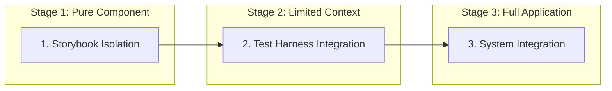
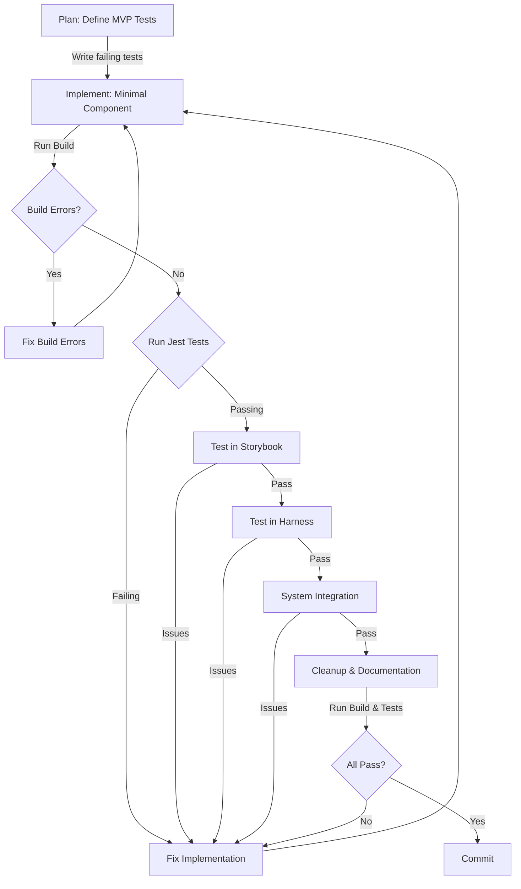

# Test-Driven Development with KISS Principles

> [!important] 
> This workflow emphasizes writing tests first, implementing to meet test expectations, and maintaining a "Keep It Simple, Stupid" approach throughout.

## Three-Stage Testing Approach

Before diving into the TDD workflow, understand the three-stage testing approach for component development:



Each component should progress through these stages:
1. **Storybook Isolation**: Component tested in complete isolation
2. **Test Harness Integration**: Component tested with limited dependencies
3. **System Integration**: Component verified within full application context

## Core TDD Workflow Loop



## Key Principles

### Test-Driven Development (TDD)
- **Write tests first** that define expected behavior
- Implement the simplest code that makes tests pass
- Refactor for cleanliness without changing behavior
- Create flow diagrams before implementation
- Focus on critical flows first

### Keep It Simple, Stupid (KISS)
- Start with the minimum viable implementation
- Avoid premature optimization
- Solve one problem at a time
- Prefer clarity over cleverness
- Break complex problems into simpler parts
- Keep files under 300 lines
- Use standard patterns and approaches

### Isolation Over Integration
- Components should be testable in isolation
- Dependencies should be injectable and mockable
- Integration should happen only after isolation testing
- Test with limited context before full application
- Maintain clean boundaries between components

## Testing Stages in Detail

### Stage 1: Unit Tests and Storybook
1. **Write Jest Tests**:
   - Define component behavior with unit tests
   - Mock all external dependencies
   - Test all edge cases and error states
   - Focus on props and events

2. **Create Storybook Stories**:
   - Create stories for all component variants
   - Test visual appearance and styling
   - Verify component renders correctly
   - Test interactive behavior with controls

### Stage 2: Test Harness
1. **Create Test Harness Page**:
   - Implement dedicated test page
   - Add state manipulation controls
   - Test with limited real dependencies
   - Verify component behavior with more realistic data

2. **Manual Testing**:
   - Test all user interactions
   - Verify state transitions
   - Check responsive behavior
   - Test with different mock data

### Stage 3: System Integration
1. **Integrate with Application**:
   - Add component to parent system
   - Connect to real services and state
   - Test in context of application flow
   - Run integration tests

2. **End-to-End Testing**:
   - Verify user flows with Playwright
   - Test real data flows
   - Verify system behavior
   - Test performance in real context

## Workflow Breakdown

### 1. Planning: Define Tests First
Clearly define what "done" means before coding:
```javascript
// Example of writing tests first
test('Character sheet displays correct health value', () => {
  const sheet = render(<CharacterSheet health={50} maxHealth={100} />);
  expect(sheet.getByTestId('health-display')).toHaveTextContent('50/100');
});
```

### 2. Implementation: Minimal Viable Component
Implement just enough to meet the requirements:
```jsx
// Minimal implementation to pass the test
const CharacterSheet = ({ health, maxHealth }) => (
  <div data-testid="health-display">{health}/{maxHealth}</div>
);
```

### 3. Testing Loop
- **Fix build errors first** (like fixing syntax errors)
- **Run and fix Jest tests** (like running unit tests)
- **Test in Storybook** (for visual and interactive testing)
- **Test in dedicated harness** (for limited integration)
- **Verify in application context** (for full integration)
- Repeat until all tests pass at all levels

### 4. Documentation & Cleanup
Only after all tests pass:
- Remove debugging code (console.logs)
- Update documentation
- Add inline comments for complex logic
- Ensure the code follows KISS principles

## Implementation Guidelines

### Code Organization
- **Follow Domain-Driven Design**: Organize code by business domains
- **Maintain Separation of Concerns**: Each file has a single responsibility
- **Keep Files Small**: Max 300 lines per file
- **Use Clear Naming**: Names should convey purpose and behavior
- **Establish Clear Boundaries**: Well-defined interfaces between systems

### Testing Strategy
- **Unit Test Coverage**: Core business logic thoroughly tested
- **Component Testing**: UI components tested with React Testing Library
- **Integration Testing**: Key system boundaries have integration tests
- **End-to-End Testing**: Critical user flows have E2E tests
- **Test Edge Cases**: Include tests for error states and boundary cases

### Building for Isolation
- **Props-First Approach**: Components should be configurable via props
- **Minimize Context Usage**: Only use context when absolutely necessary
- **Injectable Dependencies**: Services should be injectable for testing
- **Pure Components**: Prefer pure functional components
- **Container/Presenter Pattern**: Separate logic from presentation

## Component Testing Examples

### Pure Component Test
```typescript
// Example unit test for isolated component
describe('NarrativeDisplay', () => {
  it('renders narrative text correctly', () => {
    const text = 'This is a narrative text passage.';
    const { getByTestId } = render(<NarrativeDisplay text={text} />);
    
    expect(getByTestId('narrative-text')).toHaveTextContent(text);
  });
  
  it('shows loading indicator when loading', () => {
    const { getByTestId } = render(<NarrativeDisplay text="" isLoading={true} />);
    
    expect(getByTestId('loading-indicator')).toBeInTheDocument();
  });
  
  it('shows error message when error is provided', () => {
    const error = 'Failed to load narrative';
    const { getByTestId } = render(<NarrativeDisplay text="" error={error} />);
    
    expect(getByTestId('error-message')).toHaveTextContent(error);
  });
});
```

### Test Harness Example
```typescript
// Example test harness for NarrativeDisplay
export default function NarrativeTestHarness() {
  const [text, setText] = useState('Initial narrative passage...');
  const [isLoading, setIsLoading] = useState(false);
  const [error, setError] = useState<string | null>(null);
  
  // Test controls
  const simulateLoading = () => {
    setIsLoading(true);
    setText('');
    setError(null);
    
    setTimeout(() => {
      setIsLoading(false);
      setText('New narrative content after loading...');
    }, 2000);
  };
  
  const simulateError = () => {
    setIsLoading(true);
    setText('');
    setError(null);
    
    setTimeout(() => {
      setIsLoading(false);
      setError('Failed to generate narrative content');
    }, 1500);
  };
  
  return (
    <div className="p-6">
      <h1 className="text-2xl font-bold mb-4">Narrative Display Test Harness</h1>
      
      <div className="flex gap-6">
        <div className="w-2/3 border p-4 rounded">
          <NarrativeDisplay 
            text={text}
            isLoading={isLoading}
            error={error}
          />
        </div>
        
        <div className="w-1/3 border p-4 rounded bg-gray-50">
          <h2 className="text-lg font-semibold mb-2">Test Controls</h2>
          
          <div className="space-y-2">
            <button 
              onClick={simulateLoading}
              className="px-3 py-1 bg-blue-500 text-white rounded"
            >
              Simulate Loading
            </button>
            
            <button 
              onClick={simulateError}
              className="px-3 py-1 bg-red-500 text-white rounded"
            >
              Simulate Error
            </button>
            
            <button 
              onClick={() => setText('Updated narrative text...')}
              className="px-3 py-1 bg-green-500 text-white rounded"
            >
              Update Text
            </button>
          </div>
          
          <div className="mt-4">
            <h3 className="text-md font-semibold mb-2">Current State</h3>
            <div className="bg-white p-2 rounded text-xs">
              <div><strong>Text:</strong> {text || '(empty)'}</div>
              <div><strong>Loading:</strong> {isLoading ? 'Yes' : 'No'}</div>
              <div><strong>Error:</strong> {error || 'None'}</div>
            </div>
          </div>
        </div>
      </div>
    </div>
  );
}
```

### Integration Test Example
```typescript
// Example integration test with system dependencies
describe('NarrativeEngine integration', () => {
  it('generates narrative content when session starts', async () => {
    // Mock AI service
    const mockAIService = {
      generateNarrative: jest.fn().mockResolvedValue('Generated narrative text'),
      generateChoices: jest.fn().mockResolvedValue([
        { id: 'choice1', text: 'First choice' },
        { id: 'choice2', text: 'Second choice' }
      ])
    };
    
    // Render with dependencies
    const { getByTestId, findByText } = render(
      <AIServiceProvider value={mockAIService}>
        <SessionProvider initialState={{ sessionId: 'test-session' }}>
          <NarrativeEngine worldId="test-world" characterId="test-character" />
        </SessionProvider>
      </AIServiceProvider>
    );
    
    // Verify loading state appears
    expect(getByTestId('loading-indicator')).toBeInTheDocument();
    
    // Verify content and choices appear after loading
    expect(await findByText('Generated narrative text')).toBeInTheDocument();
    expect(await findByText('First choice')).toBeInTheDocument();
    expect(await findByText('Second choice')).toBeInTheDocument();
    
    // Verify AI service was called with correct context
    expect(mockAIService.generateNarrative).toHaveBeenCalledWith(
      expect.objectContaining({
        worldId: 'test-world',
        characterId: 'test-character',
        sessionId: 'test-session'
      })
    );
  });
});
```

## AI-Assisted Development Guidelines

When working with Claude or other AI assistants:

### Planning Prompts
```
Help me plan tests for a [component] that needs to [functionality].
Focus on test-driven development across all three testing stages:
1. Storybook isolation
2. Test harness integration
3. System integration
```

### Implementation Prompts
```
I need a minimal implementation of [component] that will pass these tests:
[paste tests]

Keep it as simple as possible while meeting requirements.
Ensure it can be tested in isolation via Storybook.
```

### Test Harness Prompts
```
Help me create a test harness for [component] that allows testing with:
- State manipulation controls
- Simulated events
- Mock service integration
- Visual feedback
```

## Testing Concepts in React

| Traditional Concept | React Equivalent | Testing Stage |
|----------------|------------------|----------------|
| Requirements specification | Jest test expectations | Stage 1 |
| Component API design | React component props interface | Stage 1 |
| Component implementation | React component function | Stage 1 |
| Sub-system integration | Test harness with limited dependencies | Stage 2 |
| System integration | Full application context | Stage 3 |
| End-user testing | Playwright E2E tests | Stage 3 |

## Related Docs
- [[component-isolation-strategy|Component Isolation Strategy]]
- [[storybook-workflow|Storybook Workflow]]
- [[feature-development-workflow|Feature Development Workflow]]
- [[testing-workflow|Testing Workflow]]