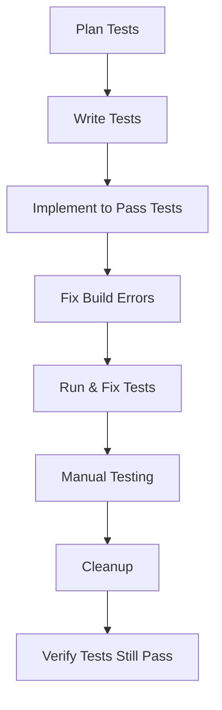

# Testing Workflow

> [!important]
> Test-driven development approach using React Testing Library and Jest.

## Process Flow


## TDD Principles
1. **Tests First**: Write failing tests that define expected behavior
2. **Minimal Implementation**: Write the simplest code that makes tests pass
3. **Refactor**: Clean up code without changing behavior
4. **Build → Test → Fix**: Always fix build errors before running tests

## Test Organization

### File Structure
```
ComponentName/
├── ComponentName.tsx       # Component implementation
├── ComponentName.test.tsx  # Test file
└── index.ts                # Export file
```

### Test File Structure
```tsx
import { render, screen } from '@testing-library/react';
import userEvent from '@testing-library/user-event';
import { ComponentName } from './ComponentName';

describe('ComponentName', () => {
  // Rendering tests
  test('renders correctly with default props', () => {
    // Test basic rendering
  });
  
  // Interaction tests
  test('handles user interaction correctly', async () => {
    // Test user interactions
  });
  
  // Edge case tests
  test('handles edge case: empty data', () => {
    // Test edge cases
  });
});
```

## Test Types

### Unit Tests
- Tests individual components in isolation
- Focus on component API (props and events)
- Mock dependencies and external services
- Examples:
  ```tsx
  test('Button renders with correct text', () => {
    render(<Button>Click me</Button>);
    expect(screen.getByRole('button')).toHaveTextContent('Click me');
  });
  ```

### Integration Tests
- Tests components working together
- Focus on component interaction
- Minimal mocking of shared dependencies
- Examples:
  ```tsx
  test('CharacterSheet updates character stats', () => {
    render(<CharacterSheet character={mockCharacter} />);
    // Test interaction between stat component and parent form
  });
  ```

### Edge Case Tests
- Tests handling of unusual or boundary inputs
- Focus on error states and recovery
- Examples:
  ```tsx
  test('CharacterSheet handles missing character data', () => {
    render(<CharacterSheet character={null} fallback="No character" />);
    expect(screen.getByText('No character')).toBeInTheDocument();
  });
  ```

## Testing Best Practices

### 1. Use data-testid for Stable Selectors
```tsx
// In component
<div data-testid="character-health">{health}/{maxHealth}</div>

// In test
expect(screen.getByTestId('character-health')).toHaveTextContent('50/100');
```

### 2. Test Behavior, Not Implementation
```tsx
// ❌ Too implementation-specific
expect(component.state.count).toBe(1);

// ✅ Tests what the user sees
expect(screen.getByText('Count: 1')).toBeInTheDocument();
```

### 3. Use Role-Based Queries When Possible
```tsx
// ✅ Accessible and semantic
expect(screen.getByRole('button', { name: 'Submit' })).toBeInTheDocument();
```

### 4. Use Act for State Updates
```tsx
// When testing components with state changes
act(() => {
  userEvent.click(screen.getByRole('button'));
});
```

### 5. Keep Tests Simple (KISS)
- Test one thing per test
- Use clear, descriptive test names
- Keep setup code minimal
- Focus on key functionality, not every detail

## Claude Integration

### Planning Phase
```
Help me plan tests for a [component] that:
1. Renders specific UI elements
2. Handles user interactions
3. Manages specific state changes
```

### Implementation Phase
```
Help me implement tests for this component:
[component code]

Focus on:
1. Basic rendering tests
2. Interaction tests
3. Edge case tests
```

### Verification Phase
```
I have these failing tests:
[test output]

How can I update my component to make these tests pass
while keeping the implementation simple?
```

## Testing Script
Run the TDD workflow script to enforce testing practices:
```bash
./scripts/tdd-workflow.sh ComponentName
```

## Related Documents
- [[tdd-with-kiss|Test-Driven Development with KISS]]
- [[kiss-principles-react|KISS Principles for React]]
