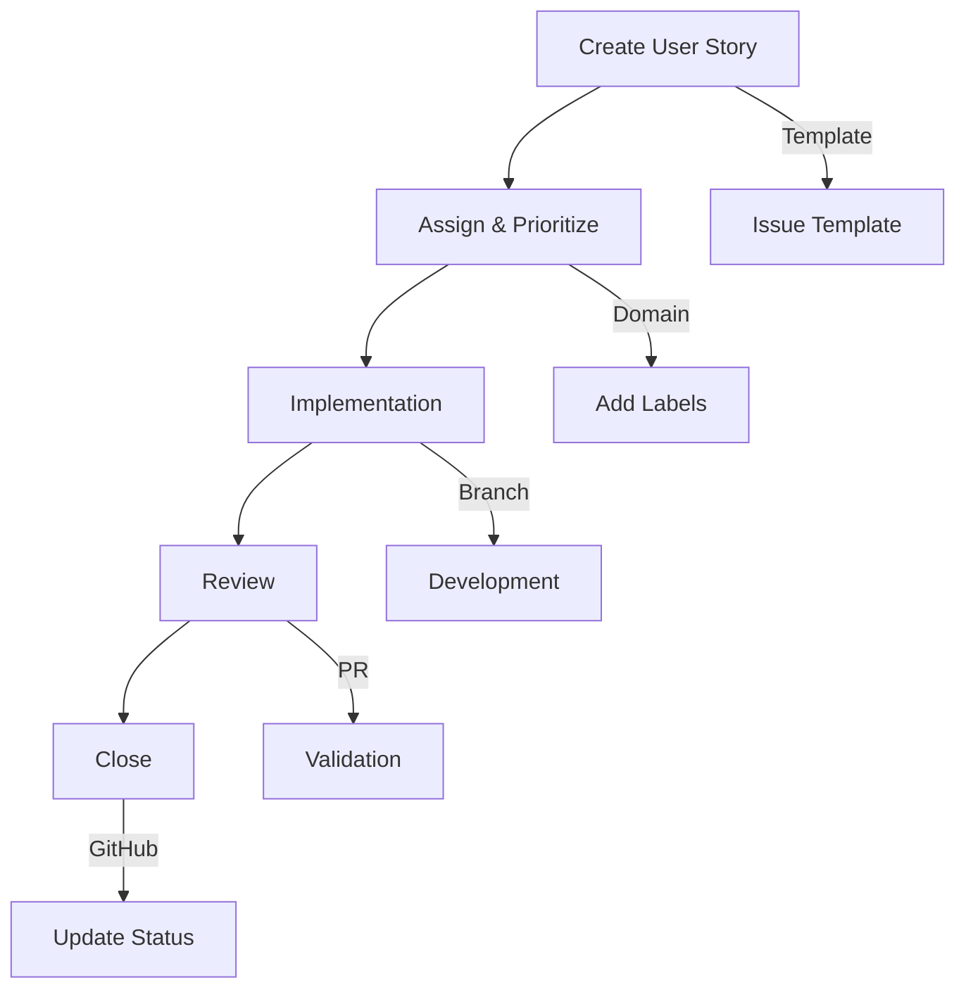

# User Story Workflow

> [!info]
> Process for managing user stories using GitHub Issues in the Narraitor project.

## Process



## Issue Templates

Narraitor uses four templates to standardize tracking:

1. **User Story**: Use the official template at `.github/ISSUE_TEMPLATE/user-story.md` to describe features from a user's perspective
2. **Bug Report**: Issues in the existing system
3. **Enhancement**: Improvements to features
4. **Epic**: Larger features composed of multiple stories

## Domain-Based Organization

All issues are categorized by domain:

- **World Configuration**: Settings, rules, parameters
- **Character System**: Character creation/management
- **Decision Tracking**: Player choice tracking
- **Decision Relevance**: Choice impact scoring
- **Narrative Engine**: AI-driven storytelling
- **Journal System**: Game event tracking
- **State Management**: Game state persistence

## Priority Levels

- **High (MVP)**: Required for Minimum Viable Product
- **Medium**: Important but not critical
- **Low**: Desirable but deferrable
- **Post-MVP**: Planned for later releases

## Workflow Stages

### 1. Creation
- Select appropriate template
- Identify domain and priority
- Define acceptance criteria
- Submit the issue

### 2. Assignment
- Assign to team member
- Move to "In Progress"
- Create feature branch

### 3. Implementation
- Develop according to acceptance criteria
- Create tests for validation
- Document changes
- Create PR referencing issue

### 4. Review
- Validate against acceptance criteria
- Peer review code
- Approve changes

### 5. Completion
- Merge changes
- Close issue
- Update documentation

## GitHub Project Board

Columns:
1. **Backlog**: Unplanned issues
2. **Ready**: Planned issues
3. **In Progress**: Active development
4. **In Review**: Under review
5. **Done**: Completed

## MCP Integration

Narraitor supports GitHub Issues MCP integration:
- Create stories via Claude
- Query issue status
- Update issue details
- Manage project board

## User Story Format

```
As a [type of user], I want [goal/need] so that [benefit/value].
```

**Example:**
```
As a player, I want to create a character with custom attributes
so that I can tailor my character to my preferred playstyle.
```

## Related
- [[feature-workflow|Feature Development Workflow]]
- [[documentation-workflow|Documentation Workflow]]
- [[testing-workflow|Testing Workflow]]
