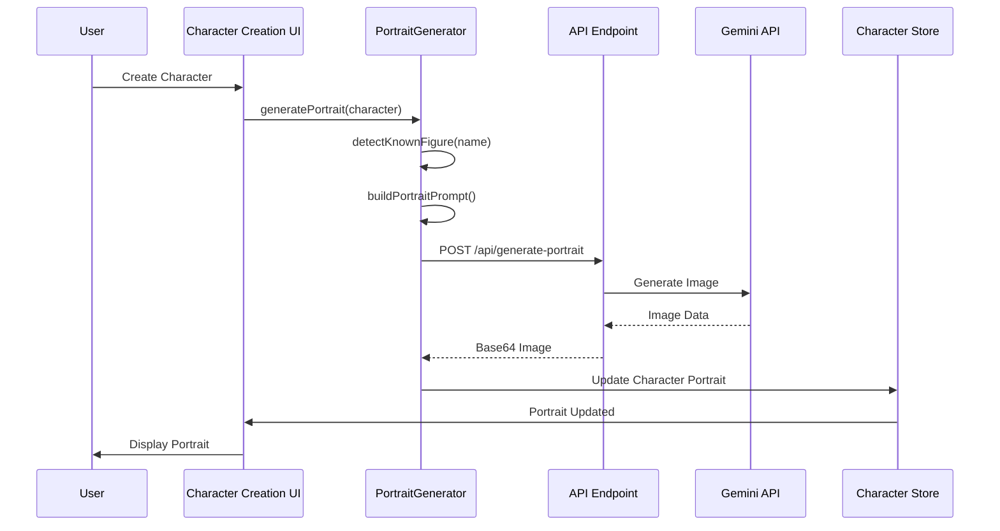
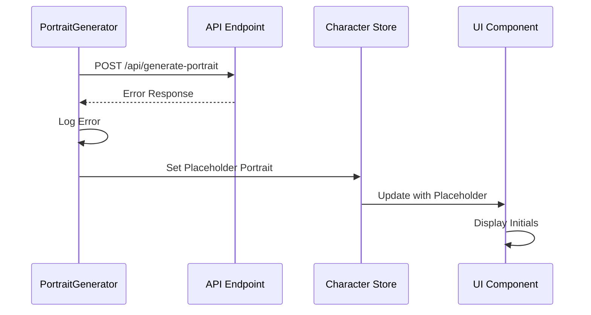
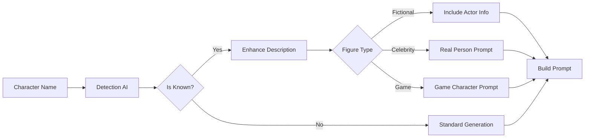
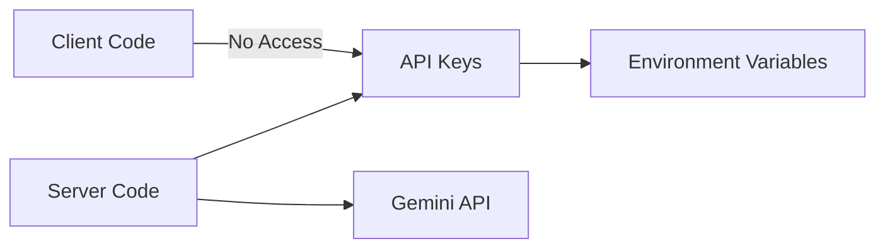
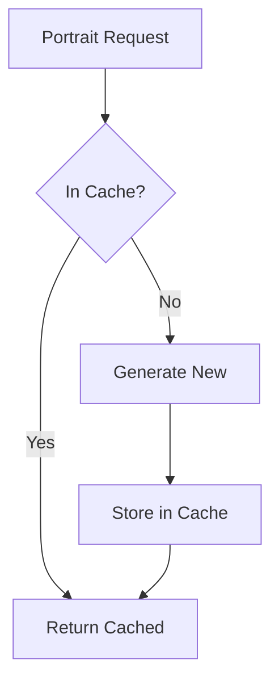

# Portrait Generation Architecture

## System Overview

The portrait generation system is designed with a modular architecture that separates concerns between UI components, business logic, and external API integration.

## Architecture Diagram

```mermaid
graph TB
    subgraph "Client Side"
        UI[Character Creation UI]
        CP[CharacterPortrait Component]
        PG[PortraitGenerator]
        AC[AIClient]
    end
    
    subgraph "Server Side"
        API[/api/generate-portrait]
        ENV[Environment Variables]
    end
    
    subgraph "External Services"
        GEM[Google Gemini API]
    end
    
    subgraph "Storage"
        IDB[IndexedDB]
        CS[Character Store]
    end
    
    UI --> PG
    PG --> AC
    AC --> API
    API --> ENV
    API --> GEM
    GEM --> API
    API --> AC
    AC --> PG
    PG --> CS
    CS --> IDB
    CS --> CP
    UI --> CP
```

## Component Details

### 1. CharacterPortrait Component
**Location**: `/src/components/CharacterPortrait/`

The UI component responsible for displaying portraits with intelligent fallback behavior.

```typescript
interface CharacterPortraitProps {
  portrait: CharacterPortrait | null;
  characterName: string;
  size?: 'small' | 'medium' | 'large';
  className?: string;
}
```

**Responsibilities:**
- Display AI-generated portraits
- Show placeholder portraits with initials
- Handle loading states
- Manage different size variations

### 2. PortraitGenerator Class
**Location**: `/src/lib/ai/portraitGenerator.ts`

Core business logic for portrait generation including character detection and prompt engineering.

```typescript
class PortraitGenerator {
  async generatePortrait(
    character: Character,
    options: PortraitGenerationOptions
  ): Promise<CharacterPortrait>
  
  private async detectKnownFigure(
    characterName: string
  ): Promise<DetectionResult>
  
  buildPortraitPrompt(
    character: Character,
    options: PortraitGenerationOptions
  ): string
}
```

**Responsibilities:**
- Detect known characters and celebrities
- Build optimized prompts for Gemini
- Enhance character descriptions for known figures
- Handle generation failures gracefully

### 3. API Endpoint
**Location**: `/src/app/api/generate-portrait/route.ts`

Next.js API route that interfaces with Google Gemini.

**Responsibilities:**
- Validate requests
- Authenticate with Gemini API
- Handle API responses and errors
- Return base64-encoded images

### 4. AI Client Integration
**Location**: `/src/lib/ai/geminiClient.ts`

Abstraction layer for AI services.

```typescript
interface AIClient {
  generateContent(prompt: string): Promise<AIResponse>;
  generateImage?(prompt: string): Promise<ImageResponse>;
}
```

## Data Flow

### Portrait Generation Flow



### Error Handling Flow



## Portrait Type System

The system uses a type-based approach for portrait management:

```typescript
type PortraitType = 'ai-generated' | 'placeholder' | 'uploaded' | 'preset';

interface CharacterPortrait {
  type: PortraitType;
  url: string | null;
  generatedAt?: string;
  prompt?: string;
}
```

### Type Descriptions

1. **ai-generated**: Successfully generated portraits from Gemini
   - Contains base64 image data
   - Includes generation timestamp
   - Stores the prompt used

2. **placeholder**: Fallback when generation fails
   - No URL (displays initials)
   - Used during loading or errors
   - Gradient background based on name

3. **uploaded**: (Future) User-uploaded custom images
   - Direct image URLs
   - No prompt data

4. **preset**: (Future) Pre-made avatar library
   - Reference to preset image ID
   - Categorized by style/theme

## Storage Architecture

### IndexedDB Schema

```typescript
// Character entity with portrait
interface Character {
  id: string;
  name: string;
  portrait?: CharacterPortrait;
  // ... other fields
}
```

### Storage Considerations

1. **Image Storage**: Base64 images are stored directly in character records
2. **Size Limits**: Browser IndexedDB typically supports 50MB+ per origin
3. **Performance**: Large images may impact load times
4. **Future Migration**: Plan to move to external storage (S3, Cloudinary)

## Character Detection System

The system includes intelligent detection for known characters:



### Detection Categories

1. **Fictional Characters**
   - Movies/TV characters with specific actors
   - Animated characters
   - Book characters

2. **Video Game Characters**
   - Recognizable game protagonists
   - Include game title in prompt

3. **Real People**
   - Celebrities, comedians, athletes
   - Historical figures
   - Public personalities

## Prompt Engineering Architecture

Prompts follow a structured three-part format:

```
[SUBJECT] + [CONTEXT] + [STYLE]
```

### Example Prompt Structure

```typescript
{
  subject: [
    "Character portrait of Harry Potter",
    "young wizard with messy black hair and round glasses"
  ],
  context: [
    "Hogwarts castle background",
    "magical atmosphere",
    "wearing Gryffindor robes"
  ],
  style: [
    "medium portrait shot",
    "photorealistic quality",
    "cinematic lighting"
  ]
}
```

## Security Architecture

### API Key Management



### Security Principles

1. **Server-Side Only**: API keys never exposed to client
2. **Environment Variables**: Keys stored in `.env.local`
3. **Request Validation**: All inputs validated server-side
4. **Error Sanitization**: Sensitive data removed from error responses

## Performance Optimization

### Caching Strategy (Future Enhancement)



### Current Optimizations

1. **Prompt Length**: Limited to ~1900 characters for token efficiency
2. **Image Size**: Gemini returns optimized web-ready images
3. **Parallel Processing**: Detection and enhancement can run concurrently
4. **Early Fallback**: Quick fallback to placeholders on errors

## Extensibility Points

The architecture supports future enhancements:

1. **Multiple AI Providers**: AIClient interface allows swapping providers
2. **Custom Portraits**: Upload system can be added without changing core logic
3. **Preset Library**: Can integrate with existing portrait type system
4. **External Storage**: Storage layer can be abstracted for cloud solutions
5. **Advanced Caching**: Can add Redis or similar for shared caching