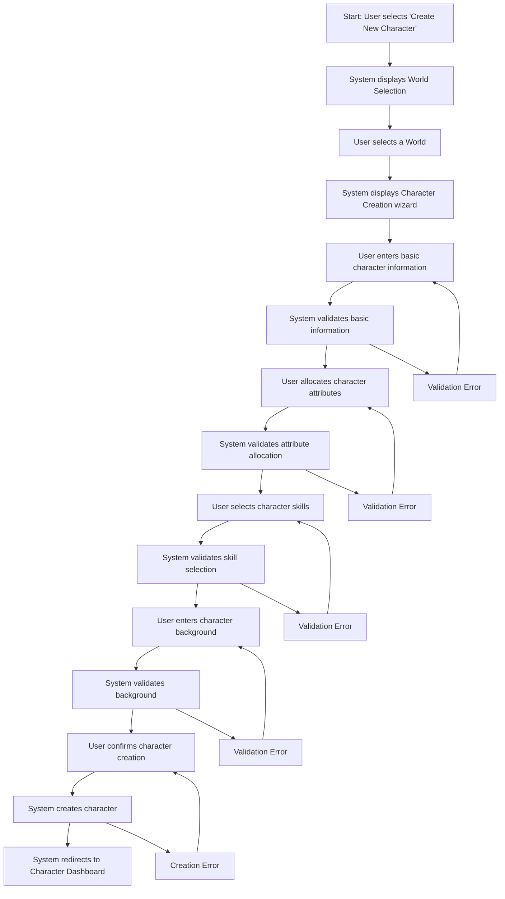

# Character Creation User Flow

## Overview
This user flow documents the process of creating a new character within a selected world in NarrAItor. It covers the complete workflow from initiating character creation to having a fully defined character ready for narrative play.

## Prerequisites
- User has logged in to NarrAItor
- At least one world has been created
- No active game session is in progress

## User Flow Diagram

## Detailed Flow Steps

### 1. Initiate Character Creation
**User Action**: Navigates to the Characters screen and clicks "Create New Character" button
**System Response**: Displays the World Selection screen if multiple worlds exist, or skips directly to Character Creation wizard if only one world exists
**UI Component**: `/src/components/character/CharacterListScreen.tsx` and `/src/components/world/WorldSelectionScreen.tsx`
**Validation**: None at this stage
**Data Changes**: None at this stage

### 2. Select World
**User Action**: Selects a world from the available worlds list
**System Response**: Loads the world configuration and displays the Character Creation wizard with step 1 (Basic Information)
**UI Component**: `/src/components/world/WorldSelectionList.tsx`
**Validation**: Selected world must exist and be properly configured
**Data Changes**: Current world is set in application state

### 3. Enter Basic Information
**User Action**: Enters character name, concept, and appearance
**System Response**: Enables the "Next" button when all required fields are filled
**UI Component**: `/src/components/character/creation/BasicInformationStep.tsx`
**Validation**: 
- Character name must be 2-30 characters
- Character concept must be 5-100 characters
- Appearance is optional but limited to 500 characters if provided
**Data Changes**: Temporary wizard state is updated with basic information

### 4. Allocate Character Attributes
**User Action**: 
- Distributes attribute points based on world-defined attributes
- Adjusts values within allowed ranges
- Clicks "Next" when finished
**System Response**: 
- Displays attribute sliders or input fields
- Shows remaining points to allocate
- Validates total point allocation
**UI Component**: `/src/components/character/creation/AttributesStep.tsx`
**Validation**: 
- Each attribute must be within world-defined min/max values
- Total attribute points must not exceed the allowed maximum
- All attribute points must be allocated
**Data Changes**: Temporary wizard state updated with attribute values

### 5. Select Character Skills
**User Action**: 
- Selects skills from world-defined skill options
- Assigns points to chosen skills
- Clicks "Next" when finished
**System Response**: 
- Displays skill selection interface
- Groups skills by related attributes
- Shows remaining skill points
**UI Component**: `/src/components/character/creation/SkillsStep.tsx`
**Validation**: 
- Selected skills must be defined in the world
- Skill values must be within world-defined min/max values
- Total skill points must not exceed the allowed maximum
- Maximum of 8 skills can be selected (MVP constraint)
**Data Changes**: Temporary wizard state updated with skill selections

### 6. Enter Character Background
**User Action**: 
- Enters character background information
- Provides personal history and personality traits
- Clicks "Next" when finished
**System Response**: 
- Displays text entry fields for background details
- Offers optional prompts to guide creation
**UI Component**: `/src/components/character/creation/BackgroundStep.tsx`
**Validation**: 
- Background text limited to 1000 characters
- Certain restricted terms may be flagged (profanity, etc.)
**Data Changes**: Temporary wizard state updated with background information

### 7. Confirm and Create Character
**User Action**: Reviews character summary and clicks "Create Character" button
**System Response**: 
- Shows loading indicator
- Creates character in the database
- Redirects to the Character Dashboard upon success
**UI Component**: `/src/components/character/creation/SummaryStep.tsx`
**Validation**: Final validation of complete character configuration
**Data Changes**: 
- New Character record created in IndexedDB
- Character state updated with new character
- Current character set to new character

## Error Paths

### Error: World Loading Failure
**Trigger**: Cannot load world configuration
**System Response**: 
- Displays error message
- Offers option to return to world selection
**Recovery Path**: User selects a different world or retry loading
**UI Component**: `/src/components/common/ErrorDisplay.tsx`

### Error: Basic Information Validation Failure
**Trigger**: User enters invalid data in step 1
**System Response**: 
- Displays field-specific error messages
- Prevents progression to next step
**Recovery Path**: User corrects the invalid fields
**UI Component**: `/src/components/character/creation/ValidationMessages.tsx`

### Error: Attribute Point Allocation Error
**Trigger**: User doesn't allocate all attribute points or exceeds limits
**System Response**: 
- Displays validation message about points
- Shows which attributes need adjustment
- Prevents progression to next step
**Recovery Path**: User correctly allocates attribute points
**UI Component**: `/src/components/character/creation/AttributePointCounter.tsx`

### Error: Character Creation Failure
**Trigger**: Database operation fails during character creation
**System Response**: 
- Displays error message with retry option
- Keeps character data in form for retry
**Recovery Path**: User clicks "Retry" or can save configuration locally
**UI Component**: `/src/components/common/ErrorDisplay.tsx`

## Success Criteria
- User can successfully create a character within a selected world
- User can allocate attribute points according to world configuration
- User can select and assign points to skills
- User can provide background information for the character
- Created character appears in the Characters list
- Character data persists between sessions
- Character reflects the world's attribute and skill definitions

## Related Components
- **CharacterCreationWizard**: `/src/components/character/creation/CharacterCreationWizard.tsx` - Main wizard container
- **BasicInformationStep**: `/src/components/character/creation/BasicInformationStep.tsx` - Step 1 of wizard
- **AttributesStep**: `/src/components/character/creation/AttributesStep.tsx` - Step 2 of wizard
- **SkillsStep**: `/src/components/character/creation/SkillsStep.tsx` - Step 3 of wizard
- **BackgroundStep**: `/src/components/character/creation/BackgroundStep.tsx` - Step 4 of wizard
- **SummaryStep**: `/src/components/character/creation/SummaryStep.tsx` - Final confirmation step
- **CharacterDashboard**: `/src/components/character/CharacterDashboard.tsx` - Landing page after creation

## Domain Interactions
- **World Domain → Character Domain**: World provides attribute and skill definitions
- **Character Domain → State Management**: Character data is persisted to IndexedDB
- **Character Domain → UI State**: Character creation progress is tracked in UI state

## Test Scenarios
1. **Happy Path**: User completes all steps with valid data and successfully creates a character
2. **Validation Error Path**: User enters invalid data at various steps and sees appropriate error messages
3. **World Constraints Path**: Character creation reflects correct constraints from selected world
4. **Cancellation Path**: User cancels character creation at various steps
5. **Database Error Path**: IndexedDB operation fails during save
6. **Edge Case: Maximum Skills**: User attempts to exceed the maximum number of skills (8)
7. **Edge Case: Point Allocation**: User tries to allocate more points than allowed

## Implementation Notes
- The wizard should maintain state internally until final submission
- Attribute and skill UI should reflect world-defined types and ranges
- Provide clear feedback on point allocation remaining
- Use optimistic UI updates with rollback on errors
- Validate character against world constraints at each step
- Consider mobile-friendly controls for point allocation

## Related Documents
- [Character System Requirements](/users/jackhaas/projects/narraitor/docs/requirements/core/character-system.md)
- [Character Interface Requirements](/users/jackhaas/projects/narraitor/docs/requirements/ui/character-interface.md)
- [World Creation Flow](/users/jackhaas/projects/narraitor/docs/flows/world-creation-flow.md)