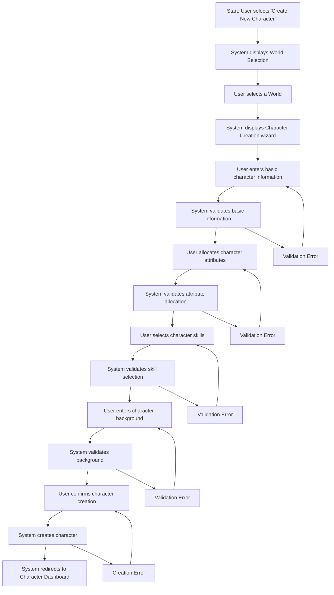

# Character Creation User Flow

## Overview
This user flow documents the process of creating a new character within a selected world in Narraitor. It covers the complete workflow from initiating character creation to having a fully defined character ready for narrative play.

## Prerequisites
- User has logged in to Narraitor
- At least one world has been created
- No active game session is in progress

## User Flow Diagram

## Detailed Flow Steps

### 1. Initiate Character Creation
**User Action**: Navigates to the Characters screen and clicks "Create New Character" button
**System Response**: Displays the World Selection screen if multiple worlds exist, or skips directly to Character Creation wizard if only one world exists
**UI Component**: `/src/components/character/CharacterListScreen.tsx` and `/src/components/world/WorldSelectionScreen.tsx`
**Validation**: None at this stage
**Data Changes**: None at this stage

### 2. Select World
**User Action**: Selects a world from the available worlds list
**System Response**: Loads the world configuration and displays the Character Creation wizard with step 1 (Basic Information)
**UI Component**: `/src/components/world/WorldSelectionList.tsx`
**Validation**: Selected world must exist and be properly configured
**Data Changes**: Current world is set in application state

### 3. Enter Basic Information
**User Action**: Enters character name and description
**System Response**: 
- Updates portrait placeholder with initials dynamically
- Shows validation errors in real-time
- Enables the "Next" button when all required fields are valid
**UI Component**: `/src/components/CharacterCreationWizard/steps/BasicInfoStep.tsx`
**Validation**: 
- Character name must be 3-50 characters
- Name must be unique within the world
- Description must be at least 50 characters
**Data Changes**: Temporary wizard state is updated with basic information

### 4. Allocate Character Attributes
**User Action**: 
- Distributes attribute points using RangeSlider components
- Uses PointPoolManager to track remaining points
- Clicks "Next" when all points are allocated
**System Response**: 
- Displays attribute sliders with visual notches
- Shows real-time point pool updates
- Dynamically constrains sliders to prevent negative pool
- Disables "Next" until all points allocated
**UI Component**: `/src/components/CharacterCreationWizard/steps/AttributesStep.tsx`
**Validation**: 
- Each attribute must be within world-defined min/max values (typically 8-18)
- Cannot make changes that would result in negative point pool
- Must allocate exactly all available points (no remaining)
**Data Changes**: Temporary wizard state updated with attribute values

### 5. Select Character Skills
**User Action**: 
- Toggles skills on/off using toggle buttons
- Selects up to the world's maximum allowed skills
- Clicks "Next" when exact number selected
**System Response**: 
- Displays skills with toggle buttons on the right
- Shows selection limit (e.g., "Select up to 5 skills")
- Prevents selecting more than allowed
- All selected skills start at level 1
- Disables "Next" until exact number selected
**UI Component**: `/src/components/CharacterCreationWizard/steps/SkillsStep.tsx`
**Validation**: 
- Must select exact number of skills specified by world
- Cannot exceed maximum skill limit
- All skills automatically set to level 1 (novice)
**Data Changes**: Temporary wizard state updated with skill selections

### 6. Enter Character Background
**User Action**: 
- Enters character history (backstory)
- Provides personality description
- Clicks "Create Character" when finished
**System Response**: 
- Displays large text areas for each field
- Shows character count validation in real-time
- Shows helpful tip about compelling backstories
**UI Component**: `/src/components/CharacterCreationWizard/steps/BackgroundStep.tsx`
**Validation**: 
- History must be at least 100 characters
- Personality must be at least 50 characters
- Maximum 1000 characters per field
**Data Changes**: Temporary wizard state updated with background information

### 7. Confirm and Create Character
**User Action**: Clicks "Create Character" button on the Background step
**System Response**: 
- Shows loading state on button
- Creates character in characterStore
- Attempts redirect to `/characters/[id]` (currently 404)
**UI Component**: Background step handles creation directly (no separate summary step in MVP)
**Validation**: Final validation of complete character configuration
**Data Changes**: 
- New Character record created via characterStore
- Character persisted to IndexedDB
- Navigation attempted to character detail page

## Error Paths

### Error: World Loading Failure
**Trigger**: Cannot load world configuration
**System Response**: 
- Displays error message
- Offers option to return to world selection
**Recovery Path**: User selects a different world or retry loading
**UI Component**: `/src/components/common/ErrorDisplay.tsx`

### Error: Basic Information Validation Failure
**Trigger**: User enters invalid data in step 1
**System Response**: 
- Displays field-specific error messages
- Prevents progression to next step
**Recovery Path**: User corrects the invalid fields
**UI Component**: `/src/components/character/creation/ValidationMessages.tsx`

### Error: Attribute Point Allocation Error
**Trigger**: User doesn't allocate all attribute points or exceeds limits
**System Response**: 
- Displays validation message about points
- Shows which attributes need adjustment
- Prevents progression to next step
**Recovery Path**: User correctly allocates attribute points
**UI Component**: `/src/components/character/creation/AttributePointCounter.tsx`

### Error: Character Creation Failure
**Trigger**: Database operation fails during character creation
**System Response**: 
- Displays error message with retry option
- Keeps character data in form for retry
**Recovery Path**: User clicks "Retry" or can save configuration locally
**UI Component**: `/src/components/common/ErrorDisplay.tsx`

## Success Criteria
- User can successfully create a character within a selected world
- User can allocate attribute points according to world configuration
- User can select and assign points to skills
- User can provide background information for the character
- Created character appears in the Characters list
- Character data persists between sessions
- Character reflects the world's attribute and skill definitions

## Related Components (Implementation Status: ✅ Complete)
- **CharacterCreationWizard**: `/src/components/CharacterCreationWizard/CharacterCreationWizard.tsx` - Main wizard container ✅
- **BasicInfoStep**: `/src/components/CharacterCreationWizard/steps/BasicInfoStep.tsx` - Step 1: Name & description ✅
- **AttributesStep**: `/src/components/CharacterCreationWizard/steps/AttributesStep.tsx` - Step 2: Point allocation with PointPoolManager ✅
- **SkillsStep**: `/src/components/CharacterCreationWizard/steps/SkillsStep.tsx` - Step 3: Skill selection (all at level 1) ✅
- **BackgroundStep**: `/src/components/CharacterCreationWizard/steps/BackgroundStep.tsx` - Step 4: History & personality ✅
- **CharacterPortraitPlaceholder**: `/src/components/CharacterCreationWizard/components/CharacterPortraitPlaceholder.tsx` - Dynamic portrait ✅
- **Shared Wizard System**: `/src/components/shared/wizard/` - Reusable wizard components ✅

## Domain Interactions
- **World Domain → Character Domain**: World provides attribute and skill definitions
- **Character Domain → State Management**: Character data is persisted to IndexedDB
- **Character Domain → UI State**: Character creation progress is tracked in UI state

## Test Scenarios
1. **Happy Path**: User completes all steps with valid data and successfully creates a character
2. **Validation Error Path**: User enters invalid data at various steps and sees appropriate error messages
3. **World Constraints Path**: Character creation reflects correct constraints from selected world
4. **Cancellation Path**: User cancels character creation at various steps
5. **Database Error Path**: IndexedDB operation fails during save
6. **Edge Case: Maximum Skills**: User attempts to exceed the maximum number of skills (8)
7. **Edge Case: Point Allocation**: User tries to allocate more points than allowed

## Implementation Notes (✅ IMPLEMENTED)
- ✅ The wizard maintains state internally using shared wizard hooks
- ✅ Attribute UI uses RangeSlider with dynamic constraints based on point pool
- ✅ Real-time feedback on point allocation with PointPoolManager
- ✅ Validation occurs at each step with real-time feedback
- ✅ Character validates against world constraints (name uniqueness, skill limits)
- ✅ Mobile-friendly sliders and toggle buttons for touch interfaces
- ✅ Shared wizard component system ensures visual consistency with WorldCreationWizard
- ✅ Auto-save functionality via sessionStorage persistence
- ⚠️ Character detail page (`/characters/[id]`) not yet implemented (causes 404 after creation)

## Related Documents
- [Character System Requirements](/users/jackhaas/projects/narraitor/docs/requirements/core/character-system.md)
- [Character Interface Requirements](/users/jackhaas/projects/narraitor/docs/requirements/ui/character-interface.md)
- [World Creation Flow](/users/jackhaas/projects/narraitor/docs/flows/world-creation-flow.md)