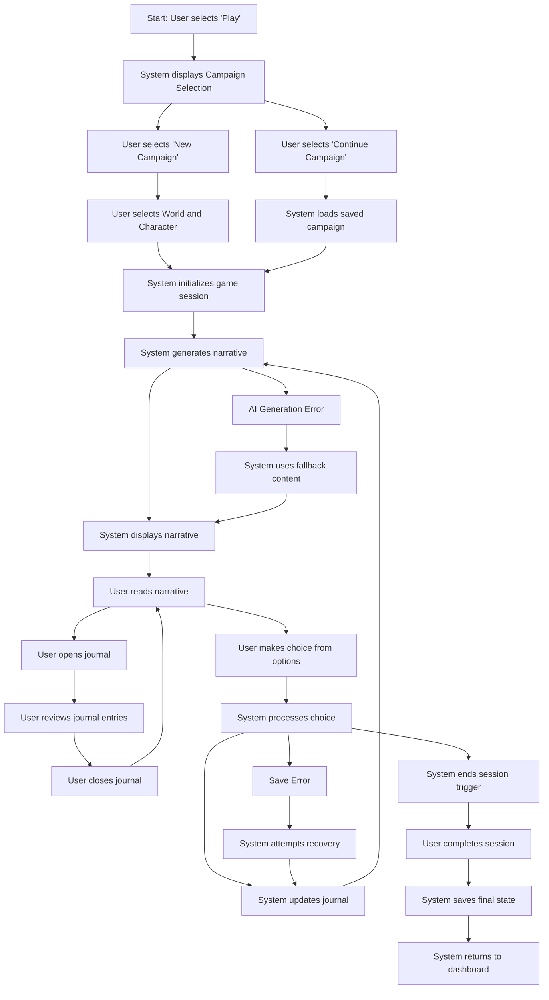

# Game Session User Flow

## Overview
This user flow documents the process of starting and playing through a narrative game session in Narraitor. It covers the sequence from session initiation through narrative progression, player choices, and journal interaction.

## Prerequisites
- User has logged in to Narraitor
- At least one world has been created
- At least one character has been created
- No other active game session is in progress
- A character must be selected before starting a session

## User Flow Diagram

## Detailed Flow Steps

### 1. Initiate Game Session
**User Action**: Navigates to the Play screen and selects "Play" button
**System Response**: Displays the Campaign Selection screen
**UI Component**: `/src/components/dashboard/DashboardScreen.tsx` and `/src/components/campaign/CampaignSelectionScreen.tsx`
**Validation**: None at this stage
**Data Changes**: None at this stage

### 2a. Start New Campaign
**User Action**: Selects "New Campaign" option
**System Response**: Displays World and Character selection interface
**UI Component**: `/src/components/campaign/NewCampaignScreen.tsx`
**Validation**: 
- At least one world must exist
- At least one character must exist for the selected world
**Data Changes**: None at this stage

### 2b. Continue Existing Campaign
**User Action**: Selects an existing campaign from the list
**System Response**: Loads the saved campaign state
**UI Component**: `/src/components/campaign/CampaignListScreen.tsx`
**Validation**: Selected campaign must exist and be valid
**Data Changes**: 
- Current campaign set to selected campaign
- World and character state loaded from saved campaign

### 3. Initialize Game Session
**User Action**: Confirms campaign settings and clicks "Start Session" button
**System Response**: 
- Shows loading indicator
- Creates new campaign if new
- Initializes game session state
- Prepares for narrative generation
**UI Component**: `/src/components/game/GameSessionContainer.tsx`
**Validation**: 
- World and character must be properly configured
- Campaign data must be valid
**Data Changes**: 
- New campaign created if new
- Session state initialized

### 4. Generate Initial Narrative
**User Action**: None (automatic)
**System Response**: 
- Shows loading indicator during AI generation
- Processes world and character context
- Generates initial narrative text
- Prepares player choice options
**UI Component**: `/src/components/game/NarrativeDisplay.tsx`
**Validation**: AI service must return valid response
**Data Changes**: 
- Narrative state updated with initial content
- Player choices generated
- Session history initiated

### 5. Display Narrative and Choices
**User Action**: Reads narrative text
**System Response**: 
- Displays formatted narrative text
- Shows character information panel
- Presents 3-4 choice options
- Enables journal access
**UI Component**: 
- `/src/components/game/NarrativeDisplay.tsx`
- `/src/components/game/ChoiceSelector.tsx`
- `/src/components/character/CharacterSummaryPanel.tsx`
**Validation**: Content must be properly formatted
**Data Changes**: None at this stage

### 6. Make Player Choice
**User Action**: Selects one of the presented choices
**System Response**: 
- Highlights selected choice
- Shows loading indicator
- Processes choice context
- Generates next narrative segment
**UI Component**: `/src/components/game/ChoiceSelector.tsx`
**Validation**: Selected choice must be valid
**Data Changes**: 
- Choice selection recorded in session history
- Narrative context updated with selection
- Journal entry created for significant decision

### 7. Update Narrative and Continue
**User Action**: None (automatic)
**System Response**: 
- Updates narrative display with new content
- Scrolls to show new content
- Presents new set of choices
- Updates journal with new events
- Auto-saves game state
**UI Component**: 
- `/src/components/game/NarrativeDisplay.tsx`
- `/src/components/game/ChoiceSelector.tsx`
**Validation**: New narrative content must be valid
**Data Changes**: 
- Narrative history updated
- New choices generated
- Journal entries created
- Game state saved to IndexedDB

### 8. Access Journal (Optional)
**User Action**: Clicks on journal icon/button
**System Response**: 
- Displays journal overlay or side panel
- Shows chronological list of journal entries
- Highlights unread entries
**UI Component**: `/src/components/journal/JournalViewer.tsx`
**Validation**: Journal data must be available
**Data Changes**: Unread entries marked as read

### 9. Review Journal Entries (Optional)
**User Action**: Browses journal entries, possibly applying filters
**System Response**: 
- Displays journal entries with formatting
- Allows filtering by entry type
- Shows entry details on selection
**UI Component**: 
- `/src/components/journal/JournalEntryList.tsx`
- `/src/components/journal/JournalEntryDetail.tsx`
**Validation**: None at this stage
**Data Changes**: Selected entry tracked for UI state

### 10. Return to Game (Optional)
**User Action**: Closes journal by clicking "Return to Game" button
**System Response**: Closes journal interface and returns to narrative display
**UI Component**: `/src/components/journal/JournalViewer.tsx`
**Validation**: None at this stage
**Data Changes**: Journal UI state reset

### 11. End Game Session
**User Action**: Clicks "End Session" button or narrative reaches conclusion
**System Response**: 
- Confirms session end with dialog
- Saves final game state
- Returns to dashboard or campaign screen
**UI Component**: `/src/components/game/SessionControls.tsx`
**Validation**: None at this stage
**Data Changes**: 
- Final game state saved
- Campaign updated with session end time
- Current session cleared

## Error Paths

### Error: AI Service Unavailable
**Trigger**: Connection to AI service fails during narrative generation
**System Response**: 
- Shows error message
- Offers fallback content options
- Provides retry button
**Recovery Path**: User selects retry or fallback option
**UI Component**: `/src/components/game/ErrorRecovery.tsx`

### Error: Save Failure
**Trigger**: IndexedDB operation fails during auto-save
**System Response**: 
- Shows warning notification
- Continues game with unsaved state
- Attempts periodic retry of save operation
**Recovery Path**: System automatically retries save, or user can manually save
**UI Component**: `/src/components/common/SaveErrorNotification.tsx`

### Error: Game State Corruption
**Trigger**: Loaded game state is invalid or corrupted
**System Response**: 
- Shows error message with recovery options
- Offers to start new session or attempt repair
**Recovery Path**: User selects recovery option
**UI Component**: `/src/components/game/SessionRecovery.tsx`

### Error: Network Interruption
**Trigger**: Internet connection lost during play
**System Response**: 
- Shows connection status indicator
- Continues with cached state if possible
- Queues actions for when connection resumes
**Recovery Path**: System automatically reconnects when available
**UI Component**: `/src/components/common/ConnectionStatus.tsx`

## Success Criteria
- User can successfully start new campaigns
- User can continue existing campaigns
- Narrative generates appropriate content based on world and character
- Player choices influence subsequent narrative
- Journal captures significant events automatically
- Game state persists between sessions
- UI responds appropriately to user choices
- Error conditions are handled gracefully

## Related Components
- **GameSessionContainer**: `/src/components/game/GameSessionContainer.tsx` - Main session container
- **NarrativeDisplay**: `/src/components/game/NarrativeDisplay.tsx` - Text display component
- **ChoiceSelector**: `/src/components/game/ChoiceSelector.tsx` - Player choice interface
- **CharacterSummaryPanel**: `/src/components/character/CharacterSummaryPanel.tsx` - Character stats display
- **JournalViewer**: `/src/components/journal/JournalViewer.tsx` - Journal interface
- **SessionControls**: `/src/components/game/SessionControls.tsx` - Session management UI
- **SaveIndicator**: `/src/components/game/SaveIndicator.tsx` - Auto-save status display

## Domain Interactions
- **World Domain → Narrative Domain**: World settings affect narrative generation
- **Character Domain → Narrative Domain**: Character attributes affect narrative context and choices
- **Narrative Domain → Journal Domain**: Narrative events create journal entries
- **World Domain → UI State**: World theme affects game session appearance
- **State Management → IndexedDB**: Game state is persisted during play

## Test Scenarios
1. **Happy Path**: User starts new campaign, makes several choices, and ends session
2. **Continue Campaign**: User loads existing campaign and continues play
3. **Journal Interaction**: User views and filters journal during play
4. **Network Error**: AI service becomes unavailable during play
5. **Save Error**: IndexedDB save operation fails
6. **Session Recovery**: User recovers from interrupted session
7. **End-of-Story**: Narrative reaches conclusion and session ends naturally

## Implementation Notes
- Auto-save should occur after each significant action (choice selection, etc.)
- Keep narrative context window optimized to preserve token usage
- Display character information relevant to current narrative context
- Implement scroll management to show new content without losing context
- Consider mobile-friendly UI for choice selection
- Balance AI token usage with narrative quality
- Implement robust error recovery for network and storage issues

## Implementation Status (May 16, 2025)

### Completed
- **World Selection Flow**: Users can select a world and click Play to start a game session
- **Play Page Routing**: Next.js route routing with worldId parameter handling
- **GameSession Component**: Core component with loading, active, and error states
- **SessionStore**: Zustand-based store for game session state management
- **Session Controls**: Basic controls for pause, resume, and end session
- **Player Choice UI**: Basic UI for displaying and selecting player choices (visual only)
- **Error Handling**: Basic error handling for missing worlds and initialization failures
- **Testing**: Comprehensive tests for GameSession component and SessionStore

### In Progress
- Narrative engine integration (future task)
- Character system integration
- Journal integration
- Complete UI styling and theming
- Persistence of game state
- Enhanced error recovery

### Implementation Path
The current implementation follows a focused MVP approach, with core components in place while maintaining clear boundaries for future features. The three-stage component testing approach has been followed to ensure component stability:

1. **Stage 1**: Storybook isolation
2. **Stage 2**: Test harness integration with interactive controls
3. **Stage 3**: System integration with routes

All core user flow steps can be tested, but narrative progression and persistence are currently simulated pending the narrative engine integration.