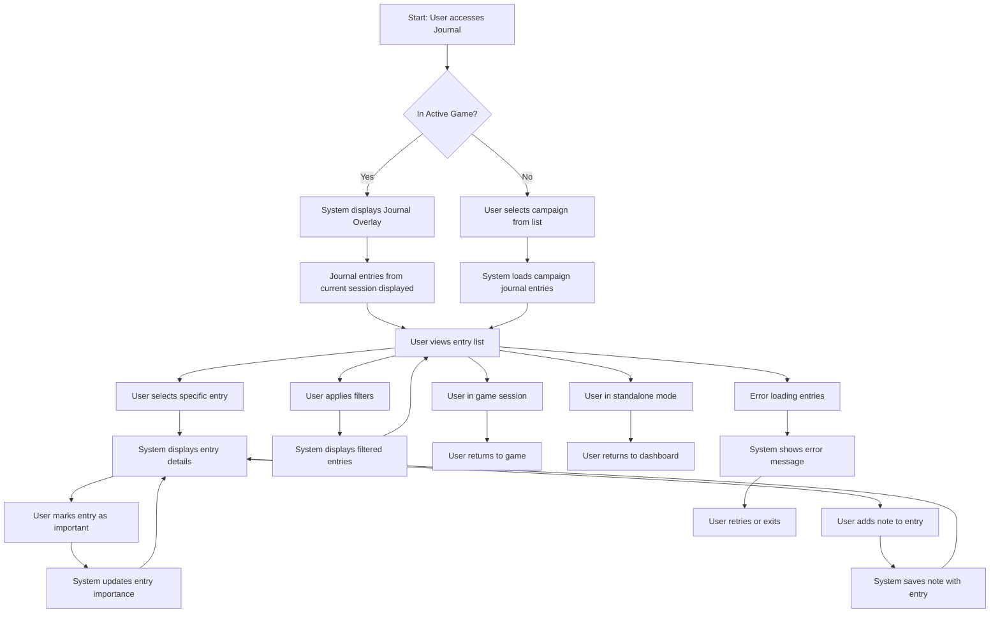

# Journal Interaction User Flow

## Overview
This user flow documents the process of accessing, reviewing, and interacting with the journal system in Narraitor. It covers both in-game journal access and standalone journal review outside of active gameplay.

## Prerequisites
- User has logged in to Narraitor
- At least one campaign with journal entries exists

## User Flow Diagram

## Detailed Flow Steps

### 1. Access Journal
**User Action**: 
- During gameplay: Clicks journal button in game interface
- Standalone: Navigates to Journal section from dashboard
**System Response**: 
- During gameplay: Displays journal overlay with current session entries
- Standalone: Displays campaign selection for journal review
**UI Component**: 
- In-game: `/src/components/journal/JournalButton.tsx` and `/src/components/journal/JournalOverlay.tsx`
- Standalone: `/src/components/journal/JournalScreen.tsx`
**Validation**: User must have permission to access journal
**Data Changes**: None at this stage

### 2. Select Campaign (Standalone Mode)
**User Action**: Selects a campaign from the list
**System Response**: Loads journal entries for the selected campaign
**UI Component**: `/src/components/journal/CampaignSelector.tsx`
**Validation**: Selected campaign must exist and have journal entries
**Data Changes**: Current journal context set to selected campaign

### 3. View Entry List
**User Action**: Browses journal entries in chronological order
**System Response**: 
- Displays formatted list of journal entries
- Groups entries by session date
- Highlights unread or important entries
**UI Component**: `/src/components/journal/JournalEntryList.tsx`
**Validation**: Journal entries must be available
**Data Changes**: UI state updated with visible entries

### 4. Apply Filters (Optional)
**User Action**: Selects filter options (entry type, importance, keyword)
**System Response**: Updates entry list based on selected filters
**UI Component**: `/src/components/journal/JournalFilters.tsx`
**Validation**: Filter options must be valid
**Data Changes**: 
- Filter state updated
- Filtered entry list generated

### 5. Select Specific Entry
**User Action**: Clicks on a journal entry from the list
**System Response**: Displays detailed view of the selected entry
**UI Component**: `/src/components/journal/JournalEntryDetail.tsx`
**Validation**: Selected entry must exist
**Data Changes**: 
- Selected entry tracked in UI state
- Entry marked as read if previously unread

### 6. Mark Entry as Important (Optional)
**User Action**: Clicks importance marker (star/flag) on an entry
**System Response**: Toggles importance status of the entry
**UI Component**: `/src/components/journal/ImportanceMarker.tsx`
**Validation**: User must have permission to modify entries
**Data Changes**: Entry importance status updated in database

### 7. Add Note to Entry (Optional)
**User Action**: Enters note text in entry detail view
**System Response**: Saves user note with the journal entry
**UI Component**: `/src/components/journal/EntryNoteEditor.tsx`
**Validation**: 
- Note text must not exceed character limit
- User must have permission to add notes
**Data Changes**: Entry updated with user note in database

### 8. Return to Previous Context
**User Action**: 
- During gameplay: Clicks "Return to Game" button
- Standalone: Clicks "Back to Dashboard" button
**System Response**: 
- During gameplay: Closes journal overlay, returns to game
- Standalone: Returns to dashboard or campaign view
**UI Component**: 
- In-game: `/src/components/journal/JournalOverlay.tsx`
- Standalone: `/src/components/journal/JournalScreen.tsx`
**Validation**: None at this stage
**Data Changes**: Journal UI state reset

## Error Paths

### Error: Journal Load Failure
**Trigger**: Unable to load journal entries from database
**System Response**: 
- Displays error message
- Offers retry option
**Recovery Path**: User retries loading or returns to previous screen
**UI Component**: `/src/components/common/ErrorDisplay.tsx`

### Error: Filter Result Empty
**Trigger**: Applied filters result in no matching entries
**System Response**: 
- Shows empty state message
- Suggests broadening filter criteria
**Recovery Path**: User adjusts filters to show results
**UI Component**: `/src/components/journal/EmptyFilterResults.tsx`

### Error: Note Save Failure
**Trigger**: Unable to save user note to database
**System Response**: 
- Shows error notification
- Preserves note text for retry
**Recovery Path**: User retries save operation
**UI Component**: `/src/components/common/SaveErrorNotification.tsx`

## Success Criteria
- User can access journal both during gameplay and standalone
- Journal entries display in chronological order with proper formatting
- Entries can be filtered by type, importance, and other criteria
- User can view detailed information for specific entries
- Important entries can be marked for easier reference
- User notes can be added to provide additional context
- Journal state persists between sessions
- Unread entries are clearly indicated

## Related Components
- **JournalScreen**: `/src/components/journal/JournalScreen.tsx` - Standalone journal interface
- **JournalOverlay**: `/src/components/journal/JournalOverlay.tsx` - In-game journal interface
- **JournalEntryList**: `/src/components/journal/JournalEntryList.tsx` - List of journal entries
- **JournalEntryDetail**: `/src/components/journal/JournalEntryDetail.tsx` - Detailed entry view
- **JournalFilters**: `/src/components/journal/JournalFilters.tsx` - Filter controls
- **EntryNoteEditor**: `/src/components/journal/EntryNoteEditor.tsx` - User note interface
- **ImportanceMarker**: `/src/components/journal/ImportanceMarker.tsx` - Entry importance toggle

## Domain Interactions
- **Journal Domain → State Management**: Journal entries loaded from database
- **Narrative Domain → Journal Domain**: Narrative events create journal entries
- **Character Domain → Journal Domain**: Character events create journal entries
- **Journal Domain → UI State**: Journal display and filter state

## Test Scenarios
1. **In-Game Access**: User accesses journal during active gameplay
2. **Standalone Access**: User reviews journal outside of gameplay
3. **Filtering**: User applies various filters to journal entries
4. **Entry Detail**: User views detailed information for a specific entry
5. **Adding Notes**: User adds personal notes to journal entries
6. **Marking Importance**: User marks entries as important
7. **Load Error**: Database error during journal loading
8. **Empty Results**: Filter criteria yield no matching entries

## Implementation Notes
- Journal overlay should not completely obscure game context
- Entry list should support virtual scrolling for large journals
- Consider collapsed/expanded view options for entry details
- Implement efficient filtering without reloading entire journal
- Use optimistic UI updates for importance toggling
- Ensure mobile-friendly layout for all journal views
- Consider search functionality for large journals
- Maintain clear navigation paths back to game or dashboard

## Related Documents
- [Journal System Requirements](/users/jackhaas/projects/narraitor/docs/requirements/core/journal-system.md)
- [Journal Interface Requirements](/users/jackhaas/projects/narraitor/docs/requirements/ui/journal-interface.md)
- [Game Session Flow](/users/jackhaas/projects/narraitor/docs/flows/game-session-flow.md)