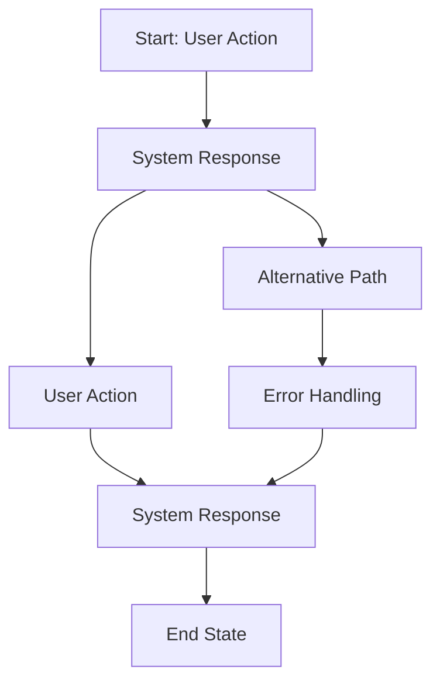

# [Flow Name] User Flow

## Overview
Brief description of this user flow's purpose and context within Narraitor.

## Prerequisites
- [Prerequisite 1]
- [Prerequisite 2]

## User Flow Diagram

## Detailed Flow Steps

### 1. [Step Name]
**User Action**: [Description of what the user does]
**System Response**: [Description of how the system responds]
**UI Component**: [Related component name and path]
**Validation**: [Any validation that occurs]
**Data Changes**: [Data that gets created/modified]

### 2. [Step Name]
**User Action**: [Description of what the user does]
**System Response**: [Description of how the system responds]
**UI Component**: [Related component name and path]
**Validation**: [Any validation that occurs]
**Data Changes**: [Data that gets created/modified]

### 3. [Step Name]
**User Action**: [Description of what the user does]
**System Response**: [Description of how the system responds]
**UI Component**: [Related component name and path]
**Validation**: [Any validation that occurs]
**Data Changes**: [Data that gets created/modified]

## Error Paths

### Error: [Error Scenario 1]
**Trigger**: [What causes this error]
**System Response**: [How the system handles it]
**Recovery Path**: [How to get back to the main flow]
**UI Component**: [Error handling component]

### Error: [Error Scenario 2]
**Trigger**: [What causes this error]
**System Response**: [How the system handles it]
**Recovery Path**: [How to get back to the main flow]
**UI Component**: [Error handling component]

## Success Criteria
- [Criterion 1]
- [Criterion 2]
- [Criterion 3]

## Related Components
- [Component 1]: [Path and purpose]
- [Component 2]: [Path and purpose]
- [Component 3]: [Path and purpose]

## Domain Interactions
- [Domain 1] → [Domain 2]: [Description of interaction]
- [Domain 2] → [Domain 3]: [Description of interaction]

## Test Scenarios
1. **Happy Path**: [Description of complete successful flow]
2. **Error Path 1**: [Description of error scenario 1]
3. **Error Path 2**: [Description of error scenario 2]
4. **Edge Case 1**: [Description of edge case 1]

## Implementation Notes
- [Note 1]
- [Note 2]
- [Note 3]

## Related Documents
- [Document 1]: [Path]
- [Document 2]: [Path]