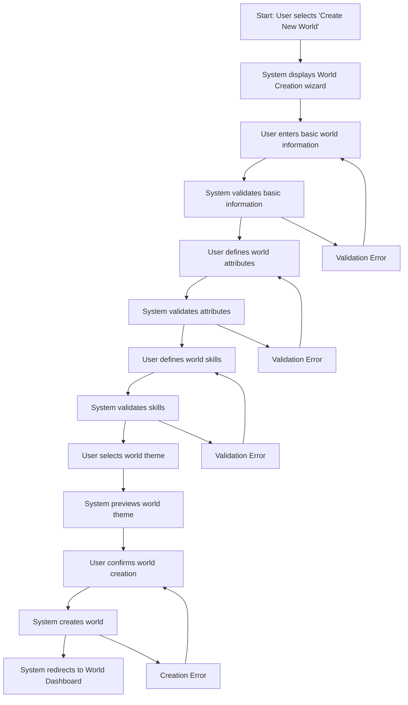

# World Creation User Flow

## Overview
This user flow documents the process of creating and configuring a new fictional world in Narraitor. It covers the complete workflow from initiating world creation to having a fully configured world ready for character creation and narrative generation.

## Prerequisites
- User has logged in to Narraitor
- No active game session is in progress

## User Flow Diagram

## Detailed Flow Steps

### 1. Initiate World Creation
**User Action**: Navigates to the Worlds screen and clicks "Create New World" button
**System Response**: Displays the World Creation wizard with step 1 (Basic Information)
**UI Component**: `/src/components/world/WorldListScreen.tsx` and `/src/components/world/creation/WorldCreationWizard.tsx`
**Validation**: None at this stage
**Data Changes**: None at this stage

### 2. Enter Basic Information
**User Action**: Enters world name, description, and selects genre
**System Response**: Enables the "Next" button when all required fields are filled
**UI Component**: `/src/components/world/creation/BasicInformationStep.tsx`
**Validation**: 
- World name must be 3-50 characters
- Description must be 10-500 characters
- Genre must be selected from predefined options
**Data Changes**: Temporary wizard state is updated with basic information

### 3. Define World Attributes
**User Action**: 
- Adds, edits, or removes attributes
- Defines name, description, and value range for each attribute
- Clicks "Next" when finished
**System Response**: 
- Displays attribute list with add/edit/delete controls
- Validates each attribute as it's added or edited
- Limits total attributes to 6 (MVP constraint)
**UI Component**: `/src/components/world/creation/AttributesStep.tsx`
**Validation**: 
- Attribute names must be unique
- Attribute names must be 2-20 characters
- Min/max/default values must be within 1-10 range
- Min must be less than max
- Default must be between min and max
**Data Changes**: Temporary wizard state updated with attributes

### 4. Define World Skills
**User Action**: 
- Adds, edits, or removes skills
- Defines name, description, related attributes, and value range for each skill
- Clicks "Next" when finished
**System Response**: 
- Displays skill list with add/edit/delete controls
- Shows available attributes for relationship selection
- Limits total skills to 12 (MVP constraint)
**UI Component**: `/src/components/world/creation/SkillsStep.tsx`
**Validation**: 
- Skill names must be unique
- Skill names must be 2-20 characters
- Each skill must relate to at least one attribute
- Min/max/default values must be within 1-5 range
- Min must be less than max
- Default must be between min and max
**Data Changes**: Temporary wizard state updated with skills

### 5. Select World Theme
**User Action**: 
- Browses available theme options
- Selects a theme
- Clicks "Create World" to finish
**System Response**: 
- Displays theme options with visual previews
- Shows selected theme applied to a sample UI
**UI Component**: `/src/components/world/creation/ThemeStep.tsx`
**Validation**: A theme must be selected
**Data Changes**: Temporary wizard state updated with selected theme

### 6. Confirm and Create World
**User Action**: Reviews world summary and clicks "Create World" button
**System Response**: 
- Shows loading indicator
- Creates world in the database
- Redirects to the World Dashboard upon success
**UI Component**: `/src/components/world/creation/SummaryStep.tsx`
**Validation**: Final validation of complete world configuration
**Data Changes**: 
- New World record created in IndexedDB
- World state updated with new world
- Current world set to new world

## Error Paths

### Error: Basic Information Validation Failure
**Trigger**: User enters invalid data in step 1
**System Response**: 
- Displays field-specific error messages
- Prevents progression to next step
**Recovery Path**: User corrects the invalid fields
**UI Component**: `/src/components/world/creation/ValidationMessages.tsx`

### Error: Attribute Validation Failure
**Trigger**: User enters invalid attribute data
**System Response**: 
- Displays attribute-specific error messages
- Prevents saving the attribute
**Recovery Path**: User corrects the invalid attribute data
**UI Component**: `/src/components/world/creation/AttributeEditor.tsx`

### Error: Skill Validation Failure
**Trigger**: User enters invalid skill data
**System Response**: 
- Displays skill-specific error messages
- Prevents saving the skill
**Recovery Path**: User corrects the invalid skill data
**UI Component**: `/src/components/world/creation/SkillEditor.tsx`

### Error: World Creation Failure
**Trigger**: Database operation fails during world creation
**System Response**: 
- Displays error message with retry option
- Keeps world data in form for retry
**Recovery Path**: User clicks "Retry" or can save configuration locally
**UI Component**: `/src/components/common/ErrorDisplay.tsx`

## Success Criteria
- User can successfully create a new world with basic information
- User can define up to 6 attributes with proper validation
- User can define up to 12 skills with attribute relationships
- User can select from available themes
- Created world appears in the Worlds list
- World data persists between sessions

## Related Components
- **WorldCreationWizard**: `/src/components/world/creation/WorldCreationWizard.tsx` - Main wizard container
- **BasicInformationStep**: `/src/components/world/creation/BasicInformationStep.tsx` - Step 1 of wizard
- **AttributesStep**: `/src/components/world/creation/AttributesStep.tsx` - Step 2 of wizard
- **SkillsStep**: `/src/components/world/creation/SkillsStep.tsx` - Step 3 of wizard
- **ThemeStep**: `/src/components/world/creation/ThemeStep.tsx` - Step 4 of wizard
- **SummaryStep**: `/src/components/world/creation/SummaryStep.tsx` - Final confirmation step
- **WorldDashboard**: `/src/components/world/WorldDashboard.tsx` - Landing page after creation

## Domain Interactions
- **World Domain → State Management**: World data is persisted to IndexedDB
- **World Domain → Character Domain**: World attributes and skills define character creation options
- **World Domain → UI State**: World theme affects UI appearance throughout the application

## Test Scenarios
1. **Happy Path**: User completes all steps with valid data and successfully creates a world
2. **Validation Error Path**: User enters invalid data at various steps and sees appropriate error messages
3. **Cancellation Path**: User cancels world creation at various steps
4. **Database Error Path**: IndexedDB operation fails during save
5. **Edge Case: Maximum Attributes**: User attempts to exceed the maximum number of attributes (6)
6. **Edge Case: Maximum Skills**: User attempts to exceed the maximum number of skills (12)
7. **Edge Case: Duplicate Names**: User attempts to create attributes or skills with duplicate names

## Implementation Notes
- The wizard should maintain state internally until final submission
- Use a multi-step form pattern with progress indicator
- Implement field-level validation with immediate feedback
- Pre-populate attribute and skill ranges with sensible defaults
- Provide visual previews of themes to assist selection
- Use optimistic UI updates with rollback on errors

## Related Documents
- [World Configuration System Requirements](/users/jackhaas/projects/narraitor/docs/requirements/core/world-configuration.md)
- [World Interface Requirements](/users/jackhaas/projects/narraitor/docs/requirements/ui/world-interface.md)
- [Character Creation Flow](/users/jackhaas/projects/narraitor/docs/flows/character-creation-flow.md)