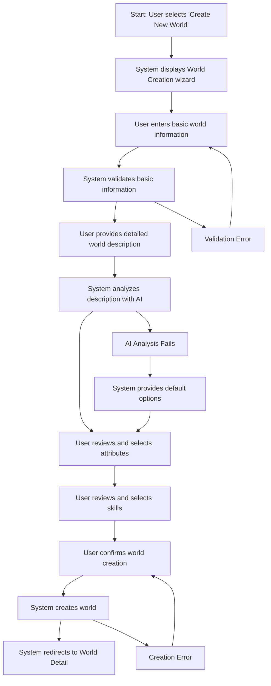

# World Creation User Flow

## Overview
This user flow documents the process of creating and configuring a new fictional world in Narraitor. It covers the complete workflow from initiating world creation to having a fully configured world ready for character creation and narrative generation.

## Prerequisites
- User has logged in to Narraitor
- No active game session is in progress

## User Flow Diagram

## Detailed Flow Steps

### 1. Initiate World Creation
**User Action**: Navigates to the Worlds screen and clicks "Create New World" button
**System Response**: Displays the World Creation wizard with step 1 (Basic Information)
**UI Component**: `/src/components/WorldCreationWizard/WorldCreationWizard.tsx`
**Validation**: None at this stage
**Data Changes**: None at this stage

### 2. Enter Basic Information
**User Action**: Enters world name, brief description, and selects genre
**System Response**: Enables the "Next" button when all required fields are filled
**UI Component**: `/src/components/WorldCreationWizard/steps/BasicInfoStep.tsx`
**Validation**: 
- World name must be at least 3 characters
- Brief description must be at least 10 characters
- Genre is pre-selected (defaults to 'fantasy')
**Data Changes**: Temporary wizard state is updated with basic information

### 3. Provide Detailed Description
**User Action**: 
- Enters a detailed world description
- Clicks "Next" to proceed
**System Response**: 
- Validates description length (50-3000 characters)
- Shows processing overlay during AI analysis
- Analyzes description using AI service
**UI Component**: `/src/components/WorldCreationWizard/steps/DescriptionStep.tsx`
**Validation**: 
- Description must be 50-3000 characters
**Data Changes**: Temporary wizard state updated with description

### 4. Review and Select Attributes
**User Action**: 
- Reviews AI-suggested attributes
- Toggles acceptance of each attribute
- Can accept up to 6 attributes
- Clicks "Next" when finished
**System Response**: 
- Displays suggested attributes with descriptions
- Updates selection count as user toggles attributes
- Enforces maximum of 6 attributes
**UI Component**: `/src/components/WorldCreationWizard/steps/AttributeReviewStep.tsx`
**Validation**: 
- At least 1 attribute must be selected
- Maximum of 6 attributes allowed
**Data Changes**: Temporary wizard state updated with selected attributes

### 5. Review and Select Skills
**User Action**: 
- Reviews AI-suggested skills
- Toggles acceptance of each skill
- Can accept up to 12 skills
- Clicks "Next" when finished
**System Response**: 
- Displays suggested skills with descriptions
- Updates selection count as user toggles skills
- Enforces maximum of 12 skills
**UI Component**: `/src/components/WorldCreationWizard/steps/SkillReviewStep.tsx`
**Validation**: 
- At least 1 skill must be selected
- Maximum of 12 skills allowed
**Data Changes**: Temporary wizard state updated with selected skills

### 6. Finalize and Create World
**User Action**: 
- Reviews world summary
- Clicks "Create World" button
**System Response**: 
- Displays complete world configuration
- Creates world with unique ID
- Redirects to world detail page or calls onComplete callback
**UI Component**: `/src/components/WorldCreationWizard/steps/FinalizeStep.tsx`
**Validation**: Final validation of complete world configuration
**Data Changes**: 
- New World record created with unique ID
- World state updated with new world
- Navigation to world detail page

## Error Paths

### Error: Basic Information Validation Failure
**Trigger**: User enters invalid data in step 1
**System Response**: 
- Displays field-specific error messages
- Prevents progression to next step
**Recovery Path**: User corrects the invalid fields
**UI Component**: Error messages shown inline in `BasicInfoStep.tsx`

### Error: Description Validation Failure
**Trigger**: User enters description outside valid length
**System Response**: 
- Displays description-specific error message
- Prevents progression to next step
**Recovery Path**: User adjusts description length
**UI Component**: Error message shown inline in `DescriptionStep.tsx`

### Error: AI Analysis Failure
**Trigger**: AI service fails to analyze description
**System Response**: 
- Displays warning message
- Provides default attribute and skill suggestions
- Allows progression with defaults
**Recovery Path**: User proceeds with default suggestions
**UI Component**: Warning shown in `DescriptionStep.tsx`

### Error: World Creation Failure
**Trigger**: Store operation fails during world creation
**System Response**: 
- Displays error message
- Keeps world data in form for retry
**Recovery Path**: User can retry creation
**UI Component**: Error shown in `FinalizeStep.tsx`

## Success Criteria
- User can successfully create a new world with basic information
- AI analyzes descriptions and provides relevant suggestions
- User can select from suggested attributes (max 6)
- User can select from suggested skills (max 12)
- Created world has unique identifier
- World data persists in the store
- User is redirected to appropriate page after creation

## AI Analysis Details
The AI analysis accepts the world description and suggests:
- 3-6 core attributes appropriate for the world
- 6-12 skills that would be relevant
- Each suggestion includes name, description, and categorization
- Fallback defaults are provided if AI fails

## Related Components
- **WorldCreationWizard**: `/src/components/WorldCreationWizard/WorldCreationWizard.tsx` - Main wizard container
- **BasicInfoStep**: `/src/components/WorldCreationWizard/steps/BasicInfoStep.tsx` - Step 1 of wizard
- **DescriptionStep**: `/src/components/WorldCreationWizard/steps/DescriptionStep.tsx` - Step 2 of wizard
- **AttributeReviewStep**: `/src/components/WorldCreationWizard/steps/AttributeReviewStep.tsx` - Step 3 of wizard
- **SkillReviewStep**: `/src/components/WorldCreationWizard/steps/SkillReviewStep.tsx` - Step 4 of wizard
- **FinalizeStep**: `/src/components/WorldCreationWizard/steps/FinalizeStep.tsx` - Final confirmation step
- **worldAnalyzer**: `/src/lib/ai/worldAnalyzer.ts` - AI analysis service

## Domain Interactions
- **World Domain → State Management**: World data is persisted to worldStore
- **World Domain → AI Service**: World descriptions analyzed by AI for suggestions
- **World Domain → Character Domain**: World attributes and skills define character creation options
- **World Domain → Navigation**: Successful creation navigates to world detail

## Test Scenarios
1. **Happy Path**: User completes all steps with valid data and successfully creates a world
2. **Validation Error Path**: User enters invalid data at various steps and sees appropriate error messages
3. **AI Failure Path**: AI service fails but user proceeds with default suggestions
4. **Cancellation Path**: User cancels world creation at various steps
5. **Store Error Path**: World creation fails at final step
6. **Edge Case: Maximum Attributes**: User attempts to select more than 6 attributes
7. **Edge Case: Maximum Skills**: User attempts to select more than 12 skills
8. **Edge Case: Long Description**: User enters very long description near character limit

## Implementation Notes
- The wizard maintains state internally until final submission
- Uses a multi-step form pattern with progress indicator
- Implements field-level validation with immediate feedback
- Provides AI-powered suggestions with graceful fallback
- Uses optimistic UI updates with error handling
- Supports both callback pattern and router navigation

## Related Documents
- [World Configuration System Requirements](/docs/requirements/core/world-configuration.md)
- [World Interface Requirements](/docs/requirements/ui/world-interface.md)
- [AI Service Integration](/docs/requirements/integrations/ai-service.md)
- [State Management](/docs/technical-guides/state-management-usage.md)
