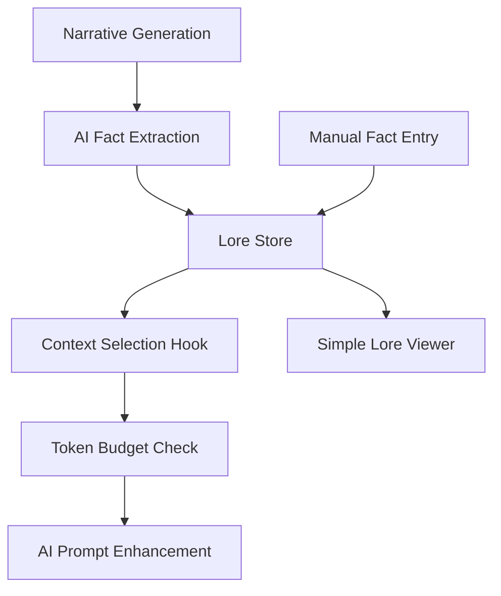

# Basic Lore Foundation System - MVP Implementation Plan

## Task Analysis

**GitHub Issue**: #434 Basic Lore Foundation System  
**Labels**: enhancement, user-story, MVP Enhancement  
**Description**: Minimal implementation to track key story facts and enable AI context integration  
**Priority**: Medium (MVP Enhancement) - Enables High Priority #185 & #184  
**Approach**: MVP-focused with hooks for AI integration, planning for post-MVP enhancements

## Technical Design

### MVP Scope
- Basic lore storage with categories
- AI-powered fact extraction (simple implementation)
- Hooks for AI context integration (#185)
- Basic token budget management
- Simple search functionality
- Manual fact addition capability

### Data Flow


### Core Changes

1. **State Management Layer**
   - Location: `/src/state/loreStore.ts`
   - Details: Minimal Zustand store with essential CRUD operations
   - Integration hook: `getFactsForContext()` method for #185

2. **AI-Powered Fact Extraction**
   - Location: `/src/lib/ai/loreExtractor.ts`
   - Details: Use Gemini to extract facts from narrative segments
   - MVP approach: Single prompt, simple fact format

3. **Context Integration Hook**
   - Location: `/src/lib/ai/loreContextManager.ts`
   - Details: Interface for #185 to consume lore facts
   - Token budget: Simple character count limit (20% of context)

4. **Basic UI Component**
   - Location: `/src/components/Lore/LoreViewer.tsx`
   - Details: Read-only fact display with categories
   - Manual entry: Simple form for adding facts

## Interfaces

```typescript
// MVP Types - Simplified for quick implementation
interface LoreFact {
  id: string;
  category: 'character' | 'location' | 'event' | 'rule';
  content: string;  // Simple string fact
  source: 'narrative' | 'manual';
  segmentId?: string;
  sessionId: string;
  worldId: string;
  createdAt: string;
}

interface LoreStore {
  // State
  facts: Record<string, LoreFact>;
  loading: boolean;
  error: string | null;

  // Basic CRUD
  addFact: (fact: Omit<LoreFact, 'id' | 'createdAt'>) => string;
  deleteFact: (id: string) => void;
  
  // Query actions
  getFactsByCategory: (category: string) => LoreFact[];
  getFactsBySession: (sessionId: string) => LoreFact[];
  searchFacts: (query: string) => LoreFact[];
  
  // AI Integration Hook (for #185)
  getFactsForContext: (sessionId: string, tokenBudget: number) => string;
  
  // Fact extraction
  extractFactsFromSegment: (segment: NarrativeSegment, sessionId: string) => Promise<void>;
}

// AI Extraction Request (MVP - single prompt approach)
interface FactExtractionPrompt {
  narrative: string;
  worldContext: string;
  instructions: "Extract key facts about characters, locations, events, and rules";
}
```

## Implementation Steps

1. [ ] **Define test cases** (TDD approach)
   - Unit tests for basic loreStore operations
   - Mock tests for AI fact extraction
   - Tests for context integration hook
   - Token budget calculation tests

2. [ ] **Create Storybook story** 
   - LoreViewer component with empty/populated states
   - Manual fact entry form
   - Category display

3. [ ] **Implement minimal loreStore**
   - Basic CRUD operations only
   - Simple fact structure (just content strings)
   - Add `getFactsForContext()` hook for #185

4. [ ] **Build AI-powered fact extraction**
   - Single Gemini API call approach
   - Simple prompt: "Extract facts about characters, locations, events, and rules"
   - Parse response into fact categories
   - Limit to 5 facts per segment (MVP constraint)

5. [ ] **Create context integration hook**
   - `getFactsForContext()` returns formatted string
   - Simple token budget: count characters, limit to 20% of context
   - Recent facts prioritized (by createdAt)

6. [ ] **Build minimal LoreViewer**
   - Display facts by category
   - Basic search (string contains)
   - Manual fact entry form
   - No edit/update in MVP

7. [ ] **Integrate with narrative generation**
   - Call fact extraction after each segment
   - Store facts with session/world IDs
   - No validation or deduplication in MVP

8. [ ] **Create test harness** (/dev/lore-system)
   - Test fact extraction from sample narratives
   - Verify token budget calculations
   - Check AI context integration

### Existing Utilities to Leverage
- `/src/lib/utils/generateId.ts`: For generating unique fact IDs
- `/src/state/persistence.ts`: IndexedDB storage configuration
- `/src/lib/ai/geminiClient.ts`: For fact extraction API calls
- Existing Zustand patterns from narrativeStore.ts

### Files to Modify
- `/src/lib/ai/promptTemplates.ts`: Add lore context section (prep for #185)
- `/src/components/GameSession/GameSessionActive.tsx`: Add lore viewer access

### Files to Create (MVP only)
- `/src/state/loreStore.ts`: Minimal store implementation
- `/src/components/Lore/LoreViewer.tsx`: Basic UI component
- `/src/lib/ai/loreExtractor.ts`: AI fact extraction
- `/src/lib/ai/loreContextManager.ts`: Integration hook
- `/src/types/lore.types.ts`: Simple type definitions

## Test Plan

1. **Unit Tests**:
   - loreStore CRUD operations
   - Context integration hook with token limits
   - Search functionality
   - AI extraction response parsing

2. **Storybook Story**:
   - Empty state
   - Populated with sample facts
   - Category views
   - Manual entry form

3. **Test Harness** (/dev/lore-system):
   - AI fact extraction from real narratives
   - Token budget verification
   - Context hook output testing

4. **Integration Tests**:
   - Fact extraction during narrative generation
   - Persistence across sessions
   - Performance with 50+ facts (MVP target)

## Success Criteria

- [x] Basic fact storage with categories implemented
- [x] AI-powered fact extraction working (5 facts/segment limit)
- [x] Context integration hook ready for #185
- [x] Simple token budget management (20% of context)
- [x] Manual fact entry capability
- [x] Basic search functionality
- [x] Performance impact <100ms on narrative generation
- [x] Stories follow 'Narraitor/Lore/LoreViewer' naming

## Technical Notes

- Use single Gemini API call for fact extraction (MVP simplicity)
- No deduplication or validation in MVP - add in post-MVP
- Token budget uses simple character count (1 token ≈ 4 chars)
- Facts are immutable in MVP (no edit functionality)
- Category assignment done by AI during extraction

## Out of Scope (MVP)

- Fact editing/updating
- Deduplication logic
- Fact validation
- Complex relevance scoring
- Fact relationships/graph structure
- Priority levels
- Reference counting
- Visual indicators for importance
- Export/import functionality

## MVP to Post-MVP Migration Path

1. **Phase 1 (Current MVP)**:
   - Get basic system working
   - Enable #185 and #184 implementation
   - Gather usage data

2. **Phase 2 (Post-MVP Enhancement)**:
   - Add fact validation and deduplication
   - Implement priority/relevance scoring
   - Add edit/update capabilities
   - Enhance UI with visual indicators

3. **Phase 3 (Advanced Features)**:
   - Implement #409 (Validation Layer)
   - Add #441 (Contradiction Detection)
   - Create fact relationship graphs
   - Build #437 (Context-Aware Tooltips)

## AI Fact Extraction Approach (MVP)

### Extraction Prompt Template
```typescript
const extractionPrompt = `
Given the following narrative segment, extract up to 5 important facts.
Categorize each fact as: character, location, event, or rule.

Narrative: ${narrativeContent}

Return facts in this JSON format:
{
  "facts": [
    {"category": "character", "content": "John is afraid of water"},
    {"category": "location", "content": "The tavern has a secret basement"},
    {"category": "event", "content": "The king's coronation is next week"},
    {"category": "rule", "content": "Magic is forbidden in the city"}
  ]
}

Focus on facts that would be important for maintaining story consistency.
`;
```

### Integration Example (for #185)
```typescript
// In future AI prompt generation:
const loreContext = loreStore.getFactsForContext(sessionId, 2000);
const enhancedPrompt = `
${basePrompt}

Established Facts:
${loreContext}

Ensure your response is consistent with these established facts.
`;
```

## Related Issues Dependency Graph

```
#434 (This issue - Foundation)
  ├── Enables → #185 (Include lore in AI context)
  ├── Enables → #184 (Ensure AI consistency)
  └── Prepares for → #409 (Validation Layer - Post-MVP)
                    └── #441 (Contradiction Detection - Post-MVP)
```
