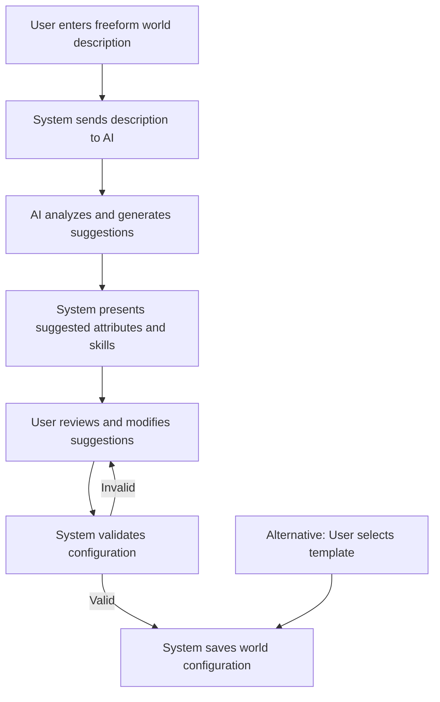

# NarrAItor MVP Implementation Plan

## Overview
This document outlines the implementation strategy for the Minimum Viable Product (MVP) of the NarrAItor project. It focuses on delivering essential functionality with a phased approach, ensuring a working product that can be iteratively enhanced while maintaining a lean scope.

## MVP Goals

1. Create a working narrative RPG framework that supports user-defined fictional worlds
2. Implement AI-assisted world creation from freeform descriptions
3. Develop essential systems for character creation and management
4. Provide a basic AI-driven narrative experience with Google Gemini integration
5. Include a journal system for tracking game history and player decisions
6. Ensure robust state persistence between sessions using IndexedDB
7. Deliver a clean, maintainable codebase following best practices and TDD principles
8. Incorporate error recovery and graceful failure handling

## Core Systems Scope

### World Configuration System (MVP)
- AI-assisted world creation from freeform descriptions:
  - User provides a description of their fictional world
  - AI analyzes description and suggests attributes and skills
  - User reviews and modifies suggestions
  - System finalizes world configuration
- Attribute system with up to 6 attributes per world (range 1-10)
- Skill system with up to 12 skills linked to attributes (range 1-5)
- Template worlds as fallback options (Western, Sitcom, Fantasy)
- World selection interface showing available worlds
- Basic world editing functionality
- Five pre-defined theme options affecting UI appearance
- Basic error handling and validation for world configurations

### Character System (MVP)
- 4-step character creation wizard (Basic Info, Attributes, Skills, Background)
- Point-buy attribute allocation respecting world-defined limits
- Skill selection and rating (up to 8 skills per character)
- Text-based character description and background
- Character listing with filtering by world
- Basic character editing functionality
- Support for multiple characters per world
- Character creation progress recovery
- Character validation and error handling

### Narrative Engine (MVP)
- Narrative generation using Google Gemini API
- Player choice system with 3-4 options per decision point
- Context management retaining 5-10 narrative segments
- History tracking for narrative segments and player decisions
- Scene transitions with location/setting changes
- Error recovery with retries and fallback content
- Prompt construction optimized for token efficiency
- World-appropriate tone and content generation
- Proper text formatting with paragraphs and dialogue
- Retry mechanisms for failed AI generation
- Fallback content for service unavailability

### Journal System (MVP)
- Automatic entry creation for narrative events, decisions, discoveries, and character encounters
- Entry categorization by four primary types
- Chronological journal view with entry detail display
- Basic filtering by entry type and significance
- New/unread entry indicators
- Session date grouping
- Mobile and desktop responsive design
- Integration with game session UI
- Entry importance levels (major/minor)
- Proper formatting for journal entries

### State Management (MVP)
- React Context + useReducer pattern for all domains
- TypeScript-based type safety throughout
- IndexedDB persistence with auto-save (every 5 minutes and after major events)
- Campaign management (create, list, load, delete)
- Export/import functionality for campaign data and world configurations
- Error handling with storage failure detection and recovery
- Component hooks for clean state access
- Safe resume functionality for interrupted sessions
- State validation middleware
- Database versioning system
- Basic progress tracking per campaign

### Game Session UI (MVP)
- Responsive narrative display with markdown formatting
- Choice presentation with 3-4 options as cards or buttons
- Character summary panel showing relevant attributes and skills
- Journal access button with unread indicator
- Loading indicator during AI generation
- Auto-saving with save time display
- World-appropriate styling (fonts, colors, decorative elements)
- Basic accessibility features (keyboard navigation, screen reader compatibility)
- Session recovery options
- Error recovery interface
- Save indicators and confirmation
- Character strength indicators for choices

### AI Service Integration (MVP)
- Google Gemini integration as primary AI provider
- Dual-purpose AI usage:
  - World creation assistance (analyzing descriptions, suggesting attributes/skills)
  - Narrative generation (creating story content, player choices)
- Prompt template system for different use cases
- Error handling with automatic retries
- Context optimization for token efficiency
- Fallback content when service unavailable
- Response parsing and normalization
- Content safety filters
- Basic performance monitoring
- Response formatting for display
- Token usage tracking
- User-friendly error messages

## Implementation Phases

### Phase 1: Project Setup and Infrastructure
- Initialize Next.js 14 project with TypeScript
- Configure ESLint, Prettier, and EditorConfig
- Set up Jest and React Testing Library
- Configure Storybook for component development
- Create domain-driven project structure
- Set up state management architecture
- Implement IndexedDB persistence layer
- Create core UI components library
- Build error boundary system
- Set up development diagnostics

### Phase 2: World Configuration System
- Implement world configuration reducer and types
- Create world creation form for freeform descriptions
- Build world description analyzer using Google Gemini
- Implement attribute and skill suggestion system
- Create user interface for reviewing and editing AI suggestions
- Develop template world system as fallback option
- Build world selection interface
- Implement world editor interface
- Create world theme system with 5 presets
- Build validation and error handling

### Phase 3: Character System
- Implement character state reducer and types
- Create 4-step character creation wizard
- Develop attribute allocation interface with validation
- Build skill selection interface with attribute linking
- Create character listing with filtering and sorting
- Implement character detail view
- Add basic character editing functionality
- Build character creation progress recovery
- Create validation and error handling

### Phase 4: AI Service Integration
- Implement Google Gemini API client
- Create prompt template system for different use cases
- Develop response parsing and normalization
- Implement error handling and retry logic
- Add token optimization for context management
- Create fallback systems for service failures
- Build configuration interface for API settings
- Implement content safety filters
- Add basic performance monitoring
- Create response formatting system

### Phase 5: Narrative Engine
- Implement narrative state reducer and types
- Create narrative context management system
- Develop player choice interface components
- Build narrative history tracking
- Implement scene transition logic
- Create narrative text display component
- Add decision relevance tracking
- Develop error recovery mechanisms
- Implement fallback narrative content
- Build text formatting system
- Create retry mechanism for failed generation

### Phase 6: Journal System
- Implement journal entry data model and reducer
- Create automatic entry creation system
- Build journal list view component
- Develop journal entry detail component
- Implement entry filtering and categorization
- Add new/unread entry tracking
- Create journal session grouping
- Build mobile-responsive journal interface
- Implement entry importance levels
- Create journal entry formatting

### Phase 7: Game Session Integration
- Create game session container component
- Integrate narrative display with AI service
- Connect player choices to narrative progression
- Implement character summary panel
- Add journal access functionality
- Create loading and error states
- Develop session controls (save, exit)
- Add world theme integration for UI components
- Build session recovery interface
- Implement choice strength indicators
- Add save indicators and confirmation

### Phase 8: Testing and Refinement
- Complete unit test coverage for all components
- Add integration tests for system interactions
- Implement end-to-end tests for critical flows
- Address performance bottlenecks
- Improve error handling and recovery
- Enhance accessibility features
- Fix identified bugs and issues
- Test error recovery paths
- Validate session restoration
- Final documentation updates

## Development Approach

### TDD Workflow
1. Create GitHub issues from requirements documents
2. Define clear acceptance criteria for each issue
3. Write tests to define expected behavior
4. Implement minimal code to pass tests
5. Refactor while maintaining test coverage
6. Conduct code reviews against established standards
7. Merge with CI/CD validation

### Component Development
1. Define component requirements and props interface
2. Create Storybook stories for all component variants
3. Develop component in isolation with TDD
4. Ensure responsive behavior across breakpoints
5. Implement accessibility features (ARIA, keyboard)
6. Document component API and usage patterns
7. Integrate into application flow

### State Management
1. Define domain-specific state types and interfaces
2. Create typed actions for all state mutations
3. Implement pure reducers with immutable updates
4. Add persistence layer with proper error handling
5. Create selector functions for derived data
6. Build custom hooks for component access
7. Add state validation and integrity checks

### AI Integration
1. Create modular AI service with specialized generators
2. Implement structured prompt templates for world creation and narrative
3. Build robust response parsers with validation
4. Develop fallback systems for service unavailability
5. Create error handling with appropriate retry logic
6. Implement context optimization for token efficiency

## AI-Assisted World Creation Flow

## Key Technical Decisions

1. **Framework**: Next.js 14+ with App Router
2. **Language**: TypeScript with strict typing
3. **State Management**: React Context + useReducer pattern
4. **Persistence**: IndexedDB via idb library
5. **UI Framework**: Tailwind CSS with world theming
6. **Testing**: Jest + React Testing Library + Playwright
7. **AI Integration**: Google Gemini API
8. **Development Approach**: TDD with KISS principles
9. **Component Development**: Storybook-first approach
10. **Documentation**: Markdown with Mermaid diagrams
11. **Error Recovery**: Comprehensive error handling with recovery options
12. **Accessibility**: WCAG 2.1 AA compliance

## BootHillGM Reference Code

Several components from the BootHillGM project will serve as valuable references:

1. **AI Integration**: The `/app/services/ai/aiService.ts` implementation provides a proven architecture for AI integration with proper error handling and fallbacks
2. **Error Recovery**: The session recovery in `/app/components/GameSessionContent.tsx` offers robust patterns for handling errors and crashes
3. **State Management**: The campaign state management in `/app/components/CampaignStateManager.tsx` provides a tested approach for game save management
4. **Narrative Interface**: The narrative display in `/app/components/NarrativeDisplay.tsx` demonstrates effective formatting
5. **Journal System**: The journal implementation in `/app/components/JournalViewer.tsx` shows useful patterns for history tracking
6. **Character Creation**: The wizard approach in `/app/components/CharacterCreation` offers a solid foundation
7. **Debug Tools**: The debug panel in `/app/components/Debug/DevToolsPanel.tsx` provides valuable patterns for development diagnostics

These components should be examined closely during implementation to leverage proven solutions.

## MVP Deliverables

1. **Working Application**
   - AI-assisted world creation system
   - Character creation and management system
   - AI-driven narrative engine with player choices
   - Journal system for game history tracking
   - Robust state persistence and campaign management
   - Responsive, accessible UI with world theming
   - Error recovery and session management

2. **Documentation**
   - System architecture documentation
   - User guides for key features
   - Component library in Storybook
   - Type definitions and interfaces
   - Development workflows and patterns
   - Error handling guidelines

3. **Test Coverage**
   - Unit tests for all components and functions
   - Integration tests for system interactions
   - End-to-end tests for critical user journeys
   - Accessibility tests with axe-core
   - Performance benchmarks for critical operations
   - Error recovery path testing

## Success Criteria

The MVP will be considered successful when:

1. Users can create worlds by providing freeform descriptions that are analyzed by AI
2. Users can review and customize AI-suggested attributes and skills
3. Users can create characters with attributes and skills defined by the world
4. The narrative engine generates coherent, world-appropriate content
5. Player choices meaningfully influence subsequent narrative
6. The journal system records and categorizes game events
7. The state management system reliably persists game state
8. The UI is responsive across desktop and mobile devices
9. The system recovers gracefully from errors and crashes
10. All core user journeys pass end-to-end tests
11. The codebase follows established best practices and standards
12. The application performs well with acceptable loading times
13. Users can recover from interrupted sessions without significant data loss

## Risk Management

### Technical Risks

1. **AI Integration Challenges**
   - **Risk**: Google Gemini API limitations, inconsistent output, or token cost concerns
   - **Mitigation**: Create robust prompt templates, implement fallback content, add retry mechanisms, optimize context management
   - **Contingency**: Prepare alternative AI providers or simplified rule-based fallbacks

2. **IndexedDB Complexity**
   - **Risk**: Challenges with IndexedDB implementation, browser compatibility issues
   - **Mitigation**: Use established library (idb), implement comprehensive error handling, add storage quota management
   - **Contingency**: Create localStorage fallback for critical data

3. **Performance Bottlenecks**
   - **Risk**: Slow application performance with large datasets or complex state
   - **Mitigation**: Implement state normalization, use selector memoization, optimize renders
   - **Contingency**: Add state pruning for older entries, implement pagination

4. **Next.js App Router Limitations**
   - **Risk**: Unexpected limitations or performance issues with App Router
   - **Mitigation**: Keep up with Next.js updates, test core functionality early
   - **Contingency**: Prepare fallback to Pages Router if necessary

5. **Error Recovery Complexity**
   - **Risk**: Difficulty implementing robust error recovery for all failure scenarios
   - **Mitigation**: Prioritize recovery for critical paths, implement comprehensive logging
   - **Contingency**: Simplify recovery options and focus on data preservation

### Project Risks

1. **Scope Creep**
   - **Risk**: Feature expansion beyond MVP boundaries
   - **Mitigation**: Strict adherence to requirements, regular scope review, clear documentation of out-of-scope features
   - **Contingency**: Maintain prioritized backlog for post-MVP enhancements

2. **Technical Debt**
   - **Risk**: Shortcuts to meet timeline leading to future issues
   - **Mitigation**: Maintain TDD discipline, enforce code standards, regular refactoring
   - **Contingency**: Schedule technical debt sprints after MVP if necessary

3. **Solo Developer Bottlenecks**
   - **Risk**: Development slowdowns due to solo developer context
   - **Mitigation**: Focused implementation plan, regular progress tracking, clear documentation
   - **Contingency**: Identify features that could be simplified if timeline is threatened

4. **AI Prompt Engineering Challenges**
   - **Risk**: Difficulty creating effective prompts for world creation and narrative
   - **Mitigation**: Iterative prompt development, extensive testing with varied inputs
   - **Contingency**: Develop simplified prompt templates with more structure

## Post-MVP Priorities

### Near-Term Enhancements

1. **UI/UX Refinements**
   - Enhanced visual theme system
   - Improved responsive design
   - Advanced accessibility features
   - User preference settings

2. **Content Enhancements**
   - Additional world templates
   - More sophisticated prompt engineering
   - Character portrait generation
   - Tone settings for narrative style customization

3. **Functional Improvements**
   - Advanced character advancement
   - Decision impact visualization
   - Journal improvements with search
   - More detailed narrative context management

4. **Inventory System Integration**
   - Basic inventory management
   - Item properties and categories
   - Equipment system
   - Integration with narrative choices

### Long-Term Roadmap Items

1. **NPC System**
   - NPC creation and management
   - Relationship tracking
   - Dialogue system improvements
   - NPC memory and personality

2. **World Building Tools**
   - Location management
   - Faction and organization systems
   - Custom mechanics beyond attributes/skills
   - World history generation

3. **Advanced Narrative Features**
   - Multiple storylines
   - Procedural quest generation
   - Advanced narrative planning
   - Custom story templates
   - Character arcs and development

4. **Combat System** (Optional)
   - Turn-based combat mechanics
   - Combat stats derived from attributes
   - Initiative and action systems
   - Equipment effects in combat

5. **Sharing and Community**
   - World sharing capabilities
   - Character sharing
   - Campaign publishing
   - Community features
   - Rating and feedback system

## Getting Started

To begin MVP implementation:

1. Set up development environment with recommended tools
2. Initialize Next.js 14 project with TypeScript configuration
3. Configure ESLint, Prettier, and testing framework
4. Create initial project structure based on domain-driven design
5. Implement core state management architecture
6. Configure Storybook for component development
7. Create GitHub issues from refined requirements
8. Begin implementing World Configuration System with AI assistance

## Conclusion

This MVP implementation plan provides a comprehensive roadmap for developing the NarrAItor application. By focusing on AI-assisted world creation from freeform descriptions, the project aims to deliver a flexible narrative RPG framework that can truly adapt to any fictional world the user wishes to explore.

The plan maintains a balanced approach between feature scope and quality, with special attention to error handling, recovery mechanisms, and user experience. Through disciplined development practices and incremental delivery, the MVP will establish a solid foundation for future enhancements while providing a fully functional application.
