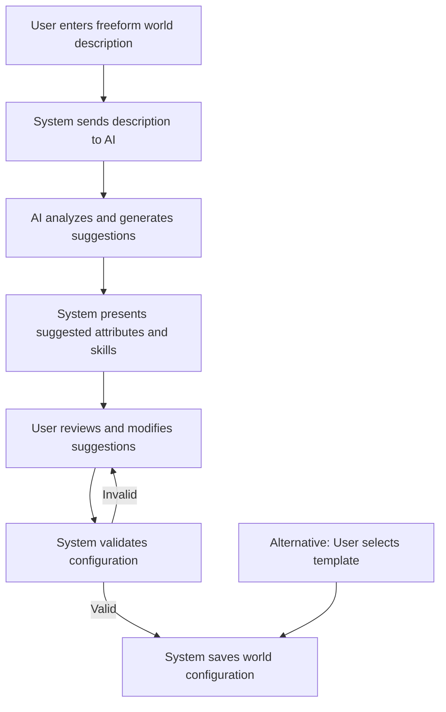

# Narraitor MVP Implementation Plan

## Overview
This document outlines the implementation strategy for the Minimum Viable Product (MVP) of the Narraitor project. It focuses on delivering essential functionality with a phased approach, ensuring a working product that can be iteratively enhanced while maintaining a lean scope.

## MVP Goals

1. Create a working narrative RPG framework that supports user-defined fictional worlds
2. Implement AI-assisted world creation from freeform descriptions
3. Develop essential systems for character creation and management
4. Provide a basic AI-driven narrative experience with Google Gemini integration
5. Include a journal system for tracking game history and player decisions
6. Ensure robust state persistence between sessions using IndexedDB
7. Deliver a clean, maintainable codebase following best practices and TDD principles
8. Launch with basic payment integration for sustainable growth

## Core Systems Scope

### Navigation System (MVP)
**GitHub Issues**: Epic #493, #432 (world switcher - completed), #509, #510, #511, #512
- ✅ Fix world switcher dropdown behavior (#432 - completed)
- Improve mobile navigation experience (#509)
- Add comprehensive keyboard navigation support (#510)
- Implement navigation state persistence (#511)
- Add loading states for navigation transitions (#512)
- Improve breadcrumb navigation for deep routes
- Create consistent navigation patterns across all pages

### World Configuration System (MVP)
**GitHub Issues**: #379 (epic), #303, #384
- AI-assisted world creation from freeform descriptions:
  - User provides a description of their fictional world
  - AI analyzes description and suggests attributes and skills
  - User reviews and modifies suggestions
  - System finalizes world configuration
- Attribute system with up to 6 attributes per world (range 1-10)
- Skill system with up to 12 skills linked to attributes (range 1-5)
- Template worlds as fallback options (Western, Sitcom, Fantasy)
- World selection interface showing available worlds
- Basic world editing functionality
- Five pre-defined theme options affecting UI appearance
- Basic error handling and validation for world configurations

### Character System (MVP)
**GitHub Issues**: #312 (epic), #256, #305, #285, #286, #287
- 4-step character creation wizard (Basic Info, Attributes, Skills, Background)
- Point-buy attribute allocation respecting world-defined limits
- Skill selection and rating (up to 8 skills per character)
- Text-based character description and background
- Character listing with filtering by world
- Character viewing interface (#256)
- Character editing functionality (#305)
- Character deletion with confirmation
- Define character attributes (#285)
- Build character skills (#286)
- Link skills to attributes (#287)
- Character creation progress recovery
- Character validation and error handling

### Narrative Engine (MVP)
**GitHub Issues**: #379 (epic), #462, #248
- Narrative generation using Google Gemini API
- Narrative ending system (#462)
- Player choice system with clear decision points (#248)
- Context management retaining 5-10 narrative segments
- History tracking for narrative segments and player decisions
- Scene transitions with location/setting changes
- Error recovery with retries and fallback content
- Prompt construction optimized for token efficiency
- World-appropriate tone and content generation
- Proper text formatting with paragraphs and dialogue
- Retry mechanisms for failed AI generation
- Fallback content for service unavailability

### Journal System (MVP)
**GitHub Issues**: Epic #494, #278, #280, #281
- **Backend (Complete)**: 
  - Journal store implementation ✅
  - Entry CRUD operations ✅
  - Entry type categorization ✅
  - Read/unread state management ✅
  - Test coverage ✅
- **UI Components (Week 2-3)**:
  - Collapsible journal panel for gameplay view (#278)
  - Journal list component with chronological display
  - Entry detail view with formatted content
  - Responsive journal layout (#280)
  - Session grouping UI
  - Entry type filtering (post-MVP)
  - New/unread indicators (post-MVP)
- **Integration**:
  - Automatic entry creation from narrative events
  - Store journal entries permanently (#281)
  - Mobile and desktop responsive design
  - Proper formatting for journal entries

### State Management (MVP) ✅
- **Zustand stores for all domain state management** ✅
- TypeScript-based type safety throughout ✅
- All 7 stores implemented with full CRUD operations ✅
- Error handling and validation for all stores ✅
- Loading state management ✅
- Reset functionality for all stores ✅
- Component hooks for clean state access ✅
- IndexedDB persistence with auto-save (#340) - **In Progress**

### Game Session UI (MVP)
- Responsive narrative display with markdown formatting
- Choice presentation with 3-4 options as cards or buttons
- Character summary panel showing relevant attributes and skills
- Journal access with collapsible panel
- Loading indicator during AI generation
- Auto-saving with save time display
- World-appropriate styling (fonts, colors, decorative elements)
- Basic accessibility features (keyboard navigation, screen reader compatibility)
- Session recovery options
- Error recovery interface
- Save indicators and confirmation

### AI Service Integration (MVP)
- Google Gemini integration as primary AI provider
- Dual-purpose AI usage:
  - World creation assistance (analyzing descriptions, suggesting attributes/skills)
  - Narrative generation (creating story content, player choices)
- Prompt template system for different use cases
- Error handling with automatic retries
- Context optimization for token efficiency
- Fallback content when service unavailable
- Response parsing and normalization
- Basic content safety filters
- Response formatting for display
- User-friendly error messages

### Launch Preparation (MVP)
**GitHub Issues**: Epic #495
- **Marketing & Documentation (Week 5-6)**:
  - Simple marketing landing page
  - Getting started guide
  - World creation tutorial
  - Basic user documentation
- **Payment Integration (Week 6)**:
  - Payment provider setup (generic: Stripe/Paddle)
  - Basic subscription tiers
  - Payment flow integration
  - Customer portal access
- **Analytics & Support (Week 6)**:
  - Privacy-focused analytics setup
  - Error tracking implementation
  - Basic support channel
  - Feedback collection system

## Implementation Phases (6-8 Weeks)

### Week 1-2: Foundation & Core Systems
**Focus**: Navigation, Character completion, Journal setup

- **Navigation Improvements**
  - Fix world switcher dropdown behavior (#432)
  - Improve breadcrumb navigation
  - Mobile navigation improvements
  - Consistent navigation patterns
  
- **Character System Completion**
  - Character viewing interface (#256)
  - Character editing capabilities (#305)
  - Character-world associations
  - UI/UX polish
  
- **Journal System UI Setup**
  - Create journal UI components
  - Collapsible journal view implementation
  - Journal entry creation hooks
  - IndexedDB persistence (#340)

### Week 3-4: Core Gameplay Loop
**Focus**: Complete narrative experience and journal integration

- **Narrative Engine Polish**
  - Narrative ending system (#462)
  - Scene transitions
  - Fallback content system
  - Decision presentation (#248)
  
- **Journal System Implementation**
  - Enable journal during gameplay (#278)
  - Responsive journal layout (#280)
  - Permanent storage (#281)
  - Session grouping and organization

### Week 5-6: Polish & Preparation
**Focus**: Testing, performance, and launch prep

- **UI/UX Polish**
  - Responsive design improvements
  - Performance optimization
  - Loading states and error handling
  - Cross-browser testing
  
- **Launch Preparation**
  - Marketing landing page
  - User documentation
  - Analytics setup
  - Payment integration preparation

### Week 7-8: Beta & Launch
**Focus**: Testing with friends, iterate, and launch

- **Beta Testing Phase**
  - Friends & family testing
  - Feedback gathering and iteration
  - Critical bug fixes
  - Performance monitoring
  
- **Launch Activities**
  - Payment system activation
  - Public launch announcement
  - User onboarding monitoring
  - Quick issue response

## Development Approach

### TDD Workflow ✅
1. Create GitHub issues from requirements documents ✅
2. Define clear acceptance criteria for each issue ✅
3. Write tests to define expected behavior ✅
4. Implement minimal code to pass tests ✅
5. Refactor while maintaining test coverage ✅
6. Conduct code reviews against established standards
7. Merge with CI/CD validation

### Component Development
1. Define component requirements and props interface
2. Create Storybook stories for all component variants
3. Develop component in isolation with TDD
4. Ensure responsive behavior across breakpoints
5. Implement accessibility features (ARIA, keyboard)
6. Document component API and usage patterns
7. Integrate into application flow

### State Management ✅
1. Define domain-specific state types and interfaces ✅
2. Create typed actions for all state mutations ✅
3. Implement stores with immutable updates ✅
4. Create selector functions for derived data ✅
5. Build custom hooks for component access ✅
6. Add state validation and integrity checks ✅
7. Add persistence layer with proper error handling (#340)

### AI Integration
1. Create modular AI service with specialized generators
2. Implement structured prompt templates for world creation and narrative
3. Build robust response parsers with validation
4. Develop fallback systems for service unavailability
5. Create error handling with appropriate retry logic
6. Implement context optimization for token efficiency

## AI-Assisted World Creation Flow

## Key Technical Decisions

1. **Framework**: Next.js 14+ with App Router
2. **Language**: TypeScript with strict typing
3. **State Management**: Zustand stores ✅
4. **Persistence**: IndexedDB via idb library
5. **UI Framework**: Tailwind CSS with world theming
6. **Testing**: Jest + React Testing Library + Playwright
7. **AI Integration**: Google Gemini API
8. **Development Approach**: TDD with KISS principles
9. **Component Development**: Storybook-first approach
10. **Documentation**: Markdown with Mermaid diagrams
11. **Error Recovery**: Comprehensive error handling with recovery options
12. **Accessibility**: WCAG 2.1 AA compliance

## Implementation Status

### Completed ✅
- Project setup and configuration
- State management architecture with Zustand
- All 7 domain stores (World, Character, Inventory, Narrative, Journal, Session, AI Context)
- Full CRUD operations for all stores
- Type safety and validation
- Error handling patterns
- Unit tests for all stores
- Integration tests for cross-store operations
- State management documentation

### In Progress 🔄
- Core UI component library
- Navigation improvements
- IndexedDB persistence layer (#340)
- Character viewing/editing UI
- Journal UI components

### Next Up 📋
- World creation UI components
- AI service integration
- Narrative display components
- Launch preparation tasks

## Updated Timeline

- **Week 1-2**: Navigation fixes, Character UI completion, Journal UI setup
- **Week 3-4**: Narrative engine polish, Journal integration
- **Week 5-6**: Polish, testing, launch preparation
- **Week 7-8**: Beta testing and public launch

## Success Metrics

1. **Initial Success**: Friends testing and having fun
2. **Growth Success**: Users willing to pay for the experience
3. **Scale Success**: Efficient platform scaling with growing user base

## Current Blockers

None - Project is on track for 6-8 week MVP delivery.

## Recent Changes

1. **Timeline Compression**: Reduced from 12 weeks to 6-8 weeks by focusing on core features
2. **Navigation Epic**: Added dedicated epic for navigation improvements
3. **Journal in MVP**: Moved journal system from post-MVP to MVP with UI implementation
4. **Launch Preparation**: Added new epic for marketing and payment setup
5. **Gamification Deferred**: Moved all gamification features to post-MVP

## Conclusion

The MVP implementation has been streamlined to focus on delivering a complete, polished narrative experience within 6-8 weeks. With the state management foundation complete and a clear focus on core features, the project is well-positioned for rapid development and successful launch.
