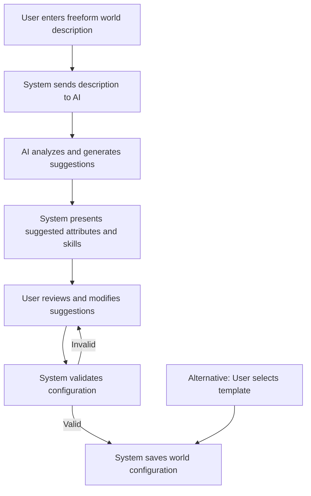

# Narraitor MVP Implementation Plan

## Overview
This document outlines the implementation strategy for the Minimum Viable Product (MVP) of the Narraitor project. It focuses on delivering essential functionality with a phased approach, ensuring a working product that can be iteratively enhanced while maintaining a lean scope.

## MVP Goals

1. Create a working narrative RPG framework that supports user-defined fictional worlds
2. Implement AI-assisted world creation from freeform descriptions
3. Develop essential systems for character creation and management
4. Provide a basic AI-driven narrative experience with Google Gemini integration
5. Include a journal system for tracking game history and player decisions
6. Ensure robust state persistence between sessions using IndexedDB
7. Deliver a clean, maintainable codebase following best practices and TDD principles
8. Incorporate error recovery and graceful failure handling

## Core Systems Scope

### World Configuration System (MVP)
- AI-assisted world creation from freeform descriptions:
  - User provides a description of their fictional world
  - AI analyzes description and suggests attributes and skills
  - User reviews and modifies suggestions
  - System finalizes world configuration
- Attribute system with up to 6 attributes per world (range 1-10)
- Skill system with up to 12 skills linked to attributes (range 1-5)
- Template worlds as fallback options (Western, Sitcom, Fantasy)
- World selection interface showing available worlds
- Basic world editing functionality
- Five pre-defined theme options affecting UI appearance
- Basic error handling and validation for world configurations

### Character System (MVP)
- 4-step character creation wizard (Basic Info, Attributes, Skills, Background)
- Point-buy attribute allocation respecting world-defined limits
- Skill selection and rating (up to 8 skills per character)
- Text-based character description and background
- Character listing with filtering by world
- Basic character editing functionality
- Character deletion with confirmation
- Basic inventory management
- Basic derived statistics
- Character creation progress recovery
- Character validation and error handling

### Narrative Engine (MVP)
- Narrative generation using Google Gemini API
- Player choice system with 3-4 options per decision point
- Context management retaining 5-10 narrative segments
- History tracking for narrative segments and player decisions
- Scene transitions with location/setting changes
- Error recovery with retries and fallback content
- Prompt construction optimized for token efficiency
- World-appropriate tone and content generation
- Proper text formatting with paragraphs and dialogue
- Retry mechanisms for failed AI generation
- Fallback content for service unavailability

### Journal System (MVP)
- Automatic entry creation for narrative events, decisions, discoveries, and character encounters
- Entry categorization by four primary types
- Chronological journal view with entry detail display
- Mobile and desktop responsive design
- Integration with game session UI
- Proper formatting for journal entries

### State Management (MVP) ✅
- ~~React Context + useReducer pattern for all domains~~
- **Zustand stores for all domain state management** ✅
- TypeScript-based type safety throughout ✅
- All 7 stores implemented with full CRUD operations ✅
- Error handling and validation for all stores ✅
- Loading state management ✅
- Reset functionality for all stores ✅
- Component hooks for clean state access ✅
- IndexedDB persistence with auto-save - **Next Phase (#340)**
- Campaign management (create, list, load, delete) - **Next Phase**
- Safe resume functionality for interrupted sessions - **Next Phase**

### Game Session UI (MVP)
- Responsive narrative display with markdown formatting
- Choice presentation with 3-4 options as cards or buttons
- Character summary panel showing relevant attributes and skills
- Journal access button with unread indicator
- Loading indicator during AI generation
- Auto-saving with save time display
- World-appropriate styling (fonts, colors, decorative elements)
- Basic accessibility features (keyboard navigation, screen reader compatibility)
- Session recovery options
- Error recovery interface
- Save indicators and confirmation

### AI Service Integration (MVP)
- Google Gemini integration as primary AI provider
- Dual-purpose AI usage:
  - World creation assistance (analyzing descriptions, suggesting attributes/skills)
  - Narrative generation (creating story content, player choices)
- Prompt template system for different use cases
- Error handling with automatic retries
- Context optimization for token efficiency
- Fallback content when service unavailable
- Response parsing and normalization
- Content safety filters
- Response formatting for display
- User-friendly error messages

## Implementation Phases

### Phase 1: Project Setup and Infrastructure ✅
- Initialize Next.js 14 project with TypeScript ✅
- Configure ESLint, Prettier, and EditorConfig ✅
- Set up Jest and React Testing Library ✅
- Configure Storybook for component development ✅
- Create domain-driven project structure ✅
- **Set up state management architecture** ✅
- Implement IndexedDB persistence layer - **Next Phase (#340)**
- Create core UI components library - **In Progress**
- Build error boundary system - **In Progress**
- Set up development diagnostics - **In Progress**

### Phase 2: World Configuration System
- **World store implementation** ✅
- **World CRUD operations** ✅
- **Attribute and skill management** ✅
- **World settings management** ✅
- **Test coverage for world store** ✅
- Create world creation form for freeform descriptions
- Build world description analyzer using Google Gemini
- Implement attribute and skill suggestion system
- Create user interface for reviewing and editing AI suggestions
- Develop template world system as fallback option
- Build world selection interface
- Implement world editor interface
- Create world theme system with 5 presets
- Build validation and error handling

### Phase 3: Character System
- **Character store implementation** ✅
- **Character CRUD operations** ✅
- **Character attribute management** ✅
- **Character skill management** ✅
- **Test coverage for character store** ✅
- Create 4-step character creation wizard
- Develop attribute allocation interface with validation
- Build skill selection interface with attribute linking
- Create character listing with filtering and sorting
- Implement character detail view
- Add basic character editing functionality
- Implement character deletion with confirmation
- **Basic inventory management** ✅ (via inventory store)
- Create basic derived statistics calculation
- Build character creation progress recovery

### Phase 4: AI Service Integration
- Implement Google Gemini API client
- Create prompt template system for different use cases
- Develop response parsing and normalization
- Implement error handling and retry logic
- Add token optimization for context management
- Create fallback systems for service failures
- Build configuration interface for API settings
- Implement content safety filters
- Create response formatting system

### Phase 5: Narrative Engine
- **Narrative store implementation** ✅
- **Narrative segment CRUD operations** ✅
- **Session-based segment organization** ✅
- **Test coverage for narrative store** ✅
- Create narrative context management system
- Develop player choice interface components
- Build narrative history tracking
- Implement scene transition logic
- Create narrative text display component
- Add decision relevance tracking
- Develop error recovery mechanisms
- Implement fallback narrative content
- Build text formatting system
- Create retry mechanism for failed generation

### Phase 6: Journal System
- **Journal store implementation** ✅
- **Journal entry CRUD operations** ✅
- **Entry type categorization** ✅
- **Read/unread state management** ✅
- **Test coverage for journal store** ✅
- Create automatic entry creation system
- Build journal list view component
- Develop journal entry detail component
- Build mobile-responsive journal interface
- Create journal entry formatting

### Phase 7: Game Session Integration
- **Session store implementation** ✅
- **Session CRUD operations** ✅
- **Active session management** ✅
- **Test coverage for session store** ✅
- Create game session container component
- Integrate narrative display with AI service
- Connect player choices to narrative progression
- Implement character summary panel
- Add journal access functionality
- Create loading and error states
- Develop session controls (save, exit)
- Add world theme integration for UI components
- Build session recovery interface
- Add save indicators and confirmation

### Phase 8: Testing and Refinement
- **Complete unit test coverage for all stores** ✅
- **Integration tests for cross-store operations** ✅
- Add integration tests for UI components
- Implement end-to-end tests for critical flows
- Address performance bottlenecks
- Improve error handling and recovery
- Enhance accessibility features
- Fix identified bugs and issues
- Test error recovery paths
- Validate session restoration
- Final documentation updates

## Development Approach

### TDD Workflow ✅
1. Create GitHub issues from requirements documents ✅
2. Define clear acceptance criteria for each issue ✅
3. Write tests to define expected behavior ✅
4. Implement minimal code to pass tests ✅
5. Refactor while maintaining test coverage ✅
6. Conduct code reviews against established standards
7. Merge with CI/CD validation

### Component Development
1. Define component requirements and props interface
2. Create Storybook stories for all component variants
3. Develop component in isolation with TDD
4. Ensure responsive behavior across breakpoints
5. Implement accessibility features (ARIA, keyboard)
6. Document component API and usage patterns
7. Integrate into application flow

### State Management ✅
1. Define domain-specific state types and interfaces ✅
2. Create typed actions for all state mutations ✅
3. Implement stores with immutable updates ✅
4. Create selector functions for derived data ✅
5. Build custom hooks for component access ✅
6. Add state validation and integrity checks ✅
7. Add persistence layer with proper error handling - **Next Phase (#340)**

### AI Integration
1. Create modular AI service with specialized generators
2. Implement structured prompt templates for world creation and narrative
3. Build robust response parsers with validation
4. Develop fallback systems for service unavailability
5. Create error handling with appropriate retry logic
6. Implement context optimization for token efficiency

## AI-Assisted World Creation Flow

## Key Technical Decisions

1. **Framework**: Next.js 14+ with App Router
2. **Language**: TypeScript with strict typing
3. **State Management**: ~~React Context + useReducer pattern~~ **Zustand stores** ✅
4. **Persistence**: IndexedDB via idb library - **Next Phase**
5. **UI Framework**: Tailwind CSS with world theming
6. **Testing**: Jest + React Testing Library + Playwright
7. **AI Integration**: Google Gemini API
8. **Development Approach**: TDD with KISS principles
9. **Component Development**: Storybook-first approach
10. **Documentation**: Markdown with Mermaid diagrams
11. **Error Recovery**: Comprehensive error handling with recovery options
12. **Accessibility**: WCAG 2.1 AA compliance

## Implementation Status

### Completed ✅
- Project setup and configuration
- State management architecture with Zustand
- All 7 domain stores (World, Character, Inventory, Narrative, Journal, Session, AI Context)
- Full CRUD operations for all stores
- Type safety and validation
- Error handling patterns
- Unit tests for all stores
- Integration tests for cross-store operations
- State management documentation

### In Progress 🔄
- Core UI component library
- Error boundary implementation
- Development diagnostics

### Next Up 📋
- IndexedDB persistence layer (#340)
- World creation UI components
- Character creation wizard
- AI service integration
- Narrative display components

## Updated Timeline

- **Week 1-2**: ~~Project setup and state management~~ ✅
- **Week 3-4**: World and Character UI components
- **Week 5-6**: AI service integration
- **Week 7-8**: Narrative engine and Journal UI
- **Week 9-10**: Game session integration
- **Week 11-12**: Testing, polish, and deployment

## Current Blockers

None - Issue #340 (IndexedDB persistence) is now unblocked and ready for implementation.

## Recent Changes

1. **State Management Migration**: Successfully migrated from proposed Context/useReducer pattern to Zustand stores
2. **Documentation Update**: Updated all state management documentation to reflect Zustand implementation
3. **Test Coverage**: Added comprehensive test coverage for all stores
4. **Issue Tracking**: Updated GitHub issues to reflect completion of #339

## Conclusion

The MVP implementation is progressing well with the state management foundation now complete. The Zustand-based architecture provides a solid foundation for the UI components and features to be built on top. With all stores implemented and tested, the project is ready to move forward with the persistence layer and UI implementation phases.
