```mermaid
graph TD
    A[Epic: Navigation Improvements] -->|Week 1| B[Fix current navigation issues]
    A --> C[World switcher improvements]
    A --> D[Breadcrumb enhancements]
    
    E[Epic: Journal System] -->|Week 2-3| F[Basic journal UI]
    E --> G[Entry persistence]
    E --> H[Session grouping]
    E --> I[Collapsible gameplay view]
    
    J[Epic: Character System] -->|Week 1-2| K[Complete character viewing]
    J --> L[Character editing]
    
    M[Epic: Narrative Engine] -->|Week 3-4| N[Narrative ending system]
    M --> O[Scene transitions]
    M --> P[Fallback content]
    
    Q[Epic: Launch Preparation] -->|Week 5-6| R[Marketing site]
    Q --> S[Documentation]
    Q --> T[Beta testing]
    Q --> U[Payment integration]
```

# Narraitor Web-First MVP Plan (6-8 Weeks)

> **Document Version**: 1.0  
> **Created**: January 2025  
> **Purpose**: Master planning document for Narraitor Web MVP development and launch

## 🎯 MVP Success Metrics (Progressive)

1. **Initial Success**: Friends testing it out and having fun
2. **Growth Success**: More people playing, even paying to play  
3. **Scale Success**: Efficiently scaling up the platform

## 📊 Updated Epic Structure



## 📅 Week-by-Week Breakdown

### **Weeks 1-2: Foundation & Core Systems**
**Focus**: Navigation, Character completion, Journal setup

- [ ] **Navigation Improvements Epic**
  - Fix world switcher dropdown behavior (#432)
  - Improve breadcrumb navigation for deep routes
  - Add mobile navigation improvements
  - Create consistent navigation patterns

- [ ] **Character System Completion** 
  - Complete character viewing interface (#256)
  - Add character editing capabilities (#305)
  - Fix character-world associations
  - Polish character UI/UX

- [ ] **Journal System Setup**
  - Create journal UI components
  - Implement basic collapsible journal view
  - Set up journal entry creation from narrative events
  - Add IndexedDB persistence for entries

### **Weeks 3-4: Core Gameplay Loop**
**Focus**: Complete narrative experience and journal integration

- [ ] **Narrative Engine Polish**
  - Implement narrative ending system (#462)
  - Add proper scene transitions
  - Create fallback content system
  - Polish decision presentation (#248)

- [ ] **Journal System Implementation**
  - Enable journal during gameplay (#278)
  - Implement responsive journal layout (#280)
  - Ensure permanent storage (#281)
  - Add session grouping and organization

### **Weeks 5-6: Polish & Preparation**
**Focus**: Testing, performance, and launch prep

- [ ] **UI/UX Polish**
  - Responsive design improvements
  - Performance optimization
  - Loading states and error handling
  - Cross-browser testing

- [ ] **Launch Preparation**
  - Create simple marketing landing page
  - Write user documentation
  - Set up analytics
  - Prepare payment integration (Stripe/Paddle)

### **Weeks 7-8: Beta & Launch**
**Focus**: Testing with friends, iterate, and launch

- [ ] **Beta Testing Phase**
  - Friends & family testing
  - Gather feedback and iterate
  - Fix critical bugs
  - Performance monitoring

- [ ] **Launch Activities**
  - Payment system activation
  - Public launch announcement
  - Monitor user onboarding
  - Quick response to issues

## 🏷️ Issue Reorganization

### **High Priority (MVP Critical)**
- #462: Narrative Ending System
- #278: Open journal during gameplay  
- #280: Responsive journal layout
- #281: Store journal entries permanently
- #248: Present clear decision points
- #285: Define character attributes
- #286: Build character skills
- #287: Link skills to attributes
- NEW: Navigation improvements
- NEW: Launch preparation tasks

### **Deferred to Post-MVP**
- Epic #429: Gamification (entire epic)
- #384: Visual regression testing
- #303: Personalized narrative content
- Portrait generation system
- Inventory system
- Lore management
- Content preferences
- Advanced AI features

## 📝 New Issues to Create

### **Navigation Improvements Epic**
```markdown
[EPIC] Navigation System Improvements

## Plain Language Summary
Make it easier for users to move around the app and know where they are.

## Goals
- Fix existing navigation bugs
- Improve mobile experience
- Add better visual feedback
- Ensure consistent navigation patterns

## User Stories
- [ ] Fix world switcher dropdown closing issues
- [ ] Improve mobile navigation experience
- [ ] Add keyboard navigation support
- [ ] Create navigation state persistence
- [ ] Add navigation loading states
```

### **Journal System Epic**  
```markdown
[EPIC] Journal System Implementation

## Plain Language Summary
Create a system that tracks and displays the player's story history during gameplay.

## Goals
- Automatic recording of game events
- Easy access during gameplay
- Persistent storage between sessions
- Clear organization by session

## User Stories
- [ ] Create journal UI components
  - JournalPanel.tsx - Collapsible panel for gameplay view
  - JournalList.tsx - Chronological list of entries
  - JournalEntry.tsx - Detailed entry view with formatting
  - JournalHeader.tsx - Controls and entry count
  - JournalEmpty.tsx - Empty state component
- [ ] Implement collapsible journal panel (#278)
  - Toggle button in game UI
  - Smooth expand/collapse animation
  - Persistent open/closed state
  - Mobile-responsive behavior
- [ ] Add journal entry creation hooks
  - Auto-create on narrative events
  - Auto-create on player decisions
  - Auto-create on session start/end
- [ ] Set up IndexedDB persistence (#281)
  - Save entries immediately on creation
  - Load entries on app start
  - Handle storage errors gracefully
- [ ] Create session grouping logic
  - Group entries by game session
  - Show session timestamps
  - Collapsible session groups
- [ ] Add entry formatting system
  - Markdown support for entries
  - Proper paragraph spacing
  - Timestamp formatting
  - Entry type indicators
- [ ] Implement responsive journal layout (#280)
  - Full-width on mobile
  - Sidebar on desktop
  - Scrollable entry list
  - Fixed header/controls
```

### **Launch Preparation Epic**
```markdown
[EPIC] MVP Launch Preparation

## Plain Language Summary
Get everything ready to launch Narraitor to the public and start accepting payments.

## Goals
- Create marketing materials
- Set up payment processing
- Prepare user documentation
- Establish support channels

## User Stories
- [ ] Create marketing landing page
- [ ] Write getting started guide
- [ ] Create world creation tutorial
- [ ] Set up Stripe/Paddle integration