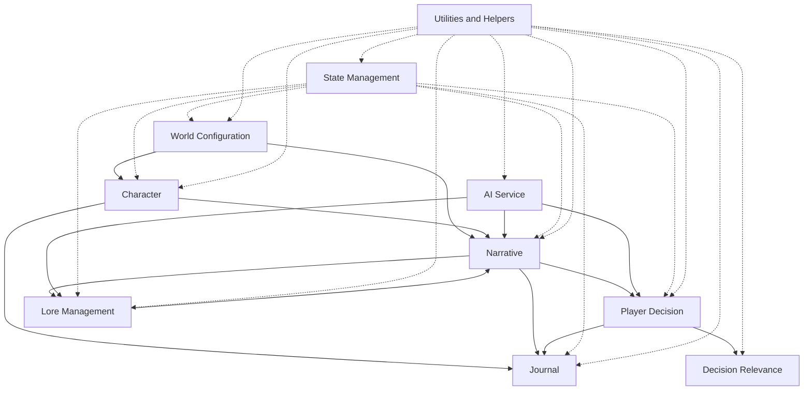

# NarrAItor Requirements Documentation

## Purpose
This directory contains lean requirements documentation for NarrAItor systems, focused on providing clear guidance for development while avoiding overengineering. These documents are designed specifically for a solo developer working towards an MVP.

## Usage
1. These documents define what needs to be built (not how)
2. They serve as the source for GitHub issue creation
3. They provide acceptance criteria for testing
4. They establish clear MVP boundaries

## Structure
- **/core**: Core system requirements
  - World Configuration System
  - Character System
  - Narrative Engine
  - Journal System
  - State Management
  - Player Decision System
  - Decision Relevance System
  - Lore Management System
  - Utilities and Helpers
- **/integrations**: Integration requirements
  - AI Service Integration
- **/ui**: User interface requirements
  - World Interface
  - Character Interface
  - Game Session
  - Journal Interface

## Requirements to GitHub Issues Workflow
1. Review the applicable requirements document
2. Create user stories in GitHub using the established templates
3. Use the acceptance criteria as a starting point
4. Link issues back to the relevant requirements document
5. Update the "GitHub Issues" section with created issue links

## Documentation Principles
- **Focused**: Include only what's necessary for MVP
- **Clear Boundaries**: Explicitly state what's included and excluded
- **Action-Oriented**: Written to facilitate direct conversion to issues
- **Testable**: Include measurable acceptance criteria 
- **Living**: Update as requirements evolve based on development insights

## How to Maintain
1. Treat requirements as living documents
2. Update them as you gain insights during development
3. Annotate with links to related GitHub issues
4. Update status as features are implemented
5. Use them as a reference for planning subsequent development phases

## Core System Relationships

## Feature Prioritization for MVP

### Phase 1: Foundation
1. World Configuration System
2. State Management
3. Utilities and Helpers
4. AI Service Integration

### Phase 2: Core Experience
1. Character System
2. Narrative Engine
3. Journal System

### Phase 3: Advanced Features
1. Player Decision System
2. Decision Relevance System
3. Lore Management System

## User Interface Components

### Phase 1
1. World Interface
2. Character Interface

### Phase 2
1. Game Session Interface
2. Journal Interface
