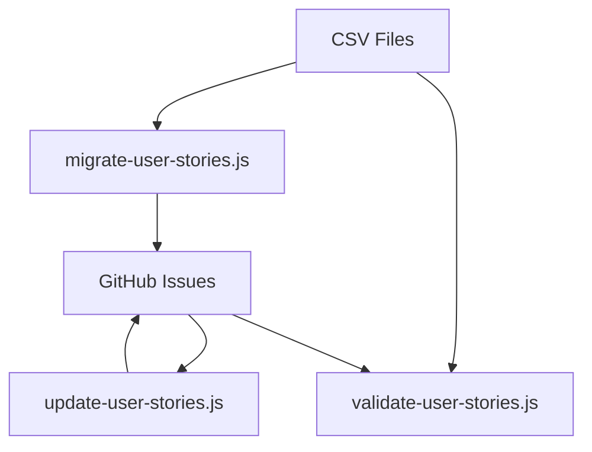

# GitHub Issue & CSV Synchronization

This document provides technical details on the synchronization process between GitHub issues and user story CSV files in the Narraitor project.

## Overview

The Narraitor project maintains user stories in both GitHub issues and CSV files. GitHub issues serve as the system of record for development tracking, while CSV files provide domain-specific views of the requirements. The synchronization process ensures that:

1. Each user story in the CSV files has a corresponding GitHub issue
2. GitHub issues accurately reflect the complexity and priority defined in CSV files
3. Implementation notes and documentation links are properly maintained
4. Duplicate issues are eliminated

## System Components

### Core Scripts

- **scripts/update-user-stories.js** - Primary synchronization script
- **scripts/user-stories/migrate-user-stories.js** - Migrates user stories from CSV to GitHub issues
- **scripts/validate-user-stories.js** - Validates consistency between docs and issues

### Support Modules

- **scripts/user-stories/modules/config.js** - Centralized configuration
- **scripts/user-stories/modules/github-api.js** - GitHub API utilities
- **scripts/user-stories/modules/csv-utils.js** - CSV file utilities
- **scripts/user-stories/modules/parsers.js** - Parsers for CSV and markdown files
- **scripts/user-stories/modules/processor.js** - Logic for processing issues and requirements
- **scripts/user-stories/modules/github-issue-converter.js** - Converts issue data to CSV format
- **scripts/user-stories/modules/legacy-parsers.js** - Parsers for older issue formats
- **scripts/user-stories/modules/markdown-parser.js** - Parses markdown content
- **scripts/user-stories/modules/parser-utils.js** - Utility functions for parsers
- **scripts/utils/cli-parser.js** - Parses command line arguments
- **scripts/utils/csv-data-utils.js** - Utility functions for CSV data
- **scripts/utils/issue-body-formats.js** - Defines expected issue body formats
- **scripts/utils/issue-body-utils.js** - Utility functions for issue body content

## Data Flow



## Integration Points

### CSV Files

CSV files in `docs/requirements/*/` follow this standard structure:
- `User Story Title Summary` - Title of the user story
- `User Story` - The user story text
- `Priority` - Priority level (High, Medium, Low, Post-MVP)
- `Estimated Complexity` - Estimated complexity (Small, Medium, Large)
- `Acceptance Criteria` - Acceptance criteria (newline-separated)
- `Technical Requirements` - Technical implementation details (newline-separated)
- `Implementation Considerations` - Implementation considerations (newline-separated)
- `Related Issues/Stories` - Related issue or story numbers (newline-separated)
- `Related Documentation` - Comma-separated paths to related documentation files
- `GitHub Issue Link` - Link to the GitHub issue

### GitHub Issues

GitHub issues use the template in `.github/ISSUE_TEMPLATE/user-story.md` with these sections:
- **User Story** - The user story text
- **Acceptance Criteria** - Acceptance criteria
- **Technical Requirements** - Technical implementation details
- **Implementation Notes** - Generated implementation guidance
- **Estimated Complexity** - Complexity level with checkboxes
- **Priority** - Priority level with checkboxes
- **Related Documentation** - Links to requirements documents
- **Related Issues/Stories** - Links to related issues

## Process Details

### Stage 1: Migration (CSV to GitHub)

1. **migrate-user-stories.js**
   - Reads CSV user story data
   - Creates new GitHub issues for rows without a GitHub Issue Link
   - Updates the CSV file with the new GitHub Issue Link

### Stage 2: Synchronization (GitHub to GitHub/CSV)

1. **update-user-stories.js**
   - Verifies required GitHub labels exist
   - Reads the GitHub issue template
   - Loads all CSV user story data
   - For each GitHub issue:
     - Finds matching CSV row
     - Updates issue body with correct user story text, acceptance criteria, technical requirements, and implementation notes
     - Updates complexity and priority labels based on CSV values
     - Updates documentation links to use absolute URLs to the `develop` branch
     - Assigns issues to the configured project board (except post-mvp)

### Stage 3: Validation

1. **validate-user-stories.js**
   - Compares data in CSV files and GitHub issues
   - Identifies inconsistencies in titles, complexity, priority, and links
   - Reports unmatched requirements or issues

## Error Handling

## Error Handling

The scripts handle these common error scenarios:

1. **GitHub API Rate Limiting**
   - Tracks the remaining rate limit
   - Pauses execution when approaching the limit
   - Resumes after the rate limit reset time

2. **Network Issues**
   - Retries failed API calls
   - Records partial progress
   - Provides detailed error messages

3. **CSV Parsing Errors**
   - Validates CSV structure
   - Handles various CSV encodings
   - Reports malformed CSV files

4. **Missing Configuration**
   - Checks for required environment variables
   - Validates GitHub repository settings
   - Verifies required labels exist

## Command Line Options

Most scripts support these common options:

- `--issueType=<type>` - Specify the issue type category (e.g., user-stories, migration)
- `--dry-run` - Test run without making changes
- `--limit N` - Limit processing to N items
- `--force` - Bypass validation checks
- `--validate` - Run in validation mode without making changes
- `--issue=N` - Process only a specific issue number

## GitHub API Usage

The scripts interact with these GitHub API endpoints:

- `GET /repos/:owner/:repo/issues` - List issues
- `GET /repos/:owner/:repo/issues/:number` - Get specific issue
- `POST /repos/:owner/:repo/issues` - Create issue
- `PATCH /repos/:owner/:repo/issues/:number` - Update issue
- `POST /repos/:owner/:repo/issues/:number/comments` - Add comment
- `GET /repos/:owner/:repo/labels` - List labels

## Performance Considerations

1. **Pagination**
   - Handles large repositories by paginating API requests
   - Processes GitHub issues in manageable batches

2. **Caching**
   - Minimizes redundant API calls
   - Stores analysis results for reuse

3. **Parallel Processing**
   - Processes independent items concurrently
   - Respects API rate limits

## Security Considerations

1. **Token Handling**
   - Uses environment variables for GitHub token
   - Never logs or exposes the token

2. **Data Validation**
   - Sanitizes input from CSV files
   - Validates URLs before processing

3. **Changes Safety**
   - Implements dry-run mode for verification
   - Backs up data before making changes
   - Logs all actions for review

## Troubleshooting

### Common Issues

1. **GitHub Token Issues**
   ```
   GitHub token not found. Set GITHUB_TOKEN environment variable.
   ```
   
   Solution: Export the GitHub token as an environment variable:
   ```bash
   export GITHUB_TOKEN=your_github_token
   ```

2. **Missing Labels**
   ```
   Required labels are missing: complexity:small, priority:high, ...
   ```
   
   Solution: Run the label creation script:
   ```bash
   node scripts/github-label-creator.js
   ```
   
   Or bypass label verification:
   ```bash
   node scripts/update-user-stories.js --force
   ```

3. **Rate Limiting**
   ```
   GitHub API rate limit exceeded. Resets at [time]
   ```
   
   Solution: Wait until the rate limit resets or use a token with higher limits.

4. **CSV Parsing Errors**
   ```
   Error parsing CSV [file]: [message]
   ```
   
   Solution: 
   - Check CSV format with a text editor
   - Ensure proper encoding (UTF-8)
   - Fix line endings (CRLF issues)

### Debugging Techniques

1. **Verbose Output**
   - Set DEBUG_MODE to true in config.js
   - Prints detailed information about each step

2. **Step-by-Step Processing**
   - Use the `--limit 1` option to process one item at a time
   - Process specific issues with `--issue=N`

3. **Dry Run Mode**
   - Use `--dry-run` to see planned changes without applying them
   - Check logs for potential issues

4. **Validation Mode**
   - Use `--validate` to check consistency without making changes
   - Identify issues before attempting fixes

## Best Practices

1. **Regular Synchronization**
   - Run the synchronization process after significant changes to CSV files
   - Schedule regular runs to maintain consistency

2. **Version Control**
   - Commit CSV changes before running synchronization
   - Log synchronization runs for tracking

3. **Incremental Processing**
   - Process small batches of issues for large repositories
   - Use `--limit` to control batch size

4. **Testing Changes**
   - Always use `--dry-run` before applying changes
   - Test on non-production repositories first

5. **Documentation**
   - Document any manual interventions
   - Keep notes on edge cases and solutions

## Extending the System

When extending the GitHub issue and CSV synchronization system, follow these guidelines:

1. **Use Existing Modules**
   - Leverage utilities in the modules directory
   - Follow established patterns for API calls and error handling

2. **Maintain Dry Run Mode**
   - Ensure all new functionality supports dry run mode
   - Provide clear logging of planned changes

3. **Document Changes**
   - Update this document with new functionality
   - Add comments to explain complex logic

4. **Error Handling**
   - Handle all potential errors gracefully
   - Provide actionable error messages

5. **TDD Approach**
   - Write tests first
   - Keep components under 300 lines
   - Use existing utilities where possible

## Related Documentation

- [GitHub API Documentation](https://docs.github.com/en/rest)
- [CSV File Format](docs/requirements/csv-format.md)
- [Issue Template Guide](docs/workflows/issue-template-guide.md)
- [GitHub Labels Guide](docs/technical-guides/github-labels.md)

## Conclusion

The GitHub issue and CSV synchronization system provides a robust way to maintain consistency between requirements documentation in CSV files and implementation tracking in GitHub issues. By following the process outlined in this document, developers can ensure that all user stories are properly tracked, prioritized, and documented.
