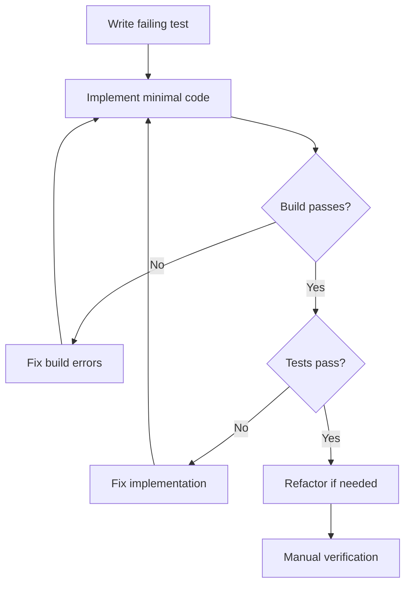

# PR Creation & Testing Workflow

Complete testing and PR creation process for the Narraitor project.

## Testing Strategy

### Test-Driven Development Loop


### Test Types & When to Use

**Unit Tests** (Always required)
- Component rendering with different props
- User interactions (clicks, input changes)
- State changes and side effects
- Error handling

**Integration Tests** (For complex features)
- Component + store interactions
- API integration with mocked endpoints
- Cross-component communication

**E2E Tests** (Critical paths only)
- Complete user workflows
- Real API interactions
- Browser-specific functionality

### Test File Structure
```typescript
// ComponentName.test.tsx
import { render, screen } from '@testing-library/react';
import userEvent from '@testing-library/user-event';
import { ComponentName } from './ComponentName';

describe('ComponentName', () => {
  // Test what the component does, not how it does it
  test('displays data correctly', () => {
    render(<ComponentName data={mockData} />);
    expect(screen.getByText('Expected Text')).toBeInTheDocument();
  });

  test('handles user interaction', async () => {
    const user = userEvent.setup();
    const onAction = jest.fn();
    
    render(<ComponentName onAction={onAction} />);
    await user.click(screen.getByRole('button'));
    
    expect(onAction).toHaveBeenCalledWith(expectedValue);
  });
});
```

### Common Testing Patterns

**Component with State**
```typescript
test('updates display when data changes', () => {
  const { rerender } = render(<Component data={initialData} />);
  expect(screen.getByText('Initial')).toBeInTheDocument();
  
  rerender(<Component data={updatedData} />);
  expect(screen.getByText('Updated')).toBeInTheDocument();
});
```

**Error Handling**
```typescript
test('displays error message when data is invalid', () => {
  render(<Component data={invalidData} />);
  expect(screen.getByText(/error/i)).toBeInTheDocument();
});
```

**Loading States**
```typescript
test('shows loading state while data is fetching', () => {
  render(<Component loading={true} />);
  expect(screen.getByText(/loading/i)).toBeInTheDocument();
});
```

## Running Tests

### Development Commands
```bash
# Run all tests
npm run test

# Run tests with coverage
npm run test:coverage

# Run specific test file
npm run test -- ComponentName.test.tsx

# Run tests in watch mode
npm run test -- --watch
```

### CI/CD Requirements
All PRs must:
- Pass all existing tests
- Maintain or improve code coverage
- Pass build without warnings
- Pass linting checks

## Pull Request Creation

### Branch Strategy
- **develop**: Main development branch (merge target)
- **main**: Production branch (protected)
- **feature/issue-123**: Feature branches from develop

### PR Requirements
1. **Target develop branch** (never main)
2. **Use PR template** from `.github/PULL_REQUEST_TEMPLATE.md`
3. **Link to GitHub issue** using "Closes #123"
4. **All tests must pass**
5. **Build must succeed**

### Manual PR Creation
```javascript
// Read PR template
const fs = require('fs');
const prBody = fs.readFileSync('.github/PULL_REQUEST_TEMPLATE.md', 'utf8')
  .replace('Closes #', 'Closes #123');

// Create PR with MCP GitHub tool
await mcp__modelcontextprotocol_server_github__server_github.createPullRequest({
  owner: "jerseycheese",
  repo: "Narraitor",
  title: "Fix #123: Brief description",
  body: prBody,
  head: "feature/issue-123",
  base: "develop"  // Always develop, never main
});
```

### PR Template Structure
The template includes:
- **Summary**: What was implemented
- **Changes**: Key technical changes
- **Testing**: How the feature was tested
- **Screenshots**: Visual changes (if applicable)
- **Checklist**: Pre-merge verification items

## Pre-Merge Checklist

### Code Quality
- [ ] All tests pass locally
- [ ] Build succeeds without warnings
- [ ] No console errors in browser
- [ ] Code follows project conventions
- [ ] No TODO/FIXME comments left behind

### Testing Coverage
- [ ] New features have unit tests
- [ ] Critical paths have integration tests
- [ ] Error scenarios are tested
- [ ] Edge cases are covered

### Documentation
- [ ] Component has Storybook story
- [ ] API changes are documented
- [ ] README updated if needed
- [ ] Breaking changes noted

### Integration Verification
- [ ] Works in Storybook
- [ ] Works in test harness
- [ ] Works in full application
- [ ] No regression in existing features

## Troubleshooting

**Tests fail in CI but pass locally**
- Check Node.js version compatibility
- Verify environment variables are set
- Check for race conditions in async tests

**Build fails with type errors**
- Run `npm run build` locally first
- Check TypeScript strict mode compliance
- Verify all imports are correctly typed

**PR template not applied**
- Manually copy from `.github/PULL_REQUEST_TEMPLATE.md`
- Ensure all placeholders are replaced

**Wrong base branch selected**
- Always target `develop`, never `main`
- Update existing PR base branch if needed
